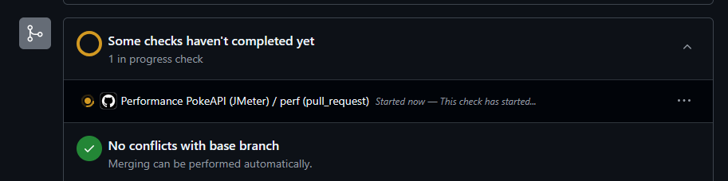
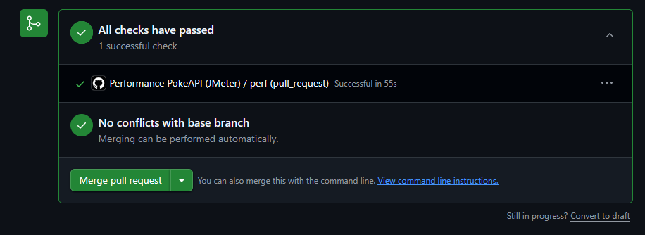
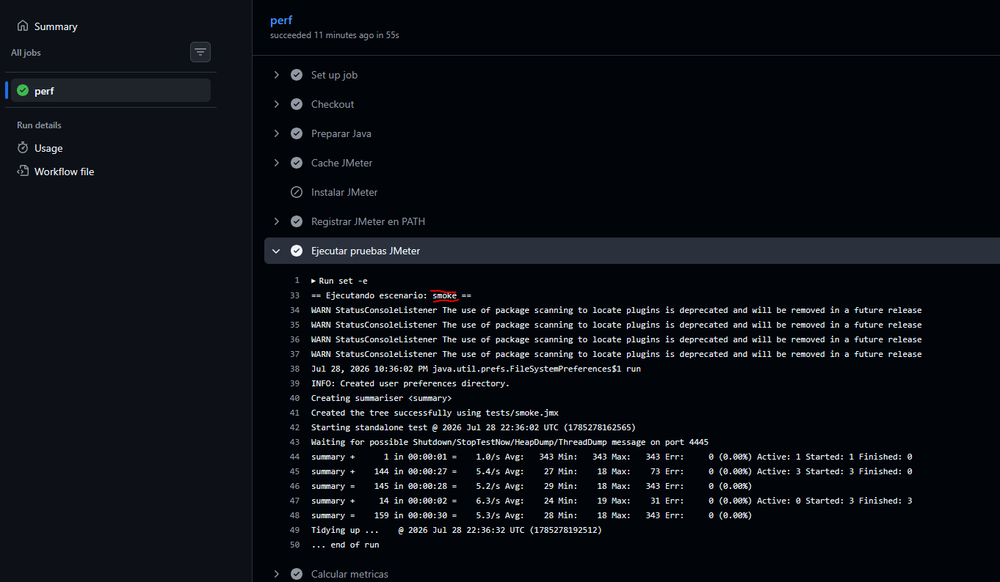
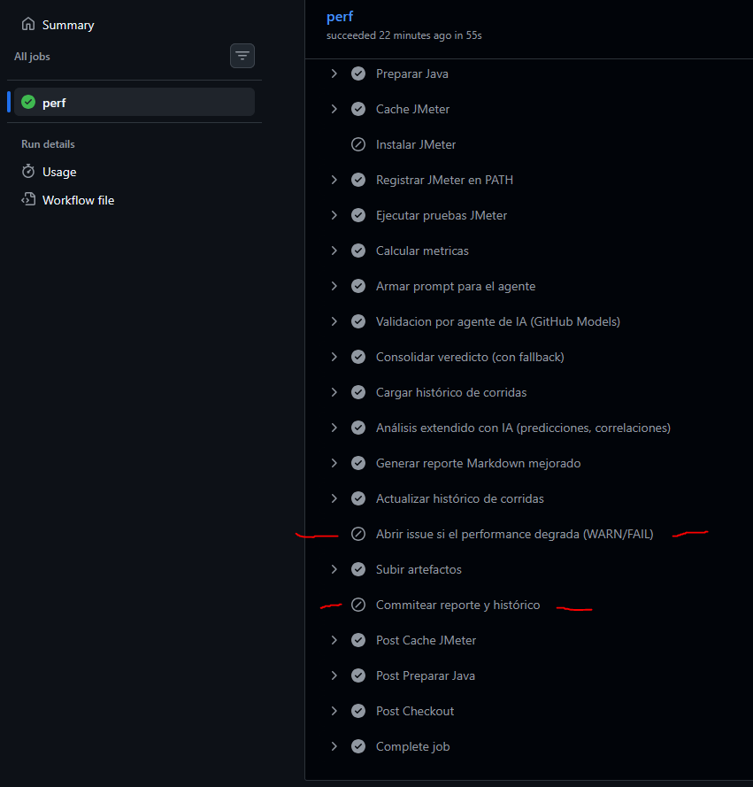

5 El gate de Pull Request
INTERMEDIO

Objetivo: entender cómo el performance protege la rama principal.

 Crea una rama, haz un cambio pequeño y abre un Pull Request hacia main.\
     RAMA USADA: FerPractice05\
        URL de PR: https://github.com/rba3/Lab_CD_CI_Perfomance/pull/14
          
    Observa que el check perf corre solo el escenario smoke.\
          Evidencia en capturas de pantalla.\
          
           
    Explica por qué en un PR el workflow no commitea el reporte ni abre issues.\
          Los pasos de commit y Open Issue están deshabilitados para el workflow de check.\
              
