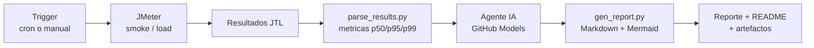

# jmeter-pokeapi-lab

Laboratorio de **pruebas de performance con Apache JMeter** contra la
[PokeAPI](https://pokeapi.co). Las pruebas se disparan desde **GitHub Actions**
(automatico por cron y manual), un **agente de IA** valida las respuestas y el
resultado se publica como **reporte Markdown con graficas Mermaid**.

> Infografia del proyecto: [`infografia.html`](infografia.html) (abrela en el navegador).

---

## Ultimo reporte

<!-- LATEST_REPORT_START -->
**Ultima corrida:** 2026-07-22 02:55 UTC - Veredicto `PASS`  
Reporte completo: [`reports/report-2026-07-22_0255.md`](reports/report-2026-07-22_0255.md)

| Escenario | Muestras | Error % | p95 (ms) | req/s |
| --- | --- | --- | --- | --- |
| smoke | 163 | 0.0% | 18.9 | 5.58 |
<!-- LATEST_REPORT_END -->

---

## Como funciona



1. **JMeter** ejecuta los planes contra PokeAPI y valida cada respuesta con
   *Response Assertions* (HTTP 200 + cuerpo JSON).
2. **`parse_results.py`** convierte el JTL en metricas agregadas (latencia,
   percentiles, throughput, % de error) por endpoint y globales.
3. Un **agente de IA** (GitHub Models, sin API key externa) analiza esas
   metricas contra los SLOs y emite un veredicto `PASS` / `WARN` / `FAIL` con
   recomendaciones. Si el agente no esta disponible, hay un fallback por umbrales.
4. **`gen_report.py`** arma el reporte Markdown con graficas Mermaid y actualiza
   esta seccion del README.

---

## Ejecutar

### Manual (desde GitHub)
`Actions` -> `Performance PokeAPI (JMeter)` -> `Run workflow`. Parametros:

| Input | Descripcion | Default |
| --- | --- | --- |
| `scenario` | `both`, `smoke` o `load` | `both` |
| `threads` | usuarios concurrentes | plan (smoke 3 / load 50) |
| `rampup` | ramp-up en segundos | plan (5 / 30) |
| `duration` | duracion en segundos | plan (30 / 120) |
| `think` | think time en ms | plan (500 / 300) |

### Automatico
Corre todos los dias a las **13:00 UTC** (~07:00 CDMX) via `cron`.

### Local (opcional)
```bash
# requiere JMeter instalado
jmeter -n -t tests/smoke.jmx -Jendpoints=config/pokeapi-endpoints.csv \
  -l results/smoke.jtl -e -o reports/html-smoke
python3 scripts/parse_results.py results/smoke.jtl smoke reports/metrics-smoke.json
python3 scripts/gen_report.py --out reports/report-local.md \
  --date "local" --metrics reports/metrics-smoke.json
```

---

## Escenarios

| Escenario | Usuarios | Duracion | Proposito |
| --- | --- | --- | --- |
| **smoke** | 3 | 30 s | Confirmar que la API responde bien con carga minima |
| **load** | 50 | 120 s | Carga sostenida moderada (PokeAPI es publica: no abusar) |

Los endpoints probados estan en [`config/pokeapi-endpoints.csv`](config/pokeapi-endpoints.csv)
(pokemon, list, type, ability, berry, move, generation). Para agregar mas,
edita ese CSV: `label,path`.

---

## Estructura

```
jmeter-pokeapi-lab/
├── infografia.html                # infografia visual (tema Pokemon)
├── README.md
├── .github/workflows/perf-tests.yml
├── tests/
│   ├── smoke.jmx
│   └── load.jmx
├── config/pokeapi-endpoints.csv
├── scripts/
│   ├── parse_results.py           # JTL -> metricas JSON
│   └── gen_report.py              # metricas -> Markdown + Mermaid
└── reports/                       # reportes generados por corrida
```

---

## SLOs de referencia

| Metrica | PASS | WARN | FAIL |
| --- | --- | --- | --- |
| % de error | < 0.1% | 0.1% - 1% | > 1% |
| Latencia p95 | < 800 ms | 800 - 1500 ms | > 1500 ms |

Ajustables en el paso *"Armar prompt para el agente"* y en el fallback del
workflow.

---

_Este laboratorio consume la API publica de PokeAPI de forma respetuosa
(carga moderada + think time). No es un servicio oficial de Pokemon ni de PokeAPI._
