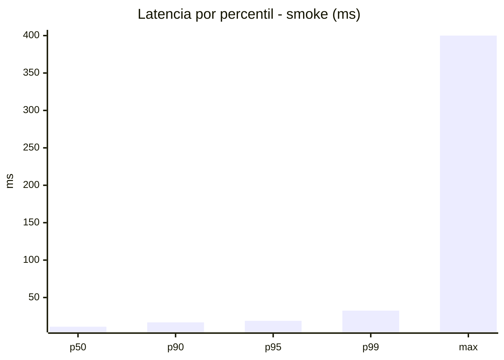
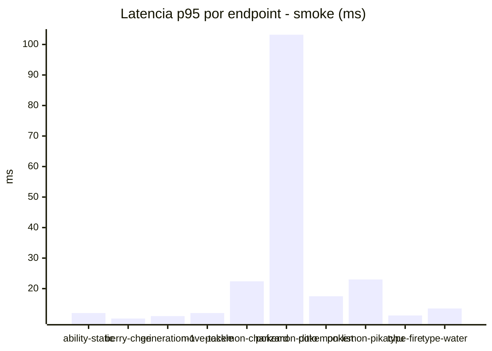
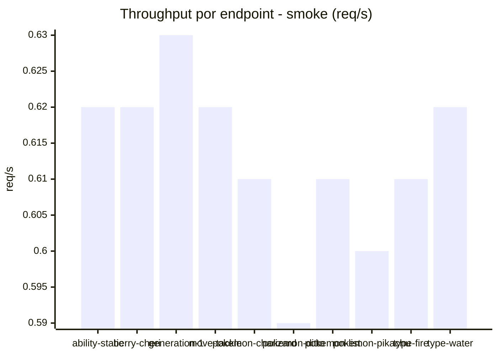
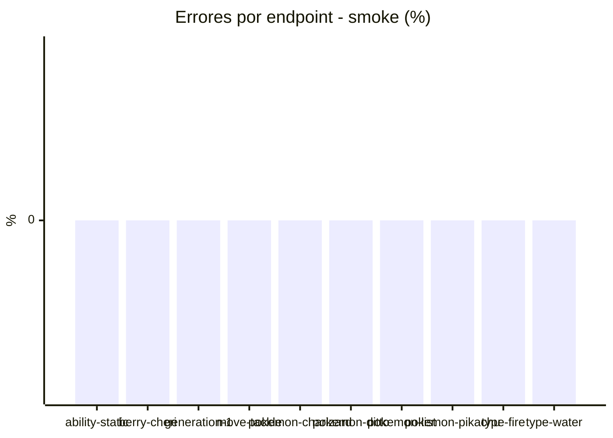

# Reporte de performance - PokeAPI

**Fecha:** 2026-07-22 02:55 UTC  
**Veredicto del agente:** `PASS`  
**Corrida:** [ver en GitHub Actions](https://github.com/lrbg/jmeter-pokeapi-lab/actions/runs/29887023536)  

## Validacion del agente de IA

PASS

1. Todos los endpoints analizados tienen un porcentaje de errores de 0%, cumpliendo con el SLO establecido de error < 1%. Esto demuestra una buena estabilidad del sistema durante la prueba.
  
2. El tiempo promedio de respuesta (avg_ms) es de 13.9 ms, con un p95 de 18.9 ms, que están muy por debajo del límite de 800 ms, lo que indica un rendimiento excelente en general.

3. Sin embargo, el endpoint "pokemon-ditto" presenta un max_ms de 400 ms y un p95 de 103.2 ms, que, aunque aceptable, sugiere que hay picos en la latencia. Recomiendo investigar este endpoint para comprender las causas de esas discrepancias y optimizar el rendimiento.

4. Es recomendable realizar pruebas continuas en diferentes condiciones de carga para identificar cómo se comportan los endpoints bajo estrés y asegurar que el rendimiento siga siendo óptimo en situaciones reales.

## Resultados

### Escenario: `smoke`

| Metrica | Valor |
| --- | --- |
| Muestras | 163 |
| Errores | 0 (0.0%) |
| Latencia media | 13.9 ms |
| p50 / p90 / p95 / p99 | 11.0 / 16.8 / 18.9 / 32.5 ms |
| Min / Max | 7 / 400 ms |
| Throughput | 5.58 req/s |
| Duracion | 29.2 s |

Detalle por endpoint

| Endpoint | Muestras | Error % | avg | p95 | p99 | req/s |
| --- | --- | --- | --- | --- | --- | --- |
| ability-static | 16 | 0.0% | 9.8 | 12.0 | 12.0 | 0.62 |
| berry-cheri | 16 | 0.0% | 8.9 | 10.2 | 10.8 | 0.62 |
| generation-1 | 16 | 0.0% | 10.4 | 11.0 | 11.0 | 0.63 |
| move-tackle | 16 | 0.0% | 10.4 | 12.0 | 12.0 | 0.62 |
| pokemon-charizard | 17 | 0.0% | 17.1 | 22.4 | 23.7 | 0.61 |
| pokemon-ditto | 17 | 0.0% | 33.8 | 103.2 | 340.6 | 0.59 |
| pokemon-list | 16 | 0.0% | 10.8 | 17.5 | 28.3 | 0.61 |
| pokemon-pikachu | 17 | 0.0% | 15.8 | 23.0 | 32.6 | 0.6 |
| type-fire | 16 | 0.0% | 10 | 11.2 | 11.8 | 0.61 |
| type-water | 16 | 0.0% | 10.6 | 13.5 | 14.7 | 0.62 |

