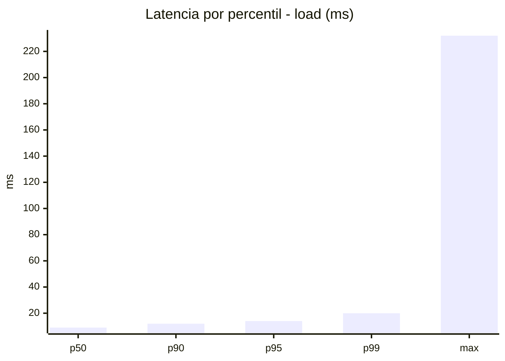
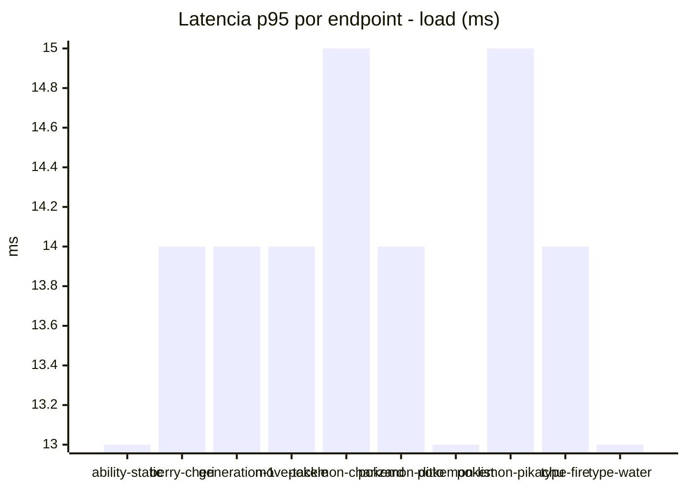
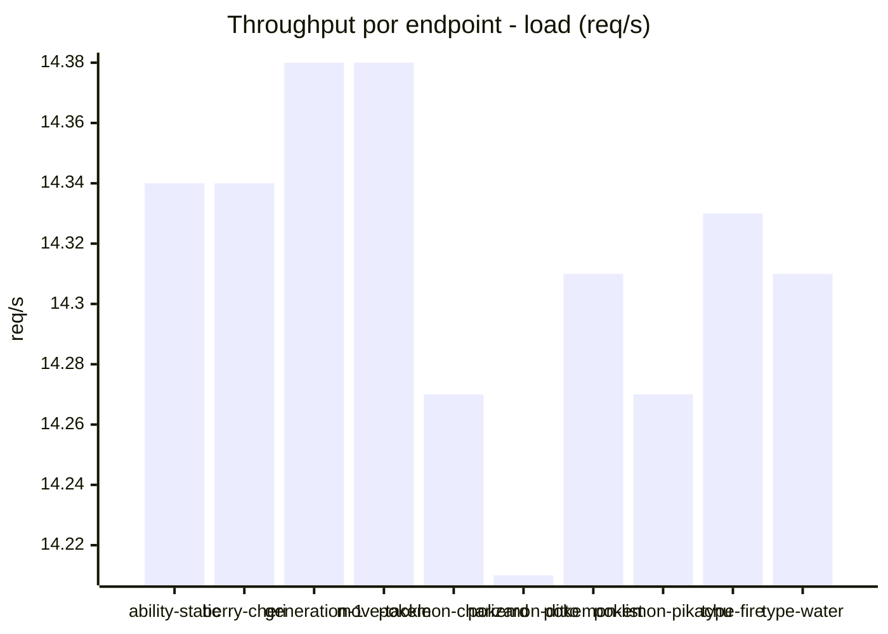
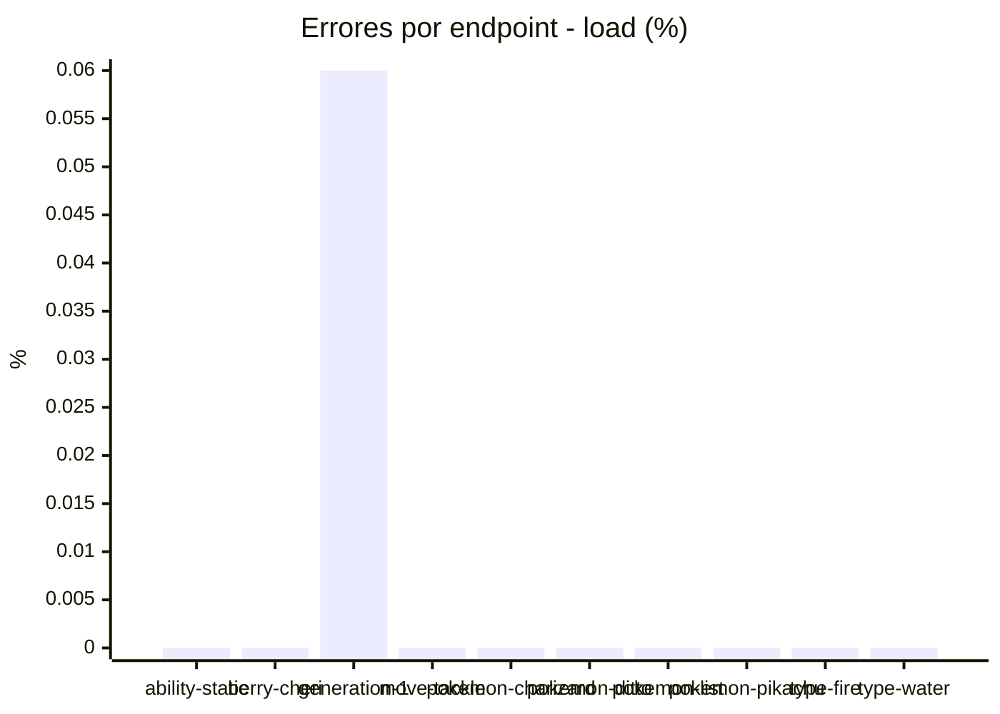
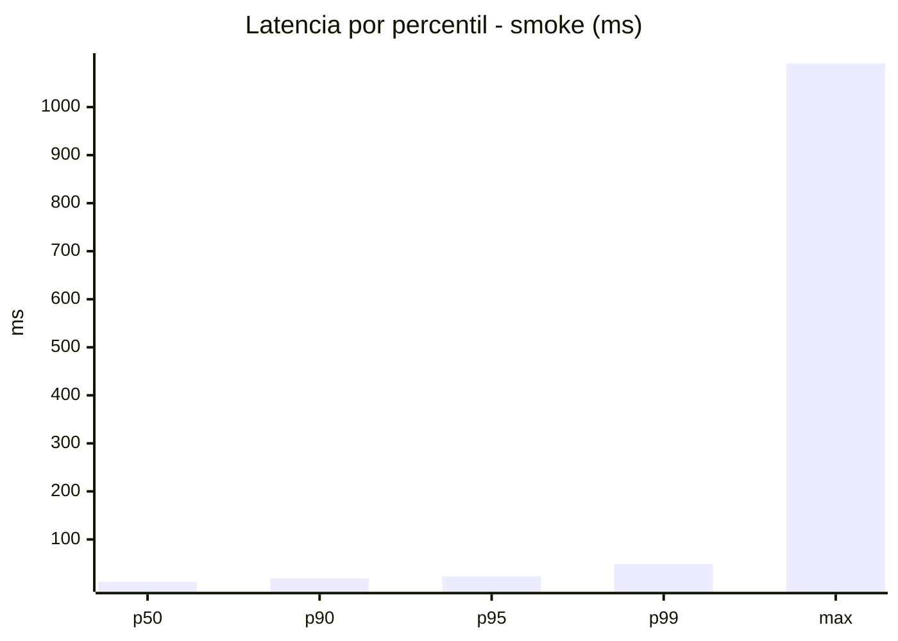
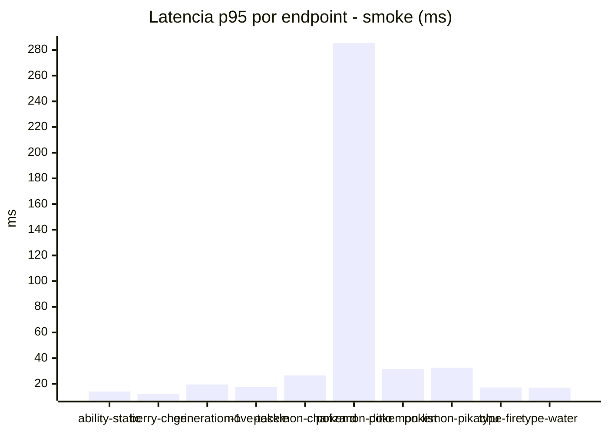
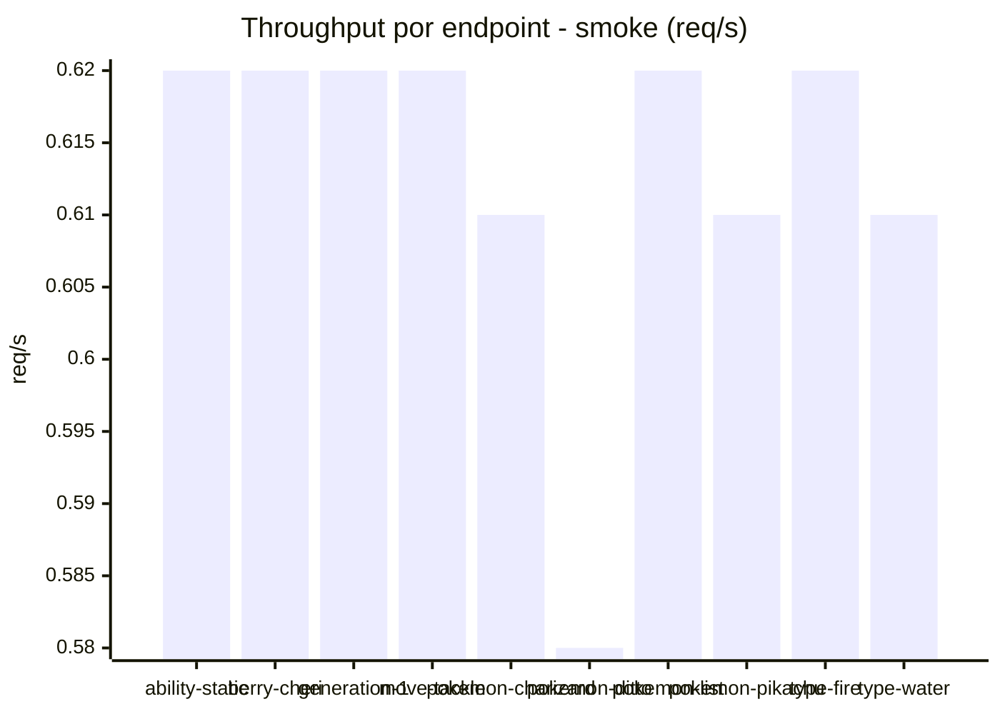
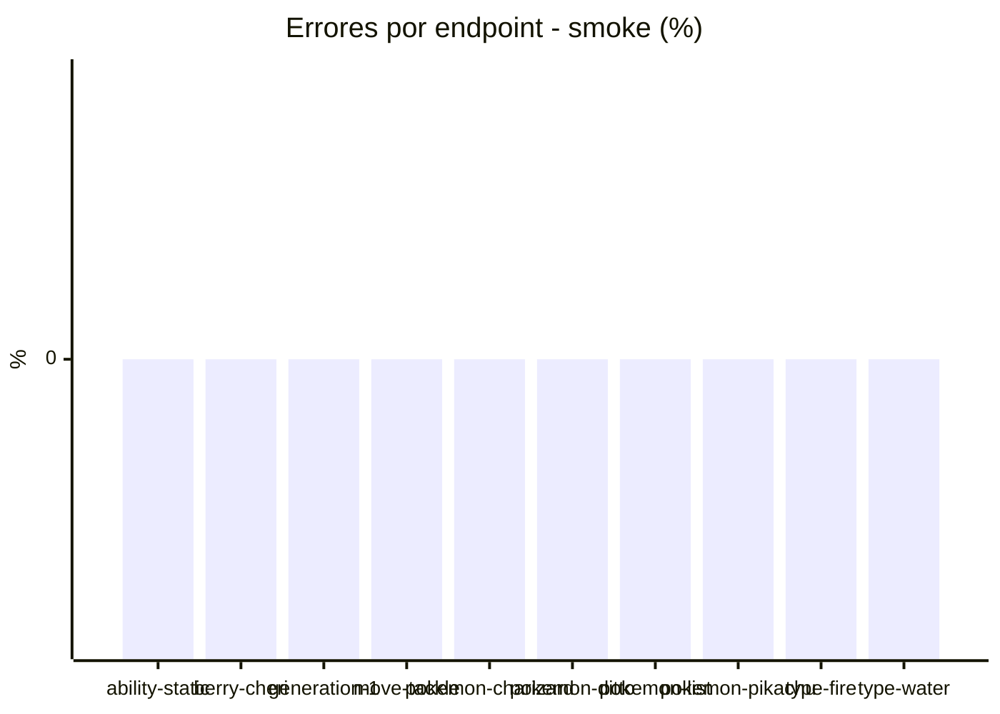

# Reporte de performance - PokeAPI

**Fecha:** 2026-07-22 15:04 UTC  
**Veredicto del agente:** `PASS`  
**Corrida:** [ver en GitHub Actions](https://github.com/lrbg/jmeter-pokeapi-lab/actions/runs/29931444646)  

## Validacion del agente de IA

PASS

1. La tasa de error general es del 0.01%, cumpliendo con el SLO (< 1%). Esto indica un buen nivel de estabilidad y fiabilidad en el servicio.
2. La latencia en percentiles p95 (14 ms) y p99 (20 ms) está muy por debajo del umbral de 800 ms definido por el SLO, lo que refleja un excelente rendimiento general.
3. Sin embargo, se observa un tiempo máximo de respuesta de 232 ms en el endpoint "pokemon-ditto", lo que podría requerir una revisión para identificar y optimizar potenciales cuellos de botella.
4. Se recomienda monitorear continuamente todos los endpoints y realizar pruebas de carga más extensas para garantizar la estabilidad del rendimiento bajo cargas futuras más altas.

## Resultados

### Escenario: `load`

| Metrica | Valor |
| --- | --- |
| Muestras | 16982 |
| Errores | 1 (0.01%) |
| Latencia media | 9.4 ms |
| p50 / p90 / p95 / p99 | 9.0 / 12.0 / 14.0 / 20.0 ms |
| Min / Max | 1 / 232 ms |
| Throughput | 142.01 req/s |
| Duracion | 119.6 s |

Detalle por endpoint

| Endpoint | Muestras | Error % | avg | p95 | p99 | req/s |
| --- | --- | --- | --- | --- | --- | --- |
| ability-static | 1698 | 0.0% | 9.1 | 13.0 | 20.0 | 14.34 |
| berry-cheri | 1698 | 0.0% | 9.0 | 14.0 | 20.0 | 14.34 |
| generation-1 | 1698 | 0.06% | 9.5 | 14.0 | 19.0 | 14.38 |
| move-tackle | 1698 | 0.0% | 9.4 | 14.0 | 19.0 | 14.38 |
| pokemon-charizard | 1698 | 0.0% | 10.5 | 15.0 | 25.0 | 14.27 |
| pokemon-ditto | 1699 | 0.0% | 9.2 | 14.0 | 19.0 | 14.21 |
| pokemon-list | 1698 | 0.0% | 8.7 | 13.0 | 19.0 | 14.31 |
| pokemon-pikachu | 1699 | 0.0% | 10.2 | 15.0 | 20.0 | 14.27 |
| type-fire | 1698 | 0.0% | 9.2 | 14.0 | 20.0 | 14.33 |
| type-water | 1698 | 0.0% | 9.0 | 13.0 | 20.0 | 14.31 |

### Escenario: `smoke`

| Metrica | Valor |
| --- | --- |
| Muestras | 159 |
| Errores | 0 (0.0%) |
| Latencia media | 20.1 ms |
| p50 / p90 / p95 / p99 | 12.0 / 19.2 / 23.1 / 49.0 ms |
| Min / Max | 7 / 1091 ms |
| Throughput | 5.52 req/s |
| Duracion | 28.8 s |

Detalle por endpoint

| Endpoint | Muestras | Error % | avg | p95 | p99 | req/s |
| --- | --- | --- | --- | --- | --- | --- |
| ability-static | 16 | 0.0% | 10.9 | 14.0 | 14.0 | 0.62 |
| berry-cheri | 16 | 0.0% | 9.8 | 12.2 | 12.8 | 0.62 |
| generation-1 | 15 | 0.0% | 12.3 | 19.5 | 27.9 | 0.62 |
| move-tackle | 16 | 0.0% | 11.8 | 17.5 | 18.7 | 0.62 |
| pokemon-charizard | 16 | 0.0% | 19.2 | 26.5 | 32.5 | 0.61 |
| pokemon-ditto | 16 | 0.0% | 78.6 | 285.5 | 929.9 | 0.58 |
| pokemon-list | 16 | 0.0% | 14.2 | 31.5 | 35.1 | 0.62 |
| pokemon-pikachu | 16 | 0.0% | 20.1 | 32.5 | 60.1 | 0.61 |
| type-fire | 16 | 0.0% | 11.5 | 17.2 | 20.2 | 0.62 |
| type-water | 16 | 0.0% | 11.8 | 17.0 | 17.0 | 0.61 |

