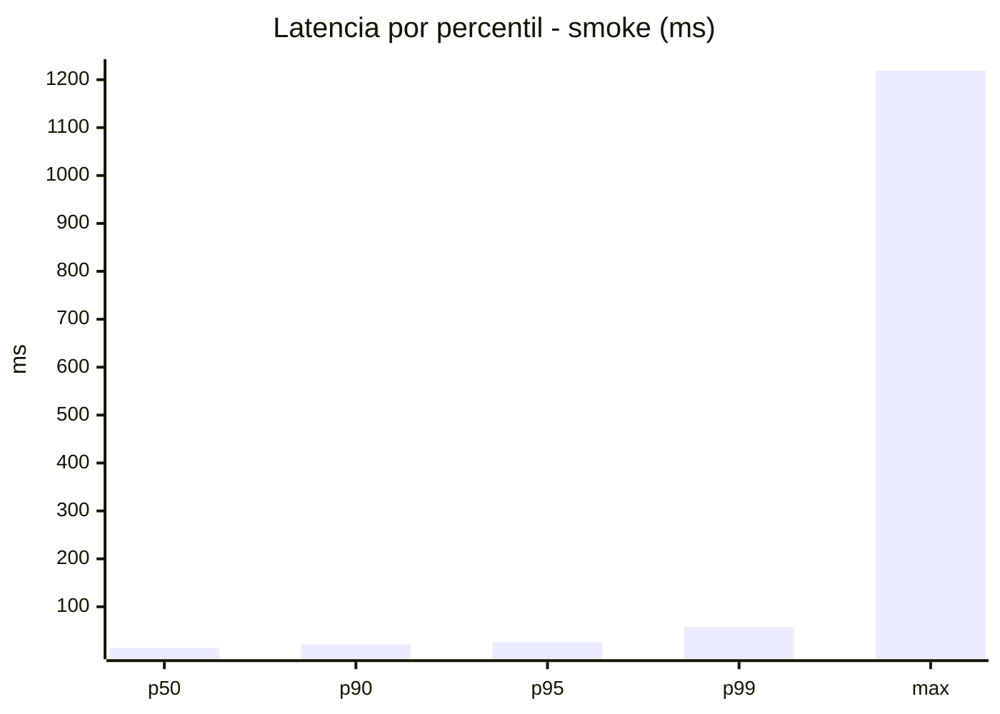
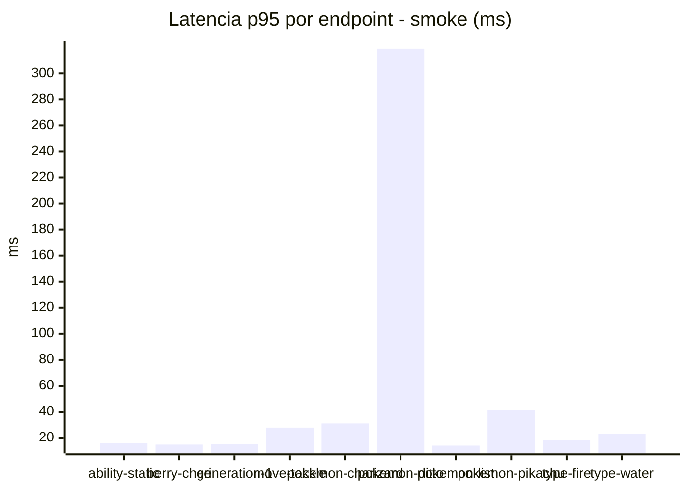
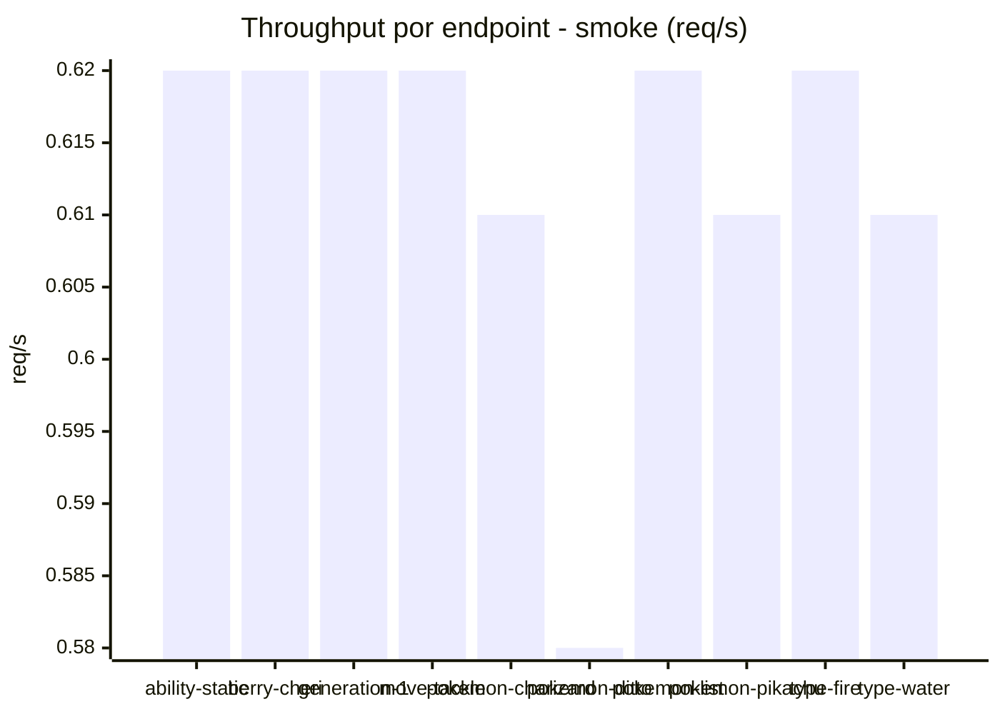
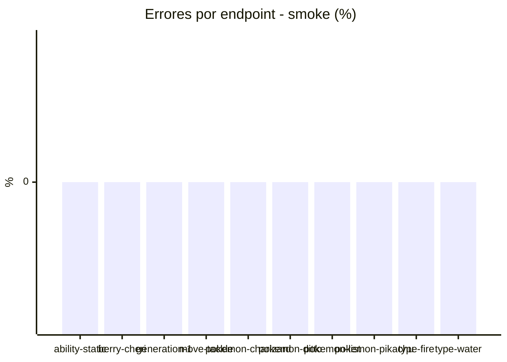

# Reporte de performance - PokeAPI

**Fecha:** 2026-07-23 15:10 UTC  
**Veredicto del agente:** `PASS`  
**Corrida:** [ver en GitHub Actions](https://github.com/rba3/Lab_CD_CI_Perfomance/actions/runs/30018881863)  

## Validacion del agente de IA

PASS

1. Todas las métricas de error están por debajo del 1%, lo que indica un rendimiento estable y confiable.
2. El percentil 95 (p95) general es de 26 ms, muy por debajo del umbral de 800 ms, lo que sugiere que las respuestas son rápidas.
3. Sin embargo, el endpoint `pokemon-ditto` presenta un máximo inusualmente alto de 1219 ms y un p95 de 319 ms; se recomienda investigar y optimizar este endpoint para reducir tiempos de respuesta.
4. Considerar monitorear el comportamiento de los endpoints en situaciones de carga más alta para asegurar que el rendimiento se mantenga estable.

## Resultados

### Escenario: `smoke`

| Metrica | Valor |
| --- | --- |
| Muestras | 158 |
| Errores | 0 (0.0%) |
| Latencia media | 23.6 ms |
| p50 / p90 / p95 / p99 | 14.0 / 21.3 / 26.0 / 57.6 ms |
| Min / Max | 11 / 1219 ms |
| Throughput | 5.45 req/s |
| Duracion | 29.0 s |

Detalle por endpoint

| Endpoint | Muestras | Error % | avg | p95 | p99 | req/s |
| --- | --- | --- | --- | --- | --- | --- |
| ability-static | 16 | 0.0% | 13.5 | 16.0 | 16.0 | 0.62 |
| berry-cheri | 16 | 0.0% | 12.7 | 15.0 | 15.0 | 0.62 |
| generation-1 | 15 | 0.0% | 13.8 | 15.3 | 15.9 | 0.62 |
| move-tackle | 15 | 0.0% | 16.5 | 28.0 | 44.8 | 0.62 |
| pokemon-charizard | 16 | 0.0% | 22.5 | 31.2 | 36.6 | 0.61 |
| pokemon-ditto | 16 | 0.0% | 89.6 | 319.0 | 1039.0 | 0.58 |
| pokemon-list | 16 | 0.0% | 13.1 | 14.2 | 14.8 | 0.62 |
| pokemon-pikachu | 16 | 0.0% | 22.8 | 41.2 | 63.4 | 0.61 |
| type-fire | 16 | 0.0% | 14.4 | 18.2 | 21.2 | 0.62 |
| type-water | 16 | 0.0% | 16.2 | 23.2 | 28.6 | 0.61 |

