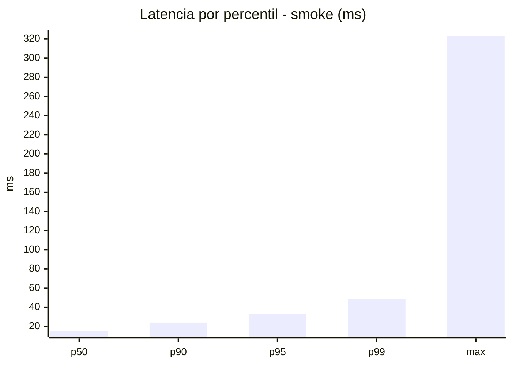
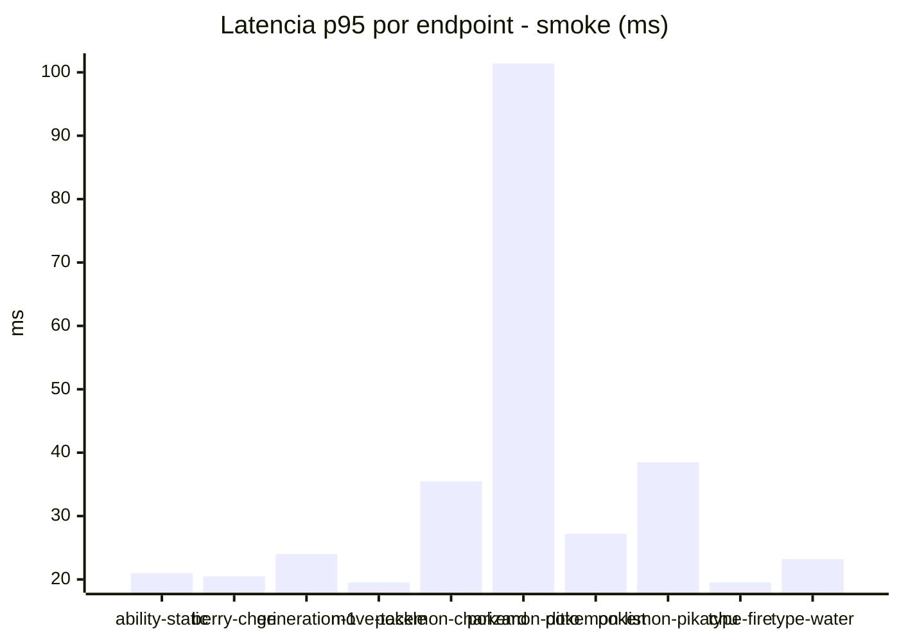
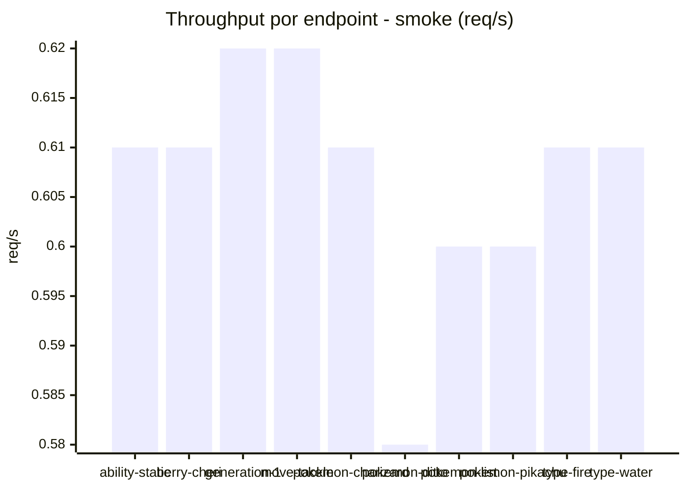
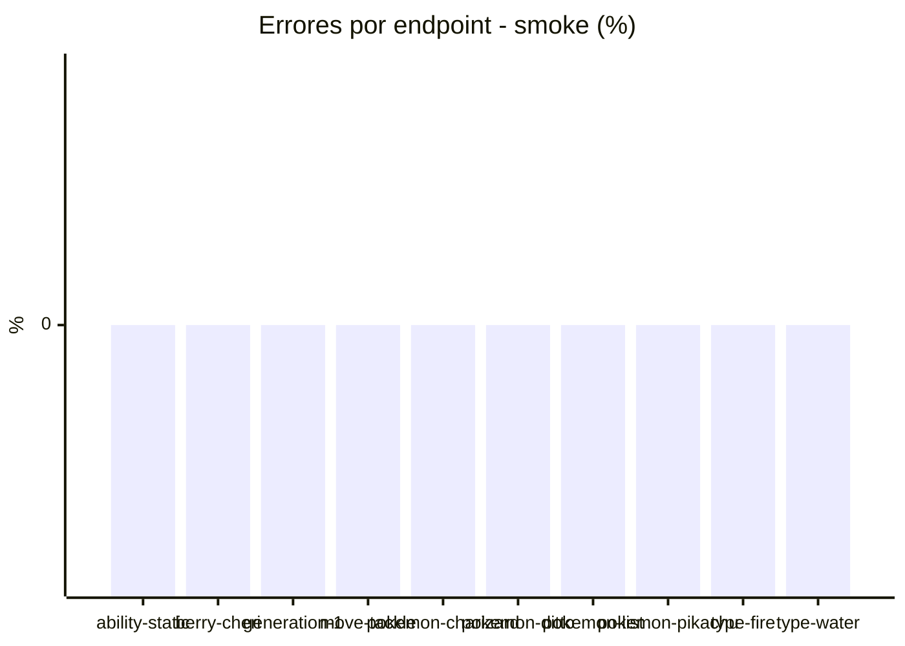

# Reporte de performance - PokeAPI

**Fecha:** 2026-07-23 16:33 UTC  
**Veredicto del agente:** `PASS`  
**Corrida:** [ver en GitHub Actions](https://github.com/rba3/Lab_CD_CI_Perfomance/actions/runs/30025543723)  

## Validacion del agente de IA

PASS

1. Todos los endpoints presentaron un 0% de errores, cumpliendo con el SLO establecido de error < 1%.
2. El p95 general de 33 ms está muy por debajo del SLO de 800 ms, lo que indica un rendimiento excelente.
3. Aunque los tiempos de respuesta son generalmente buenos, el endpoint "pokemon-ditto" presenta un máximo de 323 ms y un p95 de 101.4 ms, que son significativamente más altos que el resto. Se recomienda investigar y optimizar este endpoint para mejorar su rendimiento.
4. El throughput promedio es de 5.51 RPS, lo que muestra que el sistema puede manejar bien la carga actual. Continuar monitoreando el rendimiento a medida que aumentan los usuarios es esencial para detectar posibles problemas futuros.

## Resultados

### Escenario: `smoke`

| Metrica | Valor |
| --- | --- |
| Muestras | 161 |
| Errores | 0 (0.0%) |
| Latencia media | 19.3 ms |
| p50 / p90 / p95 / p99 | 15.0 / 24.0 / 33.0 / 48.4 ms |
| Min / Max | 11 / 323 ms |
| Throughput | 5.51 req/s |
| Duracion | 29.2 s |

Detalle por endpoint

| Endpoint | Muestras | Error % | avg | p95 | p99 | req/s |
| --- | --- | --- | --- | --- | --- | --- |
| ability-static | 16 | 0.0% | 15.3 | 21.0 | 23.4 | 0.61 |
| berry-cheri | 16 | 0.0% | 14.4 | 20.5 | 24.1 | 0.61 |
| generation-1 | 16 | 0.0% | 16.3 | 24.0 | 36.0 | 0.62 |
| move-tackle | 16 | 0.0% | 15.1 | 19.5 | 20.7 | 0.62 |
| pokemon-charizard | 16 | 0.0% | 22.5 | 35.5 | 41.5 | 0.61 |
| pokemon-ditto | 17 | 0.0% | 34.9 | 101.4 | 278.7 | 0.58 |
| pokemon-list | 16 | 0.0% | 17.2 | 27.2 | 47.0 | 0.6 |
| pokemon-pikachu | 16 | 0.0% | 22.9 | 38.5 | 42.1 | 0.6 |
| type-fire | 16 | 0.0% | 15.7 | 19.5 | 23.1 | 0.61 |
| type-water | 16 | 0.0% | 17.1 | 23.2 | 26.2 | 0.61 |

