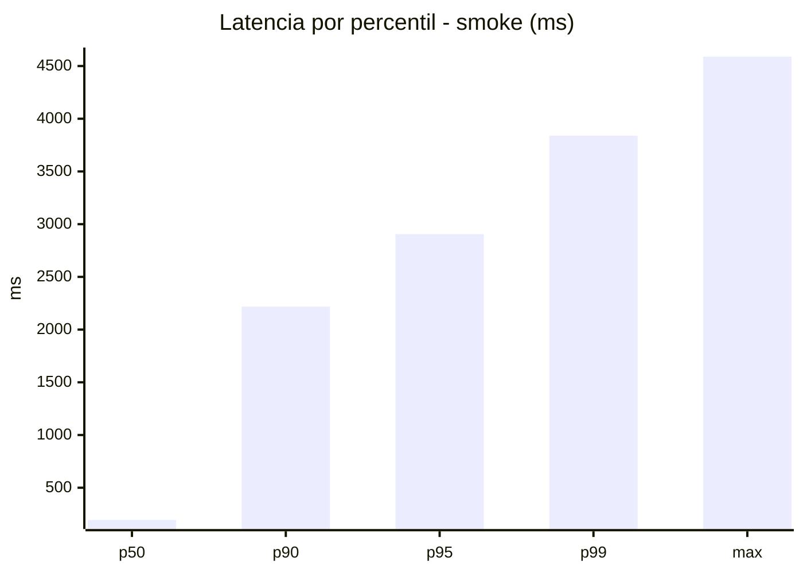
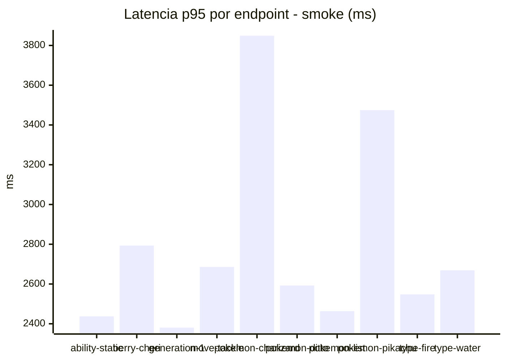
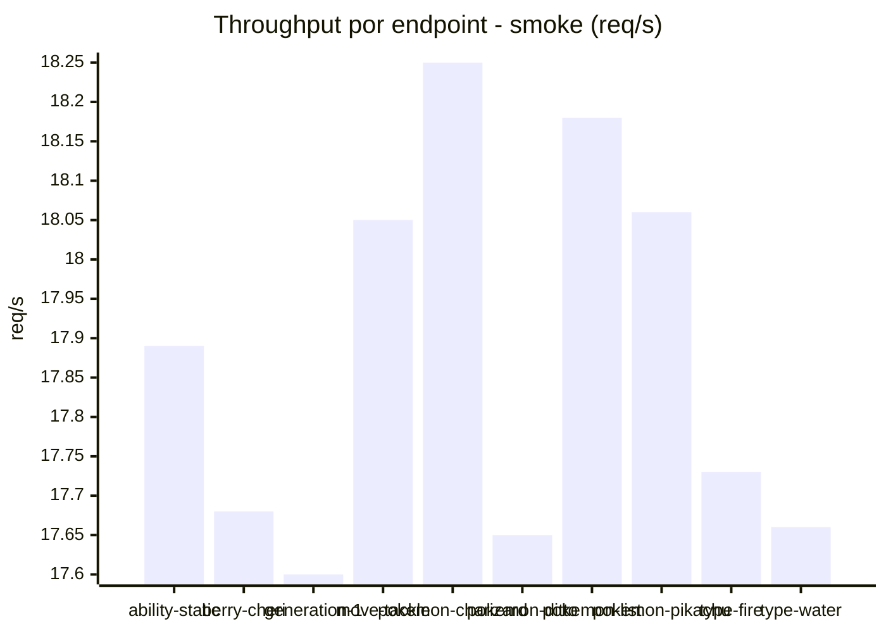
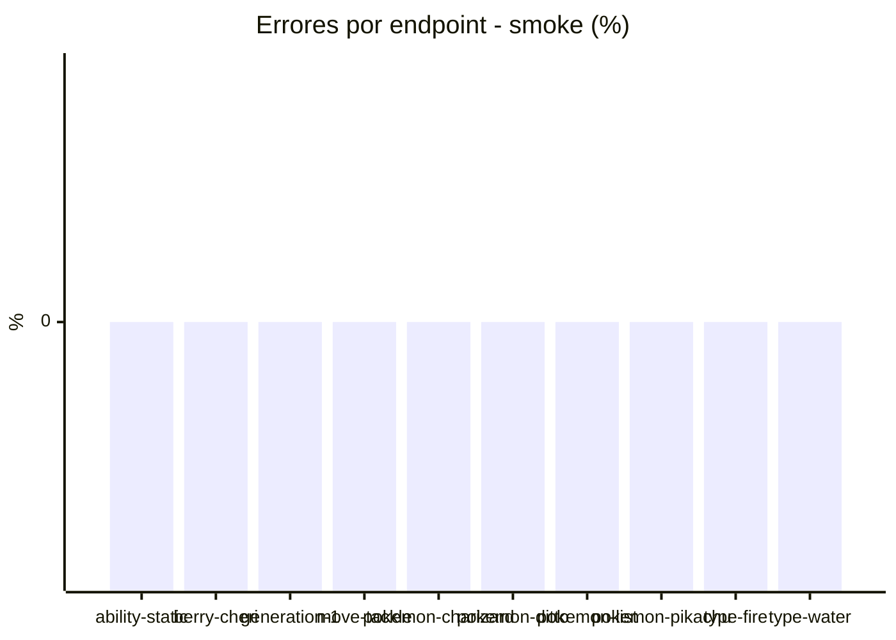

# Reporte de performance - PokeAPI

**Fecha:** 2026-07-24 18:46 UTC  
**Veredicto del agente:** `FAIL`  
**Corrida:** [ver en GitHub Actions](https://github.com/rba3/Lab_CD_CI_Perfomance/actions/runs/30118208737)  

## Validacion del agente de IA

FAIL  
1. A pesar de no haber errores (0%), el tiempo de respuesta del 95% de los casos (p95) está por encima del umbral aceptable, alcanzando 2905.6 ms, muy superior a los 800 ms establecidos en los SLOs.  
2. El endpoint "pokemon-charizard" tiene un p95 de 3849.1 ms, lo que sugiere que este endpoint es un gran contribuyente a la latencia general. Es recomendable optimizar o revisar el rendimiento de este endpoint.  
3. Muchas métricas en los diferentes endpoints muestran tiempos elevados, especialmente en los percentiles p90 y p95. Se recomienda realizar un análisis detallado de la base de datos y del código para identificar cuellos de botella.  
4. Se sugiere implementar cachés donde sea posible y revisar la infraestructura para asegurar que pueda manejar la concurrencia máxima sin degradar el rendimiento.

## Resultados

### Escenario: `smoke`

| Metrica | Valor |
| --- | --- |
| Muestras | 1002 |
| Errores | 0 (0.0%) |
| Latencia media | 664.9 ms |
| p50 / p90 / p95 / p99 | 194.0 / 2217.9 / 2905.6 / 3839.1 ms |
| Min / Max | 5 / 4589 ms |
| Throughput | 177.38 req/s |
| Duracion | 5.6 s |

Detalle por endpoint

| Endpoint | Muestras | Error % | avg | p95 | p99 | req/s |
| --- | --- | --- | --- | --- | --- | --- |
| ability-static | 100 | 0.0% | 566.2 | 2437.3 | 3528.0 | 17.89 |
| berry-cheri | 99 | 0.0% | 493.8 | 2793.3 | 3166.6 | 17.68 |
| generation-1 | 99 | 0.0% | 607.0 | 2380.7 | 2963.3 | 17.6 |
| move-tackle | 101 | 0.0% | 628.6 | 2686.0 | 3239.0 | 18.05 |
| pokemon-charizard | 103 | 0.0% | 1101.6 | 3849.1 | 4297.7 | 18.25 |
| pokemon-ditto | 99 | 0.0% | 618.4 | 2592.4 | 3385.8 | 17.65 |
| pokemon-list | 102 | 0.0% | 479.7 | 2463.3 | 2960.5 | 18.18 |
| pokemon-pikachu | 102 | 0.0% | 1007.5 | 3474.5 | 4022.0 | 18.06 |
| type-fire | 99 | 0.0% | 536.2 | 2547.9 | 3455.6 | 17.73 |
| type-water | 98 | 0.0% | 588.7 | 2668.8 | 3460.5 | 17.66 |

