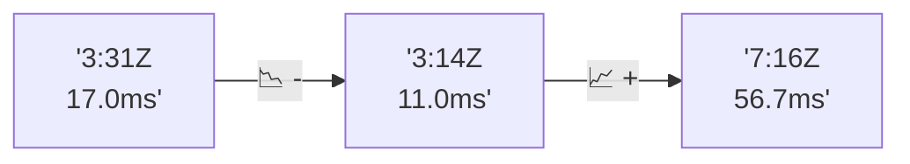

# 📊 Reporte de Performance - PokeAPI

**Fecha de corrida:** 2026-07-24 19:49 UTC

**Enlace:** [30121697595](https://github.com/rba3/Lab_CD_CI_Perfomance/actions/runs/30121697595)

## ✅ Veredicto

```
PASS

1. Todos los endpoints presentaron un error del 0%, cumpliendo con el SLO de error de < 1%. Esto indica que la aplicación está manejando adecuadamente las solicitudes sin fallos.

2. El percentil 95 (p95) para todas las métricas de tiempo de respuesta se sitúa muy por debajo del umbral de 800 ms, con un p95 general de 18.9 ms, lo que indica un rendimiento excelente.

3. Sin embargo, el endpoint "pokemon-ditto" mostró un p95 de 96 ms y un máximo de 352 ms. Se recomienda investigar y optimizar este endpoint para evitar posibles aumentos en los tiempos de respuesta.

4. Considerar una revisión de la infraestructura para manejar un incremento en el throughput (actualmente 5.59 rps), asegurando que pueda escalar adecuadamente si la carga de trabajo aumenta.
```

## 🔮 Predicciones

⚠️ **Tendencia de degradación detectada** (MEDIUM risk)
- Pendiente: +19.85ms/corrida
- P95 actual: 18.9ms
- Días hasta WARN: ~39
- Días hasta FAIL: ~74
- Confianza: 40%

## 📈 Métricas Globales

| Métrica | Valor | SLO | Estado |
|---------|-------|-----|--------|
| Error Rate | 0.0% | < 0.1% | ✅ PASS |
| Latencia p50 | 10.0ms | - | ℹ️ |
| Latencia p95 | 18.9ms | < 800ms | ✅ PASS |
| Latencia p99 | 32.0ms | - | ℹ️ |
| Throughput | 0.00 req/s | - | ℹ️ |
| Muestras | 0 | - | ℹ️ |

## 📉 Tendencia Histórica (Últimas 7 corridas)



## 🔧 Análisis Técnico Detallado (JSON)

```json
{
  "predictions": {
    "prediction": "DEGRADATION_TREND",
    "confidence": 40,
    "slope_ms_per_run": 19.85,
    "current_p95": 18.9,
    "days_to_warn": 39,
    "days_to_fail": 74,
    "risk_level": "MEDIUM"
  },
  "recommendations": [],
  "correlations": {},
  "root_cause": {
    "issue": null,
    "root_cause": null,
    "confidence": 0,
    "evidence": []
  },
  "timestamp": "2026-07-24T19:49:40.401542"
}
```

## 📦 Datos Completos (JSON)

```json
{
  "scenario": "smoke",
  "overall": {
    "samples": 162,
    "errors": 0,
    "error_pct": 0.0,
    "avg_ms": 13.6,
    "min_ms": 7,
    "max_ms": 352,
    "p50_ms": 10.0,
    "p90_ms": 16.9,
    "p95_ms": 18.9,
    "p99_ms": 32.0,
    "throughput_rps": 5.59,
    "duration_s": 29.0
  },
  "by_endpoint": {
    "ability-static": {
      "samples": 16,
      "errors": 0,
      "error_pct": 0.0,
      "avg_ms": 10.2,
      "min_ms": 8,
      "max_ms": 16,
      "p50_ms": 10.0,
      "p90_ms": 11.0,
      "p95_ms": 12.2,
      "p99_ms": 15.2,
      "throughput_rps": 0.62,
      "duration_s": 25.8
    },
    "berry-cheri": {
      "samples": 16,
      "errors": 0,
      "error_pct": 0.0,
      "avg_ms": 8.9,
      "min_ms": 7,
      "max_ms": 13,
      "p50_ms": 8.5,
      "p90_ms": 10.5,
      "p95_ms": 11.5,
      "p99_ms": 12.7,
      "throughput_rps": 0.62,
      "duration_s": 25.8
    },
    "generation-1": {
      "samples": 16,
      "errors": 0,
      "error_pct": 0.0,
      "avg_ms": 9.8,
      "min_ms": 8,
      "max_ms": 14,
      "p50_ms": 9.0,
      "p90_ms": 12.5,
      "p95_ms": 14.0,
      "p99_ms": 14.0,
      "throughput_rps": 0.62,
      "duration_s": 25.6
    },
    "move-tackle": {
      "samples": 16,
      "errors": 0,
      "error_pct": 0.0,
      "avg_ms": 10.8,
      "min_ms": 8,
      "max_ms": 14,
      "p50_ms": 11.0,
      "p90_ms": 13.0,
      "p95_ms": 13.2,
      "p99_ms": 13.8,
      "throughput_rps": 0.63,
      "duration_s": 25.5
    },
    "pokemon-charizard": {
      "samples": 16,
      "errors": 0,
      "error_pct": 0.0,
      "avg_ms": 16.9,
      "min_ms": 11,
      "max_ms": 27,
      "p50_ms": 16.5,
      "p90_ms": 21.5,
      "p95_ms": 23.2,
      "p99_ms": 26.2,
      "throughput_rps": 0.61,
      "duration_s": 26.1
    },
    "pokemon-ditto": {
      "samples": 17,
      "errors": 0,
      "error_pct": 0.0,
      "avg_ms": 31.5,
      "min_ms": 8,
      "max_ms": 352,
      "p50_ms": 10.0,
      "p90_ms": 22.4,
      "p95_ms": 96.0,
      "p99_ms": 300.8,
      "throughput_rps": 0.59,
      "duration_s": 28.9
    },
    "pokemon-list": {
      "samples": 16,
      "errors": 0,
      "error_pct": 0.0,
      "avg_ms": 11.1,
      "min_ms": 7,
      "max_ms": 32,
      "p50_ms": 10.0,
      "p90_ms": 12.0,
      "p95_ms": 17.0,
      "p99_ms": 29.0,
      "throughput_rps": 0.61,
      "duration_s": 26.2
    },
    "pokemon-pikachu": {
      "samples": 17,
      "errors": 0,
      "error_pct": 0.0,
      "avg_ms": 15.3,
      "min_ms": 10,
      "max_ms": 27,
      "p50_ms": 14.0,
      "p90_ms": 18.0,
      "p95_ms": 19.8,
      "p99_ms": 25.6,
      "throughput_rps": 0.6,
      "duration_s": 28.1
    },
    "type-fire": {
      "samples": 16,
      "errors": 0,
      "error_pct": 0.0,
      "avg_ms": 9.8,
      "min_ms": 8,
      "max_ms": 13,
      "p50_ms": 9.5,
      "p90_ms": 11.0,
      "p95_ms": 11.5,
      "p99_ms": 12.7,
      "throughput_rps": 0.62,
      "duration_s": 25.8
    },
    "type-water": {
      "samples": 16,
      "errors": 0,
      "error_pct": 0.0,
      "avg_ms": 10.5,
      "min_ms": 8,
      "max_ms": 13,
      "p50_ms": 10.0,
      "p90_ms": 12.0,
      "p95_ms": 12.2,
      "p99_ms": 12.8,
      "throughput_rps": 0.62,
      "duration_s": 26.0
    }
  },
  "empty": false
}
```

---

*Reporte generado automáticamente por el workflow de performance.*

*Timestamp: 2026-07-24T19:49:40.403021Z*
