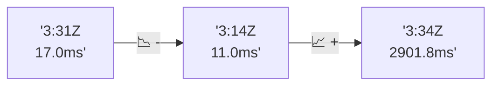

# 📊 Reporte de Performance - PokeAPI

**Fecha de corrida:** 2026-07-24 22:08 UTC

**Enlace:** [30129990268](https://github.com/rba3/Lab_CD_CI_Perfomance/actions/runs/30129990268)

## ✅ Veredicto

```
PASS

1. La tasa de errores es de 0.02%, lo cual está muy por debajo del SLO establecido (<1%), lo que indica un sistema confiable en términos de errores.

2. El p95 es de 28 ms, también por debajo del umbral deseado de 800 ms, lo que significa que la mayoría de las solicitudes se manejan rápidamente.

3. Se han observado algunos picos de latencia en endpoints específicos, como "pokemon-charizard" con un tiempo máximo de respuesta de 405 ms. Se recomienda investigar la causa de estos picos y realizar optimizaciones en el backend si es necesario.

4. La capacidad de procesamiento es excelente, con un throughput promedio de 178.39 solicitudes por segundo, lo que sugiere que el sistema puede manejar cargas altas sin problemas. Se podría considerar incrementar la carga para observar el comportamiento ante condiciones más extremas.
```

## 🔮 Predicciones

⚠️ **Tendencia de degradación detectada** (CRITICAL risk)
- Pendiente: +1442.4ms/corrida
- P95 actual: 28.0ms
- Días hasta FAIL: ~1
- Confianza: 40%

## 📈 Métricas Globales

| Métrica | Valor | SLO | Estado |
|---------|-------|-----|--------|
| Error Rate | 0.02% | < 0.1% | ✅ PASS |
| Latencia p50 | 17.0ms | - | ℹ️ |
| Latencia p95 | 28.0ms | < 800ms | ✅ PASS |
| Latencia p99 | 49.0ms | - | ℹ️ |
| Throughput | 0.00 req/s | - | ℹ️ |
| Muestras | 0 | - | ℹ️ |

## 📉 Tendencia Histórica (Últimas 7 corridas)



## 🔧 Análisis Técnico Detallado (JSON)

```json
{
  "predictions": {
    "prediction": "DEGRADATION_TREND",
    "confidence": 40,
    "slope_ms_per_run": 1442.4,
    "current_p95": 28.0,
    "days_to_warn": 0,
    "days_to_fail": 1,
    "risk_level": "CRITICAL"
  },
  "recommendations": [],
  "correlations": {},
  "root_cause": {
    "issue": null,
    "root_cause": null,
    "confidence": 0,
    "evidence": []
  },
  "timestamp": "2026-07-24T22:08:29.735429"
}
```

## 📦 Datos Completos (JSON)

```json
{
  "scenario": "smoke",
  "overall": {
    "samples": 5212,
    "errors": 1,
    "error_pct": 0.02,
    "avg_ms": 19.2,
    "min_ms": 13,
    "max_ms": 434,
    "p50_ms": 17.0,
    "p90_ms": 22.0,
    "p95_ms": 28.0,
    "p99_ms": 49.0,
    "throughput_rps": 178.39,
    "duration_s": 29.2
  },
  "by_endpoint": {
    "ability-static": {
      "samples": 522,
      "errors": 0,
      "error_pct": 0.0,
      "avg_ms": 17.7,
      "min_ms": 13,
      "max_ms": 173,
      "p50_ms": 17.0,
      "p90_ms": 20.0,
      "p95_ms": 22.0,
      "p99_ms": 43.6,
      "throughput_rps": 18.02,
      "duration_s": 29.0
    },
    "berry-cheri": {
      "samples": 520,
      "errors": 0,
      "error_pct": 0.0,
      "avg_ms": 17.5,
      "min_ms": 13,
      "max_ms": 101,
      "p50_ms": 16.0,
      "p90_ms": 20.0,
      "p95_ms": 22.0,
      "p99_ms": 42.6,
      "throughput_rps": 18.04,
      "duration_s": 28.8
    },
    "generation-1": {
      "samples": 522,
      "errors": 0,
      "error_pct": 0.0,
      "avg_ms": 18.4,
      "min_ms": 14,
      "max_ms": 129,
      "p50_ms": 17.0,
      "p90_ms": 21.0,
      "p95_ms": 23.9,
      "p99_ms": 50.6,
      "throughput_rps": 18.11,
      "duration_s": 28.8
    },
    "move-tackle": {
      "samples": 520,
      "errors": 0,
      "error_pct": 0.0,
      "avg_ms": 18.4,
      "min_ms": 13,
      "max_ms": 77,
      "p50_ms": 17.0,
      "p90_ms": 21.0,
      "p95_ms": 24.0,
      "p99_ms": 43.8,
      "throughput_rps": 18.06,
      "duration_s": 28.8
    },
    "pokemon-charizard": {
      "samples": 522,
      "errors": 1,
      "error_pct": 0.19,
      "avg_ms": 24.6,
      "min_ms": 16,
      "max_ms": 405,
      "p50_ms": 20.0,
      "p90_ms": 36.0,
      "p95_ms": 43.0,
      "p99_ms": 72.8,
      "throughput_rps": 17.9,
      "duration_s": 29.2
    },
    "pokemon-ditto": {
      "samples": 521,
      "errors": 0,
      "error_pct": 0.0,
      "avg_ms": 19.1,
      "min_ms": 13,
      "max_ms": 409,
      "p50_ms": 17.0,
      "p90_ms": 22.0,
      "p95_ms": 24.0,
      "p99_ms": 48.8,
      "throughput_rps": 17.86,
      "duration_s": 29.2
    },
    "pokemon-list": {
      "samples": 522,
      "errors": 0,
      "error_pct": 0.0,
      "avg_ms": 17.2,
      "min_ms": 13,
      "max_ms": 308,
      "p50_ms": 15.0,
      "p90_ms": 19.0,
      "p95_ms": 21.0,
      "p99_ms": 50.3,
      "throughput_rps": 17.93,
      "duration_s": 29.1
    },
    "pokemon-pikachu": {
      "samples": 521,
      "errors": 0,
      "error_pct": 0.0,
      "avg_ms": 22.8,
      "min_ms": 14,
      "max_ms": 434,
      "p50_ms": 20.0,
      "p90_ms": 31.0,
      "p95_ms": 38.0,
      "p99_ms": 66.0,
      "throughput_rps": 17.86,
      "duration_s": 29.2
    },
    "type-fire": {
      "samples": 521,
      "errors": 0,
      "error_pct": 0.0,
      "avg_ms": 18.0,
      "min_ms": 13,
      "max_ms": 208,
      "p50_ms": 17.0,
      "p90_ms": 20.0,
      "p95_ms": 22.0,
      "p99_ms": 41.4,
      "throughput_rps": 17.98,
      "duration_s": 29.0
    },
    "type-water": {
      "samples": 521,
      "errors": 0,
      "error_pct": 0.0,
      "avg_ms": 17.7,
      "min_ms": 13,
      "max_ms": 260,
      "p50_ms": 16.0,
      "p90_ms": 20.0,
      "p95_ms": 22.0,
      "p99_ms": 40.8,
      "throughput_rps": 17.95,
      "duration_s": 29.0
    }
  },
  "empty": false
}
```

---

*Reporte generado automáticamente por el workflow de performance.*

*Timestamp: 2026-07-24T22:08:29.736382Z*
