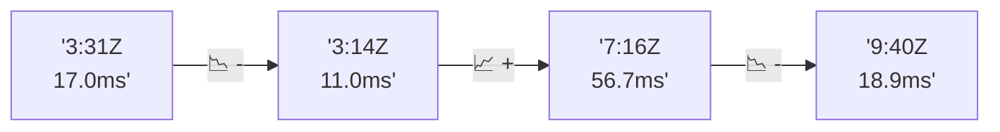

# 📊 Reporte de Performance - PokeAPI

**Fecha de corrida:** 2026-07-24 23:53 UTC

**Enlace:** [30134921337](https://github.com/rba3/Lab_CD_CI_Perfomance/actions/runs/30134921337)

## ✅ Veredicto

```
FAIL  
1. El porcentaje de errores es del 7.64%, superando el SLO de referencia del 1%, lo que indica que hay un problema significativo en la estabilidad del sistema. Se debe investigar la causa de estos errores, especialmente en el endpoint "move-tackle", que presenta un 50% de errores.  
2. El tiempo de respuesta p95 promedio es de 112.8 ms, lo cual está dentro de los límites, pero el endpoint "pokemon-ditto" tiene un tiempo máximo de respuesta de 1164 ms, lo que impacta negativamente en la experiencia del usuario. Se recomienda optimizar este endpoint.  
3. Se sugiere realizar un análisis más detallado en los endpoints con errores y tiempos de respuesta elevados, y considerar revisiones en la infraestructura que podría estar causando cuellos de botella o una gestión inadecuada de las conexiones.  
4. Implementar un monitoreo continuo para identificar problemas en tiempo real y realizar pruebas más exhaustivas en entornos de producción.
```

## 🔮 Predicciones

⚠️ **Tendencia de degradación detectada** (LOW risk)
- Pendiente: +0.63ms/corrida
- P95 actual: 112.8ms
- Días hasta WARN: ~1085
- Días hasta FAIL: ~2190
- Confianza: 60%

## 💡 Recomendaciones Prioritarias

🔴 **Tasa de error global crítica**
   - Posibles causas: Problema sistémico (BD caída, network desconectada), PokeAPI inestable
   - Acciones: Revisar estado de PokeAPI (status.pokeapi.co), Revisar logs de la corrida

## 🎯 Causa Raíz Identificada

**Latencia inconsistente (outliers)**
- Causa probable: Spikes de latencia, posible GC o context switching
- Confianza: 75%
- Evidencia:
  - p50 (9.0ms) mucho menor que p95 (112.8ms)
  - Diferencia de 3x+ indica distribución anómala

## 📈 Métricas Globales

| Métrica | Valor | SLO | Estado |
|---------|-------|-----|--------|
| Error Rate | 7.64% | < 0.1% | ❌ FAIL |
| Latencia p50 | 9.0ms | - | ℹ️ |
| Latencia p95 | 112.8ms | < 800ms | ✅ PASS |
| Latencia p99 | 164.3ms | - | ℹ️ |
| Throughput | 0.00 req/s | - | ℹ️ |
| Muestras | 0 | - | ℹ️ |

## 📉 Tendencia Histórica (Últimas 7 corridas)



## 🔧 Análisis Técnico Detallado (JSON)

```json
{
  "predictions": {
    "prediction": "DEGRADATION_TREND",
    "confidence": 60,
    "slope_ms_per_run": 0.63,
    "current_p95": 112.8,
    "days_to_warn": 1085,
    "days_to_fail": 2190,
    "risk_level": "LOW"
  },
  "recommendations": [
    {
      "issue": "Tasa de error global cr\u00edtica",
      "severity": "CRITICAL",
      "causes": [
        "Problema sist\u00e9mico (BD ca\u00edda, network desconectada)",
        "PokeAPI inestable",
        "Assertions muy restrictivas"
      ],
      "fixes": [
        "Revisar estado de PokeAPI (status.pokeapi.co)",
        "Revisar logs de la corrida",
        "Considerar relajar assertions",
        "Abrir issue en PokeAPI si es su problema"
      ]
    }
  ],
  "correlations": {},
  "root_cause": {
    "issue": "Latencia inconsistente (outliers)",
    "root_cause": "Spikes de latencia, posible GC o context switching",
    "confidence": 75,
    "evidence": [
      "p50 (9.0ms) mucho menor que p95 (112.8ms)",
      "Diferencia de 3x+ indica distribuci\u00f3n an\u00f3mala"
    ]
  },
  "timestamp": "2026-07-24T23:53:29.674835"
}
```

## 📦 Datos Completos (JSON)

```json
{
  "scenario": "smoke",
  "overall": {
    "samples": 157,
    "errors": 12,
    "error_pct": 7.64,
    "avg_ms": 26.3,
    "min_ms": 6,
    "max_ms": 1164,
    "p50_ms": 9.0,
    "p90_ms": 21.2,
    "p95_ms": 112.8,
    "p99_ms": 164.3,
    "throughput_rps": 5.45,
    "duration_s": 28.8
  },
  "by_endpoint": {
    "ability-static": {
      "samples": 12,
      "errors": 0,
      "error_pct": 0.0,
      "avg_ms": 8.9,
      "min_ms": 7,
      "max_ms": 13,
      "p50_ms": 8.5,
      "p90_ms": 11.8,
      "p95_ms": 12.4,
      "p99_ms": 12.9,
      "throughput_rps": 0.48,
      "duration_s": 24.9
    },
    "berry-cheri": {
      "samples": 12,
      "errors": 0,
      "error_pct": 0.0,
      "avg_ms": 8.1,
      "min_ms": 7,
      "max_ms": 11,
      "p50_ms": 8.0,
      "p90_ms": 9.9,
      "p95_ms": 10.4,
      "p99_ms": 10.9,
      "throughput_rps": 0.49,
      "duration_s": 24.6
    },
    "generation-1": {
      "samples": 12,
      "errors": 0,
      "error_pct": 0.0,
      "avg_ms": 10.5,
      "min_ms": 7,
      "max_ms": 37,
      "p50_ms": 8.0,
      "p90_ms": 9.0,
      "p95_ms": 21.6,
      "p99_ms": 33.9,
      "throughput_rps": 0.48,
      "duration_s": 24.9
    },
    "move-tackle": {
      "samples": 24,
      "errors": 12,
      "error_pct": 50.0,
      "avg_ms": 65.4,
      "min_ms": 7,
      "max_ms": 166,
      "p50_ms": 52.5,
      "p90_ms": 143.5,
      "p95_ms": 160.3,
      "p99_ms": 165.3,
      "throughput_rps": 0.94,
      "duration_s": 25.4
    },
    "pokemon-charizard": {
      "samples": 12,
      "errors": 0,
      "error_pct": 0.0,
      "avg_ms": 15.5,
      "min_ms": 12,
      "max_ms": 23,
      "p50_ms": 14.5,
      "p90_ms": 17.9,
      "p95_ms": 20.2,
      "p99_ms": 22.5,
      "throughput_rps": 0.47,
      "duration_s": 25.3
    },
    "pokemon-chikorita": {
      "samples": 12,
      "errors": 0,
      "error_pct": 0.0,
      "avg_ms": 12.8,
      "min_ms": 9,
      "max_ms": 17,
      "p50_ms": 12.0,
      "p90_ms": 16.7,
      "p95_ms": 17.0,
      "p99_ms": 17.0,
      "throughput_rps": 0.49,
      "duration_s": 24.6
    },
    "pokemon-ditto": {
      "samples": 13,
      "errors": 0,
      "error_pct": 0.0,
      "avg_ms": 97,
      "min_ms": 6,
      "max_ms": 1164,
      "p50_ms": 8.0,
      "p90_ms": 9.8,
      "p95_ms": 471.6,
      "p99_ms": 1025.5,
      "throughput_rps": 0.45,
      "duration_s": 28.8
    },
    "pokemon-list": {
      "samples": 12,
      "errors": 0,
      "error_pct": 0.0,
      "avg_ms": 8.3,
      "min_ms": 6,
      "max_ms": 10,
      "p50_ms": 8.0,
      "p90_ms": 9.0,
      "p95_ms": 9.4,
      "p99_ms": 9.9,
      "throughput_rps": 0.48,
      "duration_s": 25.0
    },
    "pokemon-pikachu": {
      "samples": 12,
      "errors": 0,
      "error_pct": 0.0,
      "avg_ms": 17,
      "min_ms": 11,
      "max_ms": 51,
      "p50_ms": 14.0,
      "p90_ms": 19.5,
      "p95_ms": 33.9,
      "p99_ms": 47.6,
      "throughput_rps": 0.48,
      "duration_s": 25.2
    },
    "type-fire": {
      "samples": 24,
      "errors": 0,
      "error_pct": 0.0,
      "avg_ms": 8.3,
      "min_ms": 7,
      "max_ms": 10,
      "p50_ms": 8.0,
      "p90_ms": 9.7,
      "p95_ms": 10.0,
      "p99_ms": 10.0,
      "throughput_rps": 0.92,
      "duration_s": 26.0
    },
    "type-water": {
      "samples": 12,
      "errors": 0,
      "error_pct": 0.0,
      "avg_ms": 10.1,
      "min_ms": 7,
      "max_ms": 15,
      "p50_ms": 9.0,
      "p90_ms": 12.9,
      "p95_ms": 13.9,
      "p99_ms": 14.8,
      "throughput_rps": 0.48,
      "duration_s": 25.1
    }
  },
  "empty": false
}
```

---

*Reporte generado automáticamente por el workflow de performance.*

*Timestamp: 2026-07-24T23:53:29.676376Z*
