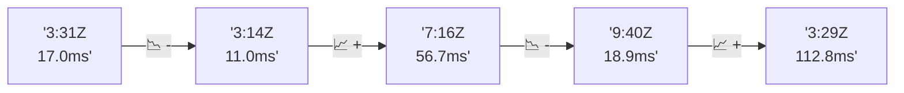

# 📊 Reporte de Performance - PokeAPI

**Fecha de corrida:** 2026-07-25 00:03 UTC

**Enlace:** [30135324862](https://github.com/rba3/Lab_CD_CI_Perfomance/actions/runs/30135324862)

## ✅ Veredicto

```
PASS

1. Todos los endpoints han registrado un porcentaje de error del 0%, cumpliendo con el SLO de error < 1%. Esto indica que el sistema es estable y confiable durante la prueba.

2. La media de tiempo de respuesta general (28.1 ms) y el percentil 95 (16.4 ms) están muy por debajo del umbral establecido de 800 ms, lo que sugiere un rendimiento excelente en la mayoría de los casos.

3. Sin embargo, se identifica un problema significativo con el endpoint `pokemon-ditto`, que presenta un tiempo máximo de 2075 ms y un percentil 95 de 837.2 ms, lo que excede el SLO. Es recomendable investigar la causa de esta latencia y optimizar el rendimiento para este endpoint en particular.

4. También se debe prestar atención al endpoint `pokemon-pikachu`, que tiene un tiempo máximo de 710 ms y un percentil 95 de 329.4 ms. Aunque no excede el SLO, deberías considerar estrategias para reducir su latencia y mejorar la experiencia del usuario.
```

## 🔮 Predicciones

⚠️ **Tendencia de degradación detectada** (MEDIUM risk)
- Pendiente: +23.95ms/corrida
- P95 actual: 16.4ms
- Días hasta WARN: ~32
- Días hasta FAIL: ~61
- Confianza: 80%

## 📈 Métricas Globales

| Métrica | Valor | SLO | Estado |
|---------|-------|-----|--------|
| Error Rate | 0.0% | < 0.1% | ✅ PASS |
| Latencia p50 | 9.0ms | - | ℹ️ |
| Latencia p95 | 16.4ms | < 800ms | ✅ PASS |
| Latencia p99 | 367.3ms | - | ℹ️ |
| Throughput | 0.00 req/s | - | ℹ️ |
| Muestras | 0 | - | ℹ️ |

## 📉 Tendencia Histórica (Últimas 7 corridas)



## 🔧 Análisis Técnico Detallado (JSON)

```json
{
  "predictions": {
    "prediction": "DEGRADATION_TREND",
    "confidence": 80,
    "slope_ms_per_run": 23.95,
    "current_p95": 16.4,
    "days_to_warn": 32,
    "days_to_fail": 61,
    "risk_level": "MEDIUM"
  },
  "recommendations": [],
  "correlations": {},
  "root_cause": {
    "issue": null,
    "root_cause": null,
    "confidence": 0,
    "evidence": []
  },
  "timestamp": "2026-07-25T00:03:14.079434"
}
```

## 📦 Datos Completos (JSON)

```json
{
  "scenario": "smoke",
  "overall": {
    "samples": 157,
    "errors": 0,
    "error_pct": 0.0,
    "avg_ms": 28.1,
    "min_ms": 6,
    "max_ms": 2075,
    "p50_ms": 9.0,
    "p90_ms": 14.0,
    "p95_ms": 16.4,
    "p99_ms": 367.3,
    "throughput_rps": 5.45,
    "duration_s": 28.8
  },
  "by_endpoint": {
    "ability-static": {
      "samples": 12,
      "errors": 0,
      "error_pct": 0.0,
      "avg_ms": 8.9,
      "min_ms": 7,
      "max_ms": 11,
      "p50_ms": 9.0,
      "p90_ms": 10.9,
      "p95_ms": 11.0,
      "p99_ms": 11.0,
      "throughput_rps": 0.49,
      "duration_s": 24.5
    },
    "berry-cheri": {
      "samples": 12,
      "errors": 0,
      "error_pct": 0.0,
      "avg_ms": 7.6,
      "min_ms": 6,
      "max_ms": 10,
      "p50_ms": 7.0,
      "p90_ms": 9.8,
      "p95_ms": 10.0,
      "p99_ms": 10.0,
      "throughput_rps": 0.5,
      "duration_s": 24.2
    },
    "generation-1": {
      "samples": 12,
      "errors": 0,
      "error_pct": 0.0,
      "avg_ms": 8.5,
      "min_ms": 7,
      "max_ms": 11,
      "p50_ms": 8.0,
      "p90_ms": 10.0,
      "p95_ms": 10.4,
      "p99_ms": 10.9,
      "throughput_rps": 0.49,
      "duration_s": 24.5
    },
    "move-nature-power": {
      "samples": 12,
      "errors": 0,
      "error_pct": 0.0,
      "avg_ms": 8.8,
      "min_ms": 7,
      "max_ms": 11,
      "p50_ms": 9.0,
      "p90_ms": 10.0,
      "p95_ms": 10.4,
      "p99_ms": 10.9,
      "throughput_rps": 0.49,
      "duration_s": 24.5
    },
    "move-tackle": {
      "samples": 12,
      "errors": 0,
      "error_pct": 0.0,
      "avg_ms": 8.9,
      "min_ms": 7,
      "max_ms": 12,
      "p50_ms": 9.0,
      "p90_ms": 10.0,
      "p95_ms": 10.9,
      "p99_ms": 11.8,
      "throughput_rps": 0.49,
      "duration_s": 24.5
    },
    "pokemon-charizard": {
      "samples": 12,
      "errors": 0,
      "error_pct": 0.0,
      "avg_ms": 15.6,
      "min_ms": 11,
      "max_ms": 27,
      "p50_ms": 15.0,
      "p90_ms": 17.8,
      "p95_ms": 22.0,
      "p99_ms": 26.0,
      "throughput_rps": 0.49,
      "duration_s": 24.5
    },
    "pokemon-chikorita": {
      "samples": 12,
      "errors": 0,
      "error_pct": 0.0,
      "avg_ms": 12.6,
      "min_ms": 9,
      "max_ms": 19,
      "p50_ms": 12.0,
      "p90_ms": 14.0,
      "p95_ms": 16.2,
      "p99_ms": 18.5,
      "throughput_rps": 0.5,
      "duration_s": 24.2
    },
    "pokemon-ditto": {
      "samples": 13,
      "errors": 0,
      "error_pct": 0.0,
      "avg_ms": 167.9,
      "min_ms": 7,
      "max_ms": 2075,
      "p50_ms": 8.0,
      "p90_ms": 12.0,
      "p95_ms": 837.2,
      "p99_ms": 1827.4,
      "throughput_rps": 0.45,
      "duration_s": 28.8
    },
    "pokemon-list": {
      "samples": 12,
      "errors": 0,
      "error_pct": 0.0,
      "avg_ms": 8.6,
      "min_ms": 7,
      "max_ms": 10,
      "p50_ms": 8.5,
      "p90_ms": 10.0,
      "p95_ms": 10.0,
      "p99_ms": 10.0,
      "throughput_rps": 0.49,
      "duration_s": 24.5
    },
    "pokemon-pikachu": {
      "samples": 12,
      "errors": 0,
      "error_pct": 0.0,
      "avg_ms": 71.6,
      "min_ms": 11,
      "max_ms": 710,
      "p50_ms": 13.5,
      "p90_ms": 17.6,
      "p95_ms": 329.4,
      "p99_ms": 633.9,
      "throughput_rps": 0.47,
      "duration_s": 25.4
    },
    "type-fairy": {
      "samples": 12,
      "errors": 0,
      "error_pct": 0.0,
      "avg_ms": 15.3,
      "min_ms": 6,
      "max_ms": 98,
      "p50_ms": 8.0,
      "p90_ms": 9.9,
      "p95_ms": 49.6,
      "p99_ms": 88.3,
      "throughput_rps": 0.49,
      "duration_s": 24.5
    },
    "type-fire": {
      "samples": 12,
      "errors": 0,
      "error_pct": 0.0,
      "avg_ms": 8.7,
      "min_ms": 8,
      "max_ms": 11,
      "p50_ms": 8.0,
      "p90_ms": 9.9,
      "p95_ms": 10.4,
      "p99_ms": 10.9,
      "throughput_rps": 0.49,
      "duration_s": 24.5
    },
    "type-water": {
      "samples": 12,
      "errors": 0,
      "error_pct": 0.0,
      "avg_ms": 10.8,
      "min_ms": 8,
      "max_ms": 32,
      "p50_ms": 9.0,
      "p90_ms": 10.0,
      "p95_ms": 19.9,
      "p99_ms": 29.6,
      "throughput_rps": 0.5,
      "duration_s": 24.2
    }
  },
  "empty": false
}
```

---

*Reporte generado automáticamente por el workflow de performance.*

*Timestamp: 2026-07-25T00:03:14.081187Z*
