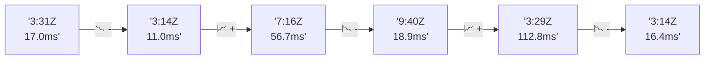

# 📊 Reporte de Performance - PokeAPI

**Fecha de corrida:** 2026-07-25 00:32 UTC

**Enlace:** [30136393864](https://github.com/rba3/Lab_CD_CI_Perfomance/actions/runs/30136393864)

## ✅ Veredicto

```
PASS

1. Todos los indicadores de error están por debajo del umbral del 1%, lo que significa que no hay problemas de disponibilidad durante la prueba. Esto es un resultado excelente.
   
2. El tiempo de respuesta p95 es de 12 ms, muy por debajo del límite de 800 ms, lo que indica un desempeño sólido en la mayoría de las solicitudes.

3. Sin embargo, algunas solicitudes individuales, como a "pokemon-charizard" y "pokemon-ditto", presentan tiempos máximos de respuesta de 894 ms y 1017 ms respectivamente. Se recomienda investigar estas API específicas para optimizar su rendimiento.

4. Considere implementar monitoreo y análisis adicionales en los endpoints con mayores tiempos de respuesta para identificar cuellos de botella y potenciales mejoras.
```

## 🔮 Predicciones

⚠️ **Tendencia de degradación detectada** (LOW risk)
- Pendiente: +1.35ms/corrida
- P95 actual: 12.0ms
- Días hasta WARN: ~583
- Días hasta FAIL: ~1102
- Confianza: 80%

## 📈 Métricas Globales

| Métrica | Valor | SLO | Estado |
|---------|-------|-----|--------|
| Error Rate | 0.0% | < 0.1% | ✅ PASS |
| Latencia p50 | 8.0ms | - | ℹ️ |
| Latencia p95 | 12.0ms | < 800ms | ✅ PASS |
| Latencia p99 | 21.4ms | - | ℹ️ |
| Throughput | 0.00 req/s | - | ℹ️ |
| Muestras | 0 | - | ℹ️ |

## 📉 Tendencia Histórica (Últimas 7 corridas)



## 🔧 Análisis Técnico Detallado (JSON)

```json
{
  "predictions": {
    "prediction": "DEGRADATION_TREND",
    "confidence": 80,
    "slope_ms_per_run": 1.35,
    "current_p95": 12.0,
    "days_to_warn": 583,
    "days_to_fail": 1102,
    "risk_level": "LOW"
  },
  "recommendations": [],
  "correlations": {},
  "root_cause": {
    "issue": null,
    "root_cause": null,
    "confidence": 0,
    "evidence": []
  },
  "timestamp": "2026-07-25T00:32:01.317993"
}
```

## 📦 Datos Completos (JSON)

```json
{
  "scenario": "load",
  "overall": {
    "samples": 7056,
    "errors": 0,
    "error_pct": 0.0,
    "avg_ms": 8.7,
    "min_ms": 5,
    "max_ms": 1036,
    "p50_ms": 8.0,
    "p90_ms": 10.0,
    "p95_ms": 12.0,
    "p99_ms": 21.4,
    "throughput_rps": 51.06,
    "duration_s": 138.2
  },
  "by_endpoint": {
    "ability-static": {
      "samples": 543,
      "errors": 0,
      "error_pct": 0.0,
      "avg_ms": 7.7,
      "min_ms": 5,
      "max_ms": 25,
      "p50_ms": 7.0,
      "p90_ms": 9.0,
      "p95_ms": 10.0,
      "p99_ms": 16.0,
      "throughput_rps": 3.98,
      "duration_s": 136.5
    },
    "berry-cheri": {
      "samples": 543,
      "errors": 0,
      "error_pct": 0.0,
      "avg_ms": 7.3,
      "min_ms": 5,
      "max_ms": 26,
      "p50_ms": 7.0,
      "p90_ms": 9.0,
      "p95_ms": 10.0,
      "p99_ms": 19.6,
      "throughput_rps": 3.99,
      "duration_s": 136.2
    },
    "generation-1": {
      "samples": 543,
      "errors": 0,
      "error_pct": 0.0,
      "avg_ms": 7.8,
      "min_ms": 5,
      "max_ms": 23,
      "p50_ms": 7.0,
      "p90_ms": 9.0,
      "p95_ms": 10.0,
      "p99_ms": 19.2,
      "throughput_rps": 3.99,
      "duration_s": 136.2
    },
    "move-nature-power": {
      "samples": 542,
      "errors": 0,
      "error_pct": 0.0,
      "avg_ms": 7.7,
      "min_ms": 5,
      "max_ms": 27,
      "p50_ms": 7.0,
      "p90_ms": 9.0,
      "p95_ms": 10.0,
      "p99_ms": 16.6,
      "throughput_rps": 3.99,
      "duration_s": 136.0
    },
    "move-tackle": {
      "samples": 543,
      "errors": 0,
      "error_pct": 0.0,
      "avg_ms": 7.9,
      "min_ms": 5,
      "max_ms": 28,
      "p50_ms": 7.0,
      "p90_ms": 10.0,
      "p95_ms": 11.0,
      "p99_ms": 16.0,
      "throughput_rps": 3.99,
      "duration_s": 136.1
    },
    "pokemon-charizard": {
      "samples": 543,
      "errors": 0,
      "error_pct": 0.0,
      "avg_ms": 11.9,
      "min_ms": 6,
      "max_ms": 894,
      "p50_ms": 9.0,
      "p90_ms": 14.0,
      "p95_ms": 16.0,
      "p99_ms": 27.6,
      "throughput_rps": 3.94,
      "duration_s": 138.0
    },
    "pokemon-chikorita": {
      "samples": 542,
      "errors": 0,
      "error_pct": 0.0,
      "avg_ms": 9.2,
      "min_ms": 6,
      "max_ms": 29,
      "p50_ms": 8.0,
      "p90_ms": 11.9,
      "p95_ms": 14.0,
      "p99_ms": 23.6,
      "throughput_rps": 3.99,
      "duration_s": 136.0
    },
    "pokemon-ditto": {
      "samples": 543,
      "errors": 0,
      "error_pct": 0.0,
      "avg_ms": 9.6,
      "min_ms": 5,
      "max_ms": 1017,
      "p50_ms": 7.0,
      "p90_ms": 9.0,
      "p95_ms": 10.9,
      "p99_ms": 20.0,
      "throughput_rps": 3.93,
      "duration_s": 138.0
    },
    "pokemon-list": {
      "samples": 543,
      "errors": 0,
      "error_pct": 0.0,
      "avg_ms": 8.5,
      "min_ms": 5,
      "max_ms": 493,
      "p50_ms": 7.0,
      "p90_ms": 9.0,
      "p95_ms": 11.0,
      "p99_ms": 20.0,
      "throughput_rps": 3.95,
      "duration_s": 137.6
    },
    "pokemon-pikachu": {
      "samples": 543,
      "errors": 0,
      "error_pct": 0.0,
      "avg_ms": 11.6,
      "min_ms": 6,
      "max_ms": 1036,
      "p50_ms": 9.0,
      "p90_ms": 12.8,
      "p95_ms": 14.0,
      "p99_ms": 26.6,
      "throughput_rps": 3.93,
      "duration_s": 138.1
    },
    "type-fairy": {
      "samples": 542,
      "errors": 0,
      "error_pct": 0.0,
      "avg_ms": 7.6,
      "min_ms": 5,
      "max_ms": 28,
      "p50_ms": 7.0,
      "p90_ms": 9.0,
      "p95_ms": 10.0,
      "p99_ms": 19.5,
      "throughput_rps": 3.99,
      "duration_s": 136.0
    },
    "type-fire": {
      "samples": 543,
      "errors": 0,
      "error_pct": 0.0,
      "avg_ms": 7.8,
      "min_ms": 5,
      "max_ms": 33,
      "p50_ms": 7.0,
      "p90_ms": 10.0,
      "p95_ms": 11.0,
      "p99_ms": 17.0,
      "throughput_rps": 3.97,
      "duration_s": 136.9
    },
    "type-water": {
      "samples": 543,
      "errors": 0,
      "error_pct": 0.0,
      "avg_ms": 8.3,
      "min_ms": 6,
      "max_ms": 138,
      "p50_ms": 8.0,
      "p90_ms": 10.0,
      "p95_ms": 11.9,
      "p99_ms": 19.6,
      "throughput_rps": 3.96,
      "duration_s": 137.3
    }
  },
  "empty": false
}
```

---

*Reporte generado automáticamente por el workflow de performance.*

*Timestamp: 2026-07-25T00:32:01.319520Z*
