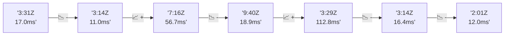

# 📊 Reporte de Performance - PokeAPI

**Fecha de corrida:** 2026-07-25 00:40 UTC

**Enlace:** [30136717108](https://github.com/rba3/Lab_CD_CI_Perfomance/actions/runs/30136717108)

## ✅ Veredicto

```
PASS

1. **Errores y SLOs**: No se registraron errores durante la prueba, cumpliendo con el SLO de error < 1%. Esto indica que el sistema es robusto bajo la carga actual.

2. **Latencia baja**: La latencia promedio fue de 12.9 ms, y el p95 fue de 23 ms, lo que está muy por debajo del umbral de 800 ms. Esto sugiere un buen rendimiento de la API en condiciones de carga.

3. **Variabilidad en un endpoint**: El endpoint "pokemon-ditto" tiene un valor máximo de latencia de 987 ms, que es anómalo. Se recomienda investigar este caso particular para identificar y mitigar cualquier problema que pueda causar dicha latencia extrema.

4. **Monitoreo continuo**: Mantener la monitorización activa de métricas como p99 y p95, especialmente en endpoints con alta latencia, para detectar problemas antes de que impacten a los usuarios.
```

## 🔮 Predicciones

✓ STABLE

## 📈 Métricas Globales

| Métrica | Valor | SLO | Estado |
|---------|-------|-----|--------|
| Error Rate | 0.0% | < 0.1% | ✅ PASS |
| Latencia p50 | 11.0ms | - | ℹ️ |
| Latencia p95 | 23.0ms | < 800ms | ✅ PASS |
| Latencia p99 | 33.0ms | - | ℹ️ |
| Throughput | 0.00 req/s | - | ℹ️ |
| Muestras | 0 | - | ℹ️ |

## 📉 Tendencia Histórica (Últimas 7 corridas)



## 🔧 Análisis Técnico Detallado (JSON)

```json
{
  "predictions": {
    "prediction": "STABLE",
    "confidence": 0,
    "slope_ms_per_run": -11.18,
    "current_p95": 23.0,
    "days_to_warn": null,
    "days_to_fail": null,
    "risk_level": "LOW"
  },
  "recommendations": [],
  "correlations": {},
  "root_cause": {
    "issue": null,
    "root_cause": null,
    "confidence": 0,
    "evidence": []
  },
  "timestamp": "2026-07-25T00:40:52.542796"
}
```

## 📦 Datos Completos (JSON)

```json
{
  "scenario": "load",
  "overall": {
    "samples": 8809,
    "errors": 0,
    "error_pct": 0.0,
    "avg_ms": 12.9,
    "min_ms": 8,
    "max_ms": 987,
    "p50_ms": 11.0,
    "p90_ms": 16.0,
    "p95_ms": 23.0,
    "p99_ms": 33.0,
    "throughput_rps": 49.47,
    "duration_s": 178.1
  },
  "by_endpoint": {
    "ability-static": {
      "samples": 678,
      "errors": 0,
      "error_pct": 0.0,
      "avg_ms": 11.5,
      "min_ms": 9,
      "max_ms": 38,
      "p50_ms": 11.0,
      "p90_ms": 13.0,
      "p95_ms": 15.0,
      "p99_ms": 27.0,
      "throughput_rps": 3.85,
      "duration_s": 176.3
    },
    "berry-cheri": {
      "samples": 678,
      "errors": 0,
      "error_pct": 0.0,
      "avg_ms": 11.2,
      "min_ms": 8,
      "max_ms": 43,
      "p50_ms": 10.0,
      "p90_ms": 13.0,
      "p95_ms": 14.0,
      "p99_ms": 30.0,
      "throughput_rps": 3.85,
      "duration_s": 176.0
    },
    "generation-1": {
      "samples": 677,
      "errors": 0,
      "error_pct": 0.0,
      "avg_ms": 11.8,
      "min_ms": 9,
      "max_ms": 50,
      "p50_ms": 11.0,
      "p90_ms": 13.0,
      "p95_ms": 15.0,
      "p99_ms": 31.2,
      "throughput_rps": 3.86,
      "duration_s": 175.4
    },
    "move-nature-power": {
      "samples": 677,
      "errors": 0,
      "error_pct": 0.0,
      "avg_ms": 11.5,
      "min_ms": 9,
      "max_ms": 35,
      "p50_ms": 11.0,
      "p90_ms": 13.0,
      "p95_ms": 14.0,
      "p99_ms": 27.2,
      "throughput_rps": 3.86,
      "duration_s": 175.4
    },
    "move-tackle": {
      "samples": 677,
      "errors": 0,
      "error_pct": 0.0,
      "avg_ms": 11.9,
      "min_ms": 9,
      "max_ms": 38,
      "p50_ms": 11.0,
      "p90_ms": 13.0,
      "p95_ms": 15.0,
      "p99_ms": 29.0,
      "throughput_rps": 3.86,
      "duration_s": 175.5
    },
    "pokemon-charizard": {
      "samples": 678,
      "errors": 0,
      "error_pct": 0.0,
      "avg_ms": 18.3,
      "min_ms": 11,
      "max_ms": 521,
      "p50_ms": 15.0,
      "p90_ms": 27.0,
      "p95_ms": 30.0,
      "p99_ms": 51.0,
      "throughput_rps": 3.82,
      "duration_s": 177.5
    },
    "pokemon-chikorita": {
      "samples": 677,
      "errors": 0,
      "error_pct": 0.0,
      "avg_ms": 15.1,
      "min_ms": 11,
      "max_ms": 48,
      "p50_ms": 13.0,
      "p90_ms": 22.0,
      "p95_ms": 25.0,
      "p99_ms": 43.0,
      "throughput_rps": 3.86,
      "duration_s": 175.4
    },
    "pokemon-ditto": {
      "samples": 678,
      "errors": 0,
      "error_pct": 0.0,
      "avg_ms": 12.9,
      "min_ms": 9,
      "max_ms": 987,
      "p50_ms": 11.0,
      "p90_ms": 13.0,
      "p95_ms": 14.0,
      "p99_ms": 30.0,
      "throughput_rps": 3.81,
      "duration_s": 178.0
    },
    "pokemon-list": {
      "samples": 678,
      "errors": 0,
      "error_pct": 0.0,
      "avg_ms": 11.7,
      "min_ms": 9,
      "max_ms": 158,
      "p50_ms": 11.0,
      "p90_ms": 13.0,
      "p95_ms": 15.0,
      "p99_ms": 29.5,
      "throughput_rps": 3.83,
      "duration_s": 177.2
    },
    "pokemon-pikachu": {
      "samples": 678,
      "errors": 0,
      "error_pct": 0.0,
      "avg_ms": 17.2,
      "min_ms": 10,
      "max_ms": 820,
      "p50_ms": 14.0,
      "p90_ms": 22.3,
      "p95_ms": 26.0,
      "p99_ms": 50.2,
      "throughput_rps": 3.81,
      "duration_s": 177.8
    },
    "type-fairy": {
      "samples": 677,
      "errors": 0,
      "error_pct": 0.0,
      "avg_ms": 11.2,
      "min_ms": 8,
      "max_ms": 31,
      "p50_ms": 10.0,
      "p90_ms": 13.0,
      "p95_ms": 14.0,
      "p99_ms": 28.0,
      "throughput_rps": 3.86,
      "duration_s": 175.4
    },
    "type-fire": {
      "samples": 678,
      "errors": 0,
      "error_pct": 0.0,
      "avg_ms": 11.8,
      "min_ms": 9,
      "max_ms": 41,
      "p50_ms": 11.0,
      "p90_ms": 13.0,
      "p95_ms": 15.0,
      "p99_ms": 31.0,
      "throughput_rps": 3.84,
      "duration_s": 176.6
    },
    "type-water": {
      "samples": 678,
      "errors": 0,
      "error_pct": 0.0,
      "avg_ms": 12.0,
      "min_ms": 9,
      "max_ms": 41,
      "p50_ms": 11.0,
      "p90_ms": 14.0,
      "p95_ms": 16.0,
      "p99_ms": 31.0,
      "throughput_rps": 3.83,
      "duration_s": 176.9
    }
  },
  "empty": false
}
```

---

*Reporte generado automáticamente por el workflow de performance.*

*Timestamp: 2026-07-25T00:40:52.544291Z*
