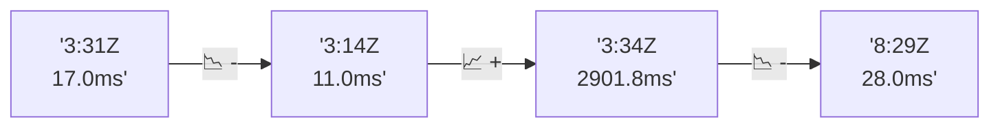

# 📊 Reporte de Performance - PokeAPI

**Fecha de corrida:** 2026-07-25 14:26 UTC

**Enlace:** [30161559639](https://github.com/rba3/Lab_CD_CI_Perfomance/actions/runs/30161559639)

## ✅ Veredicto

```
PASS  
1. Las métricas del escenario de carga cumplen con los SLOs: error < 1% (0%) y p95 < 800 ms (27 ms).  
2. El tiempo de respuesta promedio es muy bajo (21.9 ms), lo que indica un rendimiento robusto y eficiente.  
3. Se recomienda monitorear el endpoint "pokemon-ditto", que tiene el tiempo máximo más alto (278 ms) para identificar posibles cuellos de botella.  
4. En el escenario de smoke, aunque se cumplen los SLOs, se destaca un caso extremo en "pokemon-ditto" con un máximo de 1744 ms, que debería investigarse para asegurar un rendimiento consistente.
```

## 🔮 Predicciones

⚠️ **Tendencia de degradación detectada** (LOW risk)
- Pendiente: +3.67ms/corrida
- P95 actual: 27.0ms
- Días hasta WARN: ~210
- Días hasta FAIL: ~401
- Confianza: 60%

## 📈 Métricas Globales

| Métrica | Valor | SLO | Estado |
|---------|-------|-----|--------|
| Error Rate | 0.0% | < 0.1% | ✅ PASS |
| Latencia p50 | 21.0ms | - | ℹ️ |
| Latencia p95 | 27.0ms | < 800ms | ✅ PASS |
| Latencia p99 | 49.0ms | - | ℹ️ |
| Throughput | 0.00 req/s | - | ℹ️ |
| Muestras | 0 | - | ℹ️ |

## 📉 Tendencia Histórica (Últimas 7 corridas)



## 🔧 Análisis Técnico Detallado (JSON)

```json
{
  "predictions": {
    "prediction": "DEGRADATION_TREND",
    "confidence": 60,
    "slope_ms_per_run": 3.67,
    "current_p95": 27.0,
    "days_to_warn": 210,
    "days_to_fail": 401,
    "risk_level": "LOW"
  },
  "recommendations": [],
  "correlations": {},
  "root_cause": {
    "issue": null,
    "root_cause": null,
    "confidence": 0,
    "evidence": []
  },
  "timestamp": "2026-07-25T14:26:55.372764"
}
```

## 📦 Datos Completos (JSON)

```json
{
  "scenario": "load",
  "overall": {
    "samples": 16326,
    "errors": 0,
    "error_pct": 0.0,
    "avg_ms": 21.9,
    "min_ms": 15,
    "max_ms": 278,
    "p50_ms": 21.0,
    "p90_ms": 25.0,
    "p95_ms": 27.0,
    "p99_ms": 49.0,
    "throughput_rps": 136.47,
    "duration_s": 119.6
  },
  "by_endpoint": {
    "ability-static": {
      "samples": 1633,
      "errors": 0,
      "error_pct": 0.0,
      "avg_ms": 21.3,
      "min_ms": 15,
      "max_ms": 247,
      "p50_ms": 21.0,
      "p90_ms": 23.0,
      "p95_ms": 24.0,
      "p99_ms": 35.4,
      "throughput_rps": 13.79,
      "duration_s": 118.4
    },
    "berry-cheri": {
      "samples": 1633,
      "errors": 0,
      "error_pct": 0.0,
      "avg_ms": 20.5,
      "min_ms": 15,
      "max_ms": 65,
      "p50_ms": 20.0,
      "p90_ms": 22.0,
      "p95_ms": 23.0,
      "p99_ms": 28.4,
      "throughput_rps": 13.8,
      "duration_s": 118.3
    },
    "generation-1": {
      "samples": 1631,
      "errors": 0,
      "error_pct": 0.0,
      "avg_ms": 21.3,
      "min_ms": 16,
      "max_ms": 65,
      "p50_ms": 21.0,
      "p90_ms": 23.0,
      "p95_ms": 24.0,
      "p99_ms": 26.7,
      "throughput_rps": 13.83,
      "duration_s": 118.0
    },
    "move-tackle": {
      "samples": 1633,
      "errors": 0,
      "error_pct": 0.0,
      "avg_ms": 21.5,
      "min_ms": 16,
      "max_ms": 66,
      "p50_ms": 21.0,
      "p90_ms": 24.0,
      "p95_ms": 25.0,
      "p99_ms": 28.0,
      "throughput_rps": 13.82,
      "duration_s": 118.2
    },
    "pokemon-charizard": {
      "samples": 1633,
      "errors": 0,
      "error_pct": 0.0,
      "avg_ms": 26.8,
      "min_ms": 21,
      "max_ms": 119,
      "p50_ms": 25.0,
      "p90_ms": 29.0,
      "p95_ms": 36.0,
      "p99_ms": 67.0,
      "throughput_rps": 13.72,
      "duration_s": 119.0
    },
    "pokemon-ditto": {
      "samples": 1633,
      "errors": 0,
      "error_pct": 0.0,
      "avg_ms": 21.1,
      "min_ms": 16,
      "max_ms": 278,
      "p50_ms": 21.0,
      "p90_ms": 23.0,
      "p95_ms": 24.0,
      "p99_ms": 27.0,
      "throughput_rps": 13.65,
      "duration_s": 119.6
    },
    "pokemon-list": {
      "samples": 1634,
      "errors": 0,
      "error_pct": 0.0,
      "avg_ms": 19.3,
      "min_ms": 15,
      "max_ms": 63,
      "p50_ms": 19.0,
      "p90_ms": 21.0,
      "p95_ms": 22.0,
      "p99_ms": 25.0,
      "throughput_rps": 13.76,
      "duration_s": 118.7
    },
    "pokemon-pikachu": {
      "samples": 1632,
      "errors": 0,
      "error_pct": 0.0,
      "avg_ms": 24.8,
      "min_ms": 19,
      "max_ms": 117,
      "p50_ms": 23.0,
      "p90_ms": 28.0,
      "p95_ms": 36.4,
      "p99_ms": 59.0,
      "throughput_rps": 13.71,
      "duration_s": 119.0
    },
    "type-fire": {
      "samples": 1632,
      "errors": 0,
      "error_pct": 0.0,
      "avg_ms": 20.9,
      "min_ms": 16,
      "max_ms": 68,
      "p50_ms": 21.0,
      "p90_ms": 23.0,
      "p95_ms": 24.0,
      "p99_ms": 27.0,
      "throughput_rps": 13.78,
      "duration_s": 118.4
    },
    "type-water": {
      "samples": 1632,
      "errors": 0,
      "error_pct": 0.0,
      "avg_ms": 21.1,
      "min_ms": 16,
      "max_ms": 246,
      "p50_ms": 21.0,
      "p90_ms": 23.0,
      "p95_ms": 24.0,
      "p99_ms": 31.8,
      "throughput_rps": 13.76,
      "duration_s": 118.6
    }
  },
  "empty": false
}
```

---

*Reporte generado automáticamente por el workflow de performance.*

*Timestamp: 2026-07-25T14:26:55.374258Z*
