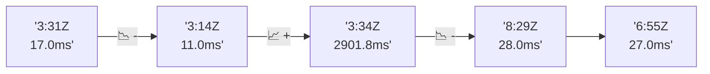

# 📊 Reporte de Performance - PokeAPI

**Fecha de corrida:** 2026-07-26 14:23 UTC

**Enlace:** [30205890963](https://github.com/rba3/Lab_CD_CI_Perfomance/actions/runs/30205890963)

## ✅ Veredicto

```
PASS

1. Todos los endpoints presentaron un porcentaje de errores del 0%, cumpliendo el SLO de errores (< 1%).
2. El percentil 95 (p95) de los tiempos de respuesta fue de 10 ms en la prueba de carga, significativamente por debajo del límite de 800 ms.
3. Los tiempos de respuesta promedio fueron muy bajos (7.6 ms), lo cual es excelente para mantener la experiencia del usuario.
4. Sin embargo, en la prueba de humo, el endpoint "pokemon-ditto" tuvo una respuesta máxima de 913 ms, lo que sugiere que podría haber un problema específico que deba ser investigado más a fondo. Se recomienda un análisis adicional de ese endpoint.
```

## 🔮 Predicciones

⚠️ **Tendencia de degradación detectada** (LOW risk)
- Pendiente: +2.5ms/corrida
- P95 actual: 10.0ms
- Días hasta WARN: ~316
- Días hasta FAIL: ~596
- Confianza: 80%

## 📈 Métricas Globales

| Métrica | Valor | SLO | Estado |
|---------|-------|-----|--------|
| Error Rate | 0.0% | < 0.1% | ✅ PASS |
| Latencia p50 | 7.0ms | - | ℹ️ |
| Latencia p95 | 10.0ms | < 800ms | ✅ PASS |
| Latencia p99 | 14.0ms | - | ℹ️ |
| Throughput | 0.00 req/s | - | ℹ️ |
| Muestras | 0 | - | ℹ️ |

## 📉 Tendencia Histórica (Últimas 7 corridas)



## 🔧 Análisis Técnico Detallado (JSON)

```json
{
  "predictions": {
    "prediction": "DEGRADATION_TREND",
    "confidence": 80,
    "slope_ms_per_run": 2.5,
    "current_p95": 10.0,
    "days_to_warn": 316,
    "days_to_fail": 596,
    "risk_level": "LOW"
  },
  "recommendations": [],
  "correlations": {},
  "root_cause": {
    "issue": null,
    "root_cause": null,
    "confidence": 0,
    "evidence": []
  },
  "timestamp": "2026-07-26T14:23:43.068508"
}
```

## 📦 Datos Completos (JSON)

```json
{
  "scenario": "load",
  "overall": {
    "samples": 17074,
    "errors": 0,
    "error_pct": 0.0,
    "avg_ms": 7.6,
    "min_ms": 4,
    "max_ms": 251,
    "p50_ms": 7.0,
    "p90_ms": 9.0,
    "p95_ms": 10.0,
    "p99_ms": 14.0,
    "throughput_rps": 142.8,
    "duration_s": 119.6
  },
  "by_endpoint": {
    "ability-static": {
      "samples": 1708,
      "errors": 0,
      "error_pct": 0.0,
      "avg_ms": 7.4,
      "min_ms": 4,
      "max_ms": 22,
      "p50_ms": 7.0,
      "p90_ms": 9.0,
      "p95_ms": 10.0,
      "p99_ms": 12.9,
      "throughput_rps": 14.43,
      "duration_s": 118.4
    },
    "berry-cheri": {
      "samples": 1708,
      "errors": 0,
      "error_pct": 0.0,
      "avg_ms": 7.4,
      "min_ms": 5,
      "max_ms": 25,
      "p50_ms": 7.0,
      "p90_ms": 9.0,
      "p95_ms": 10.0,
      "p99_ms": 13.0,
      "throughput_rps": 14.43,
      "duration_s": 118.4
    },
    "generation-1": {
      "samples": 1707,
      "errors": 0,
      "error_pct": 0.0,
      "avg_ms": 7.6,
      "min_ms": 5,
      "max_ms": 25,
      "p50_ms": 7.0,
      "p90_ms": 9.0,
      "p95_ms": 10.0,
      "p99_ms": 14.9,
      "throughput_rps": 14.46,
      "duration_s": 118.0
    },
    "move-tackle": {
      "samples": 1707,
      "errors": 0,
      "error_pct": 0.0,
      "avg_ms": 7.6,
      "min_ms": 5,
      "max_ms": 24,
      "p50_ms": 7.0,
      "p90_ms": 9.0,
      "p95_ms": 10.0,
      "p99_ms": 12.0,
      "throughput_rps": 14.46,
      "duration_s": 118.1
    },
    "pokemon-charizard": {
      "samples": 1707,
      "errors": 0,
      "error_pct": 0.0,
      "avg_ms": 8.5,
      "min_ms": 6,
      "max_ms": 32,
      "p50_ms": 8.0,
      "p90_ms": 10.0,
      "p95_ms": 12.0,
      "p99_ms": 16.0,
      "throughput_rps": 14.35,
      "duration_s": 119.0
    },
    "pokemon-ditto": {
      "samples": 1708,
      "errors": 0,
      "error_pct": 0.0,
      "avg_ms": 7.6,
      "min_ms": 5,
      "max_ms": 251,
      "p50_ms": 7.0,
      "p90_ms": 9.0,
      "p95_ms": 10.0,
      "p99_ms": 12.0,
      "throughput_rps": 14.29,
      "duration_s": 119.5
    },
    "pokemon-list": {
      "samples": 1707,
      "errors": 0,
      "error_pct": 0.0,
      "avg_ms": 7.1,
      "min_ms": 5,
      "max_ms": 23,
      "p50_ms": 7.0,
      "p90_ms": 9.0,
      "p95_ms": 9.0,
      "p99_ms": 11.9,
      "throughput_rps": 14.39,
      "duration_s": 118.6
    },
    "pokemon-pikachu": {
      "samples": 1708,
      "errors": 0,
      "error_pct": 0.0,
      "avg_ms": 8.3,
      "min_ms": 6,
      "max_ms": 53,
      "p50_ms": 8.0,
      "p90_ms": 10.0,
      "p95_ms": 11.0,
      "p99_ms": 16.0,
      "throughput_rps": 14.35,
      "duration_s": 119.0
    },
    "type-fire": {
      "samples": 1707,
      "errors": 0,
      "error_pct": 0.0,
      "avg_ms": 7.5,
      "min_ms": 5,
      "max_ms": 31,
      "p50_ms": 7.0,
      "p90_ms": 9.0,
      "p95_ms": 10.0,
      "p99_ms": 14.0,
      "throughput_rps": 14.42,
      "duration_s": 118.4
    },
    "type-water": {
      "samples": 1707,
      "errors": 0,
      "error_pct": 0.0,
      "avg_ms": 7.5,
      "min_ms": 5,
      "max_ms": 27,
      "p50_ms": 7.0,
      "p90_ms": 9.0,
      "p95_ms": 10.0,
      "p99_ms": 12.0,
      "throughput_rps": 14.39,
      "duration_s": 118.6
    }
  },
  "empty": false
}
```

---

*Reporte generado automáticamente por el workflow de performance.*

*Timestamp: 2026-07-26T14:23:43.070053Z*
