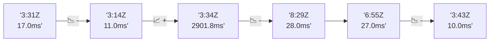

# 📊 Reporte de Performance - PokeAPI

**Fecha de corrida:** 2026-07-27 15:36 UTC

**Enlace:** [30280582576](https://github.com/rba3/Lab_CD_CI_Perfomance/actions/runs/30280582576)

## ✅ Veredicto

```
PASS

1. Todos los SLOs establecidos (error < 1%, p95 < 800 ms) se cumplen satisfactoriamente, con un 0.0% de errores y un p95 de 11 ms en el escenario de carga y 21 ms en el escenario de humo.
   
2. La carga promedio del sistema es baja, con un promedio de 8 ms para el escenario de carga y 14.1 ms para el humo. Esto indica un buen rendimiento general y capacidad de respuesta.

3. A pesar de que las métricas son positivas, se recomienda monitorear el endpoint "pokemon-ditto" donde el tiempo máximo alcanzó 246 ms. Aunque no hubo errores en las pruebas, es necesario evaluar qué está causando esta latencia para evitar problemas en escenarios de carga más alta.

4. Se sugiere realizar pruebas de carga adicionales para verificar el rendimiento continuo del sistema a medida que se incrementan los usuarios, asegurando que los resultados se mantengan dentro de los niveles aceptables.
```

## 🔮 Predicciones

✓ STABLE

## 📈 Métricas Globales

| Métrica | Valor | SLO | Estado |
|---------|-------|-----|--------|
| Error Rate | 0.0% | < 0.1% | ✅ PASS |
| Latencia p50 | 8.0ms | - | ℹ️ |
| Latencia p95 | 11.0ms | < 800ms | ✅ PASS |
| Latencia p99 | 15.0ms | - | ℹ️ |
| Throughput | 0.00 req/s | - | ℹ️ |
| Muestras | 0 | - | ℹ️ |

## 📉 Tendencia Histórica (Últimas 7 corridas)



## 🔧 Análisis Técnico Detallado (JSON)

```json
{
  "predictions": {
    "prediction": "STABLE",
    "confidence": 0,
    "slope_ms_per_run": -0.25,
    "current_p95": 11.0,
    "days_to_warn": null,
    "days_to_fail": null,
    "risk_level": "LOW"
  },
  "recommendations": [],
  "correlations": {},
  "root_cause": {
    "issue": null,
    "root_cause": null,
    "confidence": 0,
    "evidence": []
  },
  "timestamp": "2026-07-27T15:36:39.451232"
}
```

## 📦 Datos Completos (JSON)

```json
{
  "scenario": "load",
  "overall": {
    "samples": 17059,
    "errors": 0,
    "error_pct": 0.0,
    "avg_ms": 8.0,
    "min_ms": 5,
    "max_ms": 246,
    "p50_ms": 8.0,
    "p90_ms": 10.0,
    "p95_ms": 11.0,
    "p99_ms": 15.0,
    "throughput_rps": 142.6,
    "duration_s": 119.6
  },
  "by_endpoint": {
    "ability-static": {
      "samples": 1705,
      "errors": 0,
      "error_pct": 0.0,
      "avg_ms": 8.0,
      "min_ms": 5,
      "max_ms": 57,
      "p50_ms": 8.0,
      "p90_ms": 10.0,
      "p95_ms": 11.0,
      "p99_ms": 14.0,
      "throughput_rps": 14.41,
      "duration_s": 118.3
    },
    "berry-cheri": {
      "samples": 1706,
      "errors": 0,
      "error_pct": 0.0,
      "avg_ms": 7.8,
      "min_ms": 5,
      "max_ms": 20,
      "p50_ms": 7.0,
      "p90_ms": 10.0,
      "p95_ms": 10.0,
      "p99_ms": 13.0,
      "throughput_rps": 14.41,
      "duration_s": 118.4
    },
    "generation-1": {
      "samples": 1706,
      "errors": 0,
      "error_pct": 0.0,
      "avg_ms": 8.1,
      "min_ms": 5,
      "max_ms": 57,
      "p50_ms": 8.0,
      "p90_ms": 10.0,
      "p95_ms": 11.0,
      "p99_ms": 15.0,
      "throughput_rps": 14.44,
      "duration_s": 118.1
    },
    "move-tackle": {
      "samples": 1705,
      "errors": 0,
      "error_pct": 0.0,
      "avg_ms": 7.9,
      "min_ms": 5,
      "max_ms": 20,
      "p50_ms": 7.0,
      "p90_ms": 10.0,
      "p95_ms": 11.0,
      "p99_ms": 14.0,
      "throughput_rps": 14.44,
      "duration_s": 118.1
    },
    "pokemon-charizard": {
      "samples": 1706,
      "errors": 0,
      "error_pct": 0.0,
      "avg_ms": 8.8,
      "min_ms": 6,
      "max_ms": 34,
      "p50_ms": 8.0,
      "p90_ms": 11.0,
      "p95_ms": 12.0,
      "p99_ms": 17.0,
      "throughput_rps": 14.33,
      "duration_s": 119.0
    },
    "pokemon-ditto": {
      "samples": 1707,
      "errors": 0,
      "error_pct": 0.0,
      "avg_ms": 7.8,
      "min_ms": 5,
      "max_ms": 246,
      "p50_ms": 7.0,
      "p90_ms": 10.0,
      "p95_ms": 11.0,
      "p99_ms": 14.9,
      "throughput_rps": 14.27,
      "duration_s": 119.6
    },
    "pokemon-list": {
      "samples": 1706,
      "errors": 0,
      "error_pct": 0.0,
      "avg_ms": 7.4,
      "min_ms": 5,
      "max_ms": 26,
      "p50_ms": 7.0,
      "p90_ms": 9.0,
      "p95_ms": 10.0,
      "p99_ms": 13.0,
      "throughput_rps": 14.37,
      "duration_s": 118.7
    },
    "pokemon-pikachu": {
      "samples": 1706,
      "errors": 0,
      "error_pct": 0.0,
      "avg_ms": 8.5,
      "min_ms": 6,
      "max_ms": 48,
      "p50_ms": 8.0,
      "p90_ms": 11.0,
      "p95_ms": 12.0,
      "p99_ms": 21.0,
      "throughput_rps": 14.33,
      "duration_s": 119.1
    },
    "type-fire": {
      "samples": 1706,
      "errors": 0,
      "error_pct": 0.0,
      "avg_ms": 7.7,
      "min_ms": 5,
      "max_ms": 65,
      "p50_ms": 7.0,
      "p90_ms": 10.0,
      "p95_ms": 10.0,
      "p99_ms": 13.0,
      "throughput_rps": 14.4,
      "duration_s": 118.5
    },
    "type-water": {
      "samples": 1706,
      "errors": 0,
      "error_pct": 0.0,
      "avg_ms": 7.7,
      "min_ms": 5,
      "max_ms": 35,
      "p50_ms": 7.0,
      "p90_ms": 10.0,
      "p95_ms": 10.0,
      "p99_ms": 14.0,
      "throughput_rps": 14.37,
      "duration_s": 118.7
    }
  },
  "empty": false
}
```

---

*Reporte generado automáticamente por el workflow de performance.*

*Timestamp: 2026-07-27T15:36:39.452718Z*
