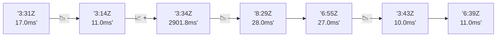

# 📊 Reporte de Performance - PokeAPI

**Fecha de corrida:** 2026-07-28 15:11 UTC

**Enlace:** [30371859171](https://github.com/rba3/Lab_CD_CI_Perfomance/actions/runs/30371859171)

## ✅ Veredicto

```
PASS

1. La tasa de errores es de 0.01%, lo que cumple con el SLO de error < 1%. Solo un error se reportó en 16904 muestras.
2. El percentil 95 (p95) es de 15 ms, que está muy por debajo del límite de 800 ms, lo que indica un buen desempeño general.
3. Sin embargo, se observa un caso particular con la API "pokemon-ditto", donde se registró un tiempo máximo de respuesta de 322 ms. Se debería investigar la causa de esta anomalía para prevenir futuros problemas.
4. Se recomienda monitorear continuamente estas métricas y realizar pruebas adicionales para asegurar que no haya degradaciones de rendimiento en diferentes escenarios de carga.
```

## 🔮 Predicciones

✓ STABLE

## 📈 Métricas Globales

| Métrica | Valor | SLO | Estado |
|---------|-------|-----|--------|
| Error Rate | 0.01% | < 0.1% | ✅ PASS |
| Latencia p50 | 10.0ms | - | ℹ️ |
| Latencia p95 | 15.0ms | < 800ms | ✅ PASS |
| Latencia p99 | 22.0ms | - | ℹ️ |
| Throughput | 0.00 req/s | - | ℹ️ |
| Muestras | 0 | - | ℹ️ |

## 📉 Tendencia Histórica (Últimas 7 corridas)



## 🔧 Análisis Técnico Detallado (JSON)

```json
{
  "predictions": {
    "prediction": "STABLE",
    "confidence": 0,
    "slope_ms_per_run": -722.7,
    "current_p95": 15.0,
    "days_to_warn": null,
    "days_to_fail": null,
    "risk_level": "LOW"
  },
  "recommendations": [],
  "correlations": {},
  "root_cause": {
    "issue": null,
    "root_cause": null,
    "confidence": 0,
    "evidence": []
  },
  "timestamp": "2026-07-28T15:11:06.096224"
}
```

## 📦 Datos Completos (JSON)

```json
{
  "scenario": "load",
  "overall": {
    "samples": 16904,
    "errors": 1,
    "error_pct": 0.01,
    "avg_ms": 10.9,
    "min_ms": 6,
    "max_ms": 322,
    "p50_ms": 10.0,
    "p90_ms": 14.0,
    "p95_ms": 15.0,
    "p99_ms": 22.0,
    "throughput_rps": 141.32,
    "duration_s": 119.6
  },
  "by_endpoint": {
    "ability-static": {
      "samples": 1690,
      "errors": 0,
      "error_pct": 0.0,
      "avg_ms": 10.6,
      "min_ms": 6,
      "max_ms": 51,
      "p50_ms": 10.0,
      "p90_ms": 13.0,
      "p95_ms": 15.0,
      "p99_ms": 19.0,
      "throughput_rps": 14.28,
      "duration_s": 118.3
    },
    "berry-cheri": {
      "samples": 1690,
      "errors": 0,
      "error_pct": 0.0,
      "avg_ms": 10.6,
      "min_ms": 6,
      "max_ms": 225,
      "p50_ms": 10.0,
      "p90_ms": 13.0,
      "p95_ms": 15.0,
      "p99_ms": 23.1,
      "throughput_rps": 14.29,
      "duration_s": 118.3
    },
    "generation-1": {
      "samples": 1691,
      "errors": 0,
      "error_pct": 0.0,
      "avg_ms": 10.7,
      "min_ms": 6,
      "max_ms": 71,
      "p50_ms": 10.0,
      "p90_ms": 13.0,
      "p95_ms": 15.0,
      "p99_ms": 22.0,
      "throughput_rps": 14.32,
      "duration_s": 118.1
    },
    "move-tackle": {
      "samples": 1690,
      "errors": 0,
      "error_pct": 0.0,
      "avg_ms": 11.0,
      "min_ms": 6,
      "max_ms": 51,
      "p50_ms": 10.0,
      "p90_ms": 14.0,
      "p95_ms": 16.0,
      "p99_ms": 21.0,
      "throughput_rps": 14.3,
      "duration_s": 118.1
    },
    "pokemon-charizard": {
      "samples": 1690,
      "errors": 0,
      "error_pct": 0.0,
      "avg_ms": 11.9,
      "min_ms": 7,
      "max_ms": 46,
      "p50_ms": 11.0,
      "p90_ms": 15.0,
      "p95_ms": 17.0,
      "p99_ms": 23.1,
      "throughput_rps": 14.21,
      "duration_s": 118.9
    },
    "pokemon-ditto": {
      "samples": 1691,
      "errors": 1,
      "error_pct": 0.06,
      "avg_ms": 10.7,
      "min_ms": 6,
      "max_ms": 322,
      "p50_ms": 10.0,
      "p90_ms": 13.0,
      "p95_ms": 14.0,
      "p99_ms": 20.0,
      "throughput_rps": 14.14,
      "duration_s": 119.6
    },
    "pokemon-list": {
      "samples": 1690,
      "errors": 0,
      "error_pct": 0.0,
      "avg_ms": 10.1,
      "min_ms": 6,
      "max_ms": 56,
      "p50_ms": 10.0,
      "p90_ms": 12.0,
      "p95_ms": 14.0,
      "p99_ms": 19.0,
      "throughput_rps": 14.25,
      "duration_s": 118.6
    },
    "pokemon-pikachu": {
      "samples": 1691,
      "errors": 0,
      "error_pct": 0.0,
      "avg_ms": 11.7,
      "min_ms": 7,
      "max_ms": 99,
      "p50_ms": 11.0,
      "p90_ms": 15.0,
      "p95_ms": 17.0,
      "p99_ms": 25.1,
      "throughput_rps": 14.2,
      "duration_s": 119.1
    },
    "type-fire": {
      "samples": 1691,
      "errors": 0,
      "error_pct": 0.0,
      "avg_ms": 10.8,
      "min_ms": 6,
      "max_ms": 38,
      "p50_ms": 10.0,
      "p90_ms": 13.0,
      "p95_ms": 15.0,
      "p99_ms": 22.0,
      "throughput_rps": 14.27,
      "duration_s": 118.5
    },
    "type-water": {
      "samples": 1690,
      "errors": 0,
      "error_pct": 0.0,
      "avg_ms": 10.8,
      "min_ms": 6,
      "max_ms": 40,
      "p50_ms": 10.0,
      "p90_ms": 13.0,
      "p95_ms": 15.0,
      "p99_ms": 21.0,
      "throughput_rps": 14.25,
      "duration_s": 118.6
    }
  },
  "empty": false
}
```

---

*Reporte generado automáticamente por el workflow de performance.*

*Timestamp: 2026-07-28T15:11:06.097658Z*
