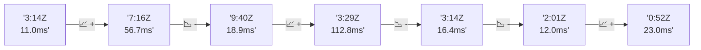

# 📊 Reporte de Performance - PokeAPI

**Fecha de corrida:** 2026-07-28 23:55 UTC

**Enlace:** [30409474773](https://github.com/rba3/Lab_CD_CI_Perfomance/actions/runs/30409474773)

## ✅ Veredicto

```
FAIL

1. Tasa de error del 100% en todas las muestras indica que no se pudieron completar las solicitudes. Es crucial investigar la causa raíz de estos fallos en el sistema o la configuración de JMeter.
  
2. Aunque los tiempos de respuesta son aceptables en promedio (con P95 ≤ 800 ms), la ausencia total de respuestas exitosas implica que no se puede verificar el rendimiento real bajo carga. Se recomienda realizar simulaciones con menos carga inicial y revisar los logs del servidor para encontrar más detalles sobre las fallas.

3. Revisa la configuración del servidor y la API para asegurarte de que estén operando correctamente y que no haya limitaciones como limitaciones de tasa o problemas de capacidad.

4. Considera ajustar la configuración de JMeter, como el número de hilos o el período de ramp-up, para permitir que el sistema tenga tiempo suficiente para responder antes de que se apliquen cargas adicionales.
```

## 🔮 Predicciones

⚠️ **Tendencia de degradación detectada** (LOW risk)
- Pendiente: +1.03ms/corrida
- P95 actual: 17.0ms
- Días hasta WARN: ~763
- Días hasta FAIL: ~1446
- Confianza: 80%

## 💡 Recomendaciones Prioritarias

🔴 **Tasa de error global crítica**
   - Posibles causas: Problema sistémico (BD caída, network desconectada), PokeAPI inestable
   - Acciones: Revisar estado de PokeAPI (status.pokeapi.co), Revisar logs de la corrida

## 📈 Métricas Globales

| Métrica | Valor | SLO | Estado |
|---------|-------|-----|--------|
| Error Rate | 100.0% | < 0.1% | ❌ FAIL |
| Latencia p50 | 9.0ms | - | ℹ️ |
| Latencia p95 | 17.0ms | < 800ms | ✅ PASS |
| Latencia p99 | 48.0ms | - | ℹ️ |
| Throughput | 0.00 req/s | - | ℹ️ |
| Muestras | 0 | - | ℹ️ |

## 📉 Tendencia Histórica (Últimas 7 corridas)



## 🔧 Análisis Técnico Detallado (JSON)

```json
{
  "predictions": {
    "prediction": "DEGRADATION_TREND",
    "confidence": 80,
    "slope_ms_per_run": 1.03,
    "current_p95": 17.0,
    "days_to_warn": 763,
    "days_to_fail": 1446,
    "risk_level": "LOW"
  },
  "recommendations": [
    {
      "issue": "Tasa de error global cr\u00edtica",
      "severity": "CRITICAL",
      "causes": [
        "Problema sist\u00e9mico (BD ca\u00edda, network desconectada)",
        "PokeAPI inestable",
        "Assertions muy restrictivas"
      ],
      "fixes": [
        "Revisar estado de PokeAPI (status.pokeapi.co)",
        "Revisar logs de la corrida",
        "Considerar relajar assertions",
        "Abrir issue en PokeAPI si es su problema"
      ]
    }
  ],
  "correlations": {},
  "root_cause": {
    "issue": null,
    "root_cause": null,
    "confidence": 0,
    "evidence": []
  },
  "timestamp": "2026-07-28T23:55:30.641430"
}
```

## 📦 Datos Completos (JSON)

```json
{
  "scenario": "smoke",
  "overall": {
    "samples": 161,
    "errors": 161,
    "error_pct": 100.0,
    "avg_ms": 16.1,
    "min_ms": 6,
    "max_ms": 879,
    "p50_ms": 9.0,
    "p90_ms": 14.0,
    "p95_ms": 17.0,
    "p99_ms": 48.0,
    "throughput_rps": 5.55,
    "duration_s": 29.0
  },
  "by_endpoint": {
    "ability-static": {
      "samples": 12,
      "errors": 12,
      "error_pct": 100.0,
      "avg_ms": 9.8,
      "min_ms": 7,
      "max_ms": 17,
      "p50_ms": 9.0,
      "p90_ms": 11.8,
      "p95_ms": 14.2,
      "p99_ms": 16.5,
      "throughput_rps": 0.49,
      "duration_s": 24.6
    },
    "berry-cheri": {
      "samples": 12,
      "errors": 12,
      "error_pct": 100.0,
      "avg_ms": 8.9,
      "min_ms": 7,
      "max_ms": 13,
      "p50_ms": 9.0,
      "p90_ms": 10.8,
      "p95_ms": 11.9,
      "p99_ms": 12.8,
      "throughput_rps": 0.49,
      "duration_s": 24.3
    },
    "generation-1": {
      "samples": 12,
      "errors": 12,
      "error_pct": 100.0,
      "avg_ms": 12.7,
      "min_ms": 8,
      "max_ms": 57,
      "p50_ms": 9.0,
      "p90_ms": 9.9,
      "p95_ms": 31.1,
      "p99_ms": 51.8,
      "throughput_rps": 0.49,
      "duration_s": 24.5
    },
    "move-nature-power": {
      "samples": 12,
      "errors": 12,
      "error_pct": 100.0,
      "avg_ms": 9.2,
      "min_ms": 7,
      "max_ms": 11,
      "p50_ms": 9.0,
      "p90_ms": 10.9,
      "p95_ms": 11.0,
      "p99_ms": 11.0,
      "throughput_rps": 0.49,
      "duration_s": 24.3
    },
    "move-tackle": {
      "samples": 12,
      "errors": 12,
      "error_pct": 100.0,
      "avg_ms": 12.2,
      "min_ms": 8,
      "max_ms": 42,
      "p50_ms": 9.5,
      "p90_ms": 11.0,
      "p95_ms": 24.9,
      "p99_ms": 38.6,
      "throughput_rps": 0.49,
      "duration_s": 24.4
    },
    "pokemon-charizard": {
      "samples": 13,
      "errors": 13,
      "error_pct": 100.0,
      "avg_ms": 16.5,
      "min_ms": 10,
      "max_ms": 39,
      "p50_ms": 15.0,
      "p90_ms": 20.6,
      "p95_ms": 28.2,
      "p99_ms": 36.8,
      "throughput_rps": 0.48,
      "duration_s": 27.2
    },
    "pokemon-chikorita": {
      "samples": 12,
      "errors": 12,
      "error_pct": 100.0,
      "avg_ms": 12.1,
      "min_ms": 8,
      "max_ms": 17,
      "p50_ms": 12.0,
      "p90_ms": 13.9,
      "p95_ms": 15.3,
      "p99_ms": 16.7,
      "throughput_rps": 0.49,
      "duration_s": 24.3
    },
    "pokemon-ditto": {
      "samples": 13,
      "errors": 13,
      "error_pct": 100.0,
      "avg_ms": 75.5,
      "min_ms": 7,
      "max_ms": 879,
      "p50_ms": 9.0,
      "p90_ms": 9.8,
      "p95_ms": 357.6,
      "p99_ms": 774.7,
      "throughput_rps": 0.46,
      "duration_s": 28.3
    },
    "pokemon-list": {
      "samples": 13,
      "errors": 13,
      "error_pct": 100.0,
      "avg_ms": 8.4,
      "min_ms": 7,
      "max_ms": 10,
      "p50_ms": 8.0,
      "p90_ms": 9.0,
      "p95_ms": 9.4,
      "p99_ms": 9.9,
      "throughput_rps": 0.48,
      "duration_s": 26.9
    },
    "pokemon-pikachu": {
      "samples": 13,
      "errors": 13,
      "error_pct": 100.0,
      "avg_ms": 14.6,
      "min_ms": 9,
      "max_ms": 34,
      "p50_ms": 13.0,
      "p90_ms": 15.8,
      "p95_ms": 23.2,
      "p99_ms": 31.8,
      "throughput_rps": 0.48,
      "duration_s": 27.1
    },
    "type-fairy": {
      "samples": 12,
      "errors": 12,
      "error_pct": 100.0,
      "avg_ms": 8.8,
      "min_ms": 7,
      "max_ms": 11,
      "p50_ms": 8.5,
      "p90_ms": 10.0,
      "p95_ms": 10.4,
      "p99_ms": 10.9,
      "throughput_rps": 0.49,
      "duration_s": 24.4
    },
    "type-fire": {
      "samples": 12,
      "errors": 12,
      "error_pct": 100.0,
      "avg_ms": 8.7,
      "min_ms": 6,
      "max_ms": 14,
      "p50_ms": 8.0,
      "p90_ms": 10.8,
      "p95_ms": 12.3,
      "p99_ms": 13.7,
      "throughput_rps": 0.49,
      "duration_s": 24.6
    },
    "type-water": {
      "samples": 13,
      "errors": 13,
      "error_pct": 100.0,
      "avg_ms": 9,
      "min_ms": 7,
      "max_ms": 12,
      "p50_ms": 9.0,
      "p90_ms": 10.8,
      "p95_ms": 11.4,
      "p99_ms": 11.9,
      "throughput_rps": 0.48,
      "duration_s": 26.9
    }
  },
  "empty": false
}
```

---

*Reporte generado automáticamente por el workflow de performance.*

*Timestamp: 2026-07-28T23:55:30.642948Z*
