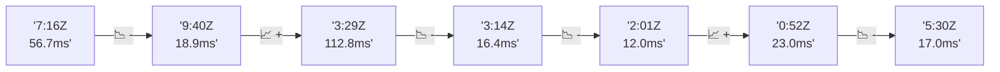

# 📊 Reporte de Performance - PokeAPI

**Fecha de corrida:** 2026-07-29 00:26 UTC

**Enlace:** [30411113179](https://github.com/rba3/Lab_CD_CI_Perfomance/actions/runs/30411113179)

## ✅ Veredicto

```
FAIL  
1. El porcentaje de errores es extremadamente alto (47.2%), superando con creces el SLO de <1%. Es crucial investigar las causas de los errores para cada uno de los endpoints que fallaron, como `berry-cheri`, `pokemon-charizard`, y `pokemon-ditto`.  
2. Aunque el tiempo promedio de respuesta es bajo (16.5 ms), hay endpoints con p95 que superan los 800 ms, especialmente `pokemon-ditto` que llega a 390.2 ms y requiere atención inmediata.  
3. Se recomienda realizar una revisión y optimización del backend para los endpoints problemáticos, así como realizar pruebas adicionales bajo condiciones controladas para identificar la fuente de los errores.  
4. Implementar un análisis de logs y monitoreo en tiempo real ayudará a obtener información sobre el estado de salud de la API y a detectar problemas antes de que impacten a los usuarios finales.
```

## 🔮 Predicciones

✓ STABLE

## 💡 Recomendaciones Prioritarias

🔴 **Tasa de error global crítica**
   - Posibles causas: Problema sistémico (BD caída, network desconectada), PokeAPI inestable
   - Acciones: Revisar estado de PokeAPI (status.pokeapi.co), Revisar logs de la corrida

## 📈 Métricas Globales

| Métrica | Valor | SLO | Estado |
|---------|-------|-----|--------|
| Error Rate | 47.2% | < 0.1% | ❌ FAIL |
| Latencia p50 | 9.0ms | - | ℹ️ |
| Latencia p95 | 17.0ms | < 800ms | ✅ PASS |
| Latencia p99 | 37.4ms | - | ℹ️ |
| Throughput | 0.00 req/s | - | ℹ️ |
| Muestras | 0 | - | ℹ️ |

## 📉 Tendencia Histórica (Últimas 7 corridas)



## 🔧 Análisis Técnico Detallado (JSON)

```json
{
  "predictions": {
    "prediction": "STABLE",
    "confidence": 0,
    "slope_ms_per_run": -23.95,
    "current_p95": 17.0,
    "days_to_warn": null,
    "days_to_fail": null,
    "risk_level": "LOW"
  },
  "recommendations": [
    {
      "issue": "Tasa de error global cr\u00edtica",
      "severity": "CRITICAL",
      "causes": [
        "Problema sist\u00e9mico (BD ca\u00edda, network desconectada)",
        "PokeAPI inestable",
        "Assertions muy restrictivas"
      ],
      "fixes": [
        "Revisar estado de PokeAPI (status.pokeapi.co)",
        "Revisar logs de la corrida",
        "Considerar relajar assertions",
        "Abrir issue en PokeAPI si es su problema"
      ]
    }
  ],
  "correlations": {},
  "root_cause": {
    "issue": null,
    "root_cause": null,
    "confidence": 0,
    "evidence": []
  },
  "timestamp": "2026-07-29T00:26:27.763344"
}
```

## 📦 Datos Completos (JSON)

```json
{
  "scenario": "smoke",
  "overall": {
    "samples": 161,
    "errors": 76,
    "error_pct": 47.2,
    "avg_ms": 16.5,
    "min_ms": 7,
    "max_ms": 956,
    "p50_ms": 9.0,
    "p90_ms": 15.0,
    "p95_ms": 17.0,
    "p99_ms": 37.4,
    "throughput_rps": 5.53,
    "duration_s": 29.1
  },
  "by_endpoint": {
    "ability-static": {
      "samples": 12,
      "errors": 0,
      "error_pct": 0.0,
      "avg_ms": 8.6,
      "min_ms": 7,
      "max_ms": 11,
      "p50_ms": 8.0,
      "p90_ms": 9.9,
      "p95_ms": 10.4,
      "p99_ms": 10.9,
      "throughput_rps": 0.49,
      "duration_s": 24.6
    },
    "berry-cheri": {
      "samples": 12,
      "errors": 12,
      "error_pct": 100.0,
      "avg_ms": 8.2,
      "min_ms": 7,
      "max_ms": 10,
      "p50_ms": 8.0,
      "p90_ms": 9.0,
      "p95_ms": 9.4,
      "p99_ms": 9.9,
      "throughput_rps": 0.49,
      "duration_s": 24.3
    },
    "generation-1": {
      "samples": 12,
      "errors": 0,
      "error_pct": 0.0,
      "avg_ms": 10.8,
      "min_ms": 8,
      "max_ms": 33,
      "p50_ms": 9.0,
      "p90_ms": 9.9,
      "p95_ms": 20.3,
      "p99_ms": 30.5,
      "throughput_rps": 0.49,
      "duration_s": 24.5
    },
    "move-nature-power": {
      "samples": 12,
      "errors": 0,
      "error_pct": 0.0,
      "avg_ms": 10.8,
      "min_ms": 8,
      "max_ms": 25,
      "p50_ms": 10.0,
      "p90_ms": 10.9,
      "p95_ms": 17.3,
      "p99_ms": 23.5,
      "throughput_rps": 0.49,
      "duration_s": 24.4
    },
    "move-tackle": {
      "samples": 12,
      "errors": 0,
      "error_pct": 0.0,
      "avg_ms": 9.3,
      "min_ms": 8,
      "max_ms": 11,
      "p50_ms": 9.0,
      "p90_ms": 11.0,
      "p95_ms": 11.0,
      "p99_ms": 11.0,
      "throughput_rps": 0.49,
      "duration_s": 24.4
    },
    "pokemon-charizard": {
      "samples": 13,
      "errors": 13,
      "error_pct": 100.0,
      "avg_ms": 18.2,
      "min_ms": 13,
      "max_ms": 44,
      "p50_ms": 16.0,
      "p90_ms": 21.2,
      "p95_ms": 30.8,
      "p99_ms": 41.4,
      "throughput_rps": 0.48,
      "duration_s": 27.2
    },
    "pokemon-chikorita": {
      "samples": 12,
      "errors": 12,
      "error_pct": 100.0,
      "avg_ms": 12.9,
      "min_ms": 10,
      "max_ms": 16,
      "p50_ms": 13.0,
      "p90_ms": 14.9,
      "p95_ms": 15.4,
      "p99_ms": 15.9,
      "throughput_rps": 0.49,
      "duration_s": 24.3
    },
    "pokemon-ditto": {
      "samples": 13,
      "errors": 13,
      "error_pct": 100.0,
      "avg_ms": 81.8,
      "min_ms": 8,
      "max_ms": 956,
      "p50_ms": 9.0,
      "p90_ms": 12.4,
      "p95_ms": 390.2,
      "p99_ms": 842.8,
      "throughput_rps": 0.46,
      "duration_s": 28.3
    },
    "pokemon-list": {
      "samples": 13,
      "errors": 13,
      "error_pct": 100.0,
      "avg_ms": 8.4,
      "min_ms": 7,
      "max_ms": 10,
      "p50_ms": 8.0,
      "p90_ms": 9.0,
      "p95_ms": 9.4,
      "p99_ms": 9.9,
      "throughput_rps": 0.48,
      "duration_s": 26.8
    },
    "pokemon-pikachu": {
      "samples": 13,
      "errors": 13,
      "error_pct": 100.0,
      "avg_ms": 14.4,
      "min_ms": 10,
      "max_ms": 29,
      "p50_ms": 13.0,
      "p90_ms": 16.0,
      "p95_ms": 21.2,
      "p99_ms": 27.4,
      "throughput_rps": 0.48,
      "duration_s": 27.1
    },
    "type-fairy": {
      "samples": 12,
      "errors": 0,
      "error_pct": 0.0,
      "avg_ms": 8.9,
      "min_ms": 7,
      "max_ms": 13,
      "p50_ms": 9.0,
      "p90_ms": 9.9,
      "p95_ms": 11.3,
      "p99_ms": 12.7,
      "throughput_rps": 0.49,
      "duration_s": 24.4
    },
    "type-fire": {
      "samples": 12,
      "errors": 0,
      "error_pct": 0.0,
      "avg_ms": 8.8,
      "min_ms": 8,
      "max_ms": 10,
      "p50_ms": 9.0,
      "p90_ms": 9.0,
      "p95_ms": 9.4,
      "p99_ms": 9.9,
      "throughput_rps": 0.49,
      "duration_s": 24.6
    },
    "type-water": {
      "samples": 13,
      "errors": 0,
      "error_pct": 0.0,
      "avg_ms": 8.9,
      "min_ms": 8,
      "max_ms": 11,
      "p50_ms": 9.0,
      "p90_ms": 10.0,
      "p95_ms": 10.4,
      "p99_ms": 10.9,
      "throughput_rps": 0.48,
      "duration_s": 27.0
    }
  },
  "empty": false
}
```

---

*Reporte generado automáticamente por el workflow de performance.*

*Timestamp: 2026-07-29T00:26:27.764888Z*
