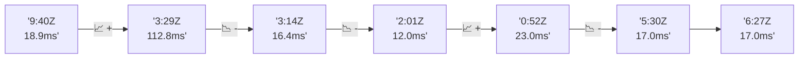

# 📊 Reporte de Performance - PokeAPI

**Fecha de corrida:** 2026-07-29 00:38 UTC

**Enlace:** [30411688651](https://github.com/rba3/Lab_CD_CI_Perfomance/actions/runs/30411688651)

## ✅ Veredicto

```
FAIL

1. Aunque no hubo errores (0%), varios endpoints, especialmente el "pokemon-charizard", excedieron el umbral de p95, alcanzando 1924.4 ms, lo que puede afectar la experiencia del usuario. Se recomienda optimizar este endpoint, considerando revisiones de consultas y bases de datos.

2. El tiempo de respuesta promedio (avg_ms) se encuentra dentro de un rango aceptable (202.6 ms), pero el max_ms alcanza hasta 2328 ms. Se sugiere implementar mecanismos de monitoreo y escalabilidad para asegurar un rendimiento constante durante picos de carga.

3. Es importante realizar un análisis adicional sobre las llamadas lentas de ciertos endpoints, como "pokemon-ditto" y "pokemon-pikachu". Se debe investigar la infraestructura subyacente y la eficiencia del código para mejorar su rendimiento.

4. Reforzar las pruebas de carga para incluir escenarios más variados y representativos que puedan ayudar a identificar cuellos de botella en situaciones de tráfico más realistas.
```

## 🔮 Predicciones

⚠️ **Tendencia de degradación detectada** (LOW risk)
- Pendiente: +0.15ms/corrida
- P95 actual: 694.3ms
- Días hasta WARN: ~704
- Días hasta FAIL: ~5371
- Confianza: 80%

## 🎯 Causa Raíz Identificada

**Latencia inconsistente (outliers)**
- Causa probable: Spikes de latencia, posible GC o context switching
- Confianza: 75%
- Evidencia:
  - p50 (111.0ms) mucho menor que p95 (694.3ms)
  - Diferencia de 3x+ indica distribución anómala

## 📈 Métricas Globales

| Métrica | Valor | SLO | Estado |
|---------|-------|-----|--------|
| Error Rate | 0.0% | < 0.1% | ✅ PASS |
| Latencia p50 | 111.0ms | - | ℹ️ |
| Latencia p95 | 694.3ms | < 800ms | ✅ PASS |
| Latencia p99 | 1282.3ms | - | ℹ️ |
| Throughput | 0.00 req/s | - | ℹ️ |
| Muestras | 0 | - | ℹ️ |

## 📉 Tendencia Histórica (Últimas 7 corridas)



## 🔧 Análisis Técnico Detallado (JSON)

```json
{
  "predictions": {
    "prediction": "DEGRADATION_TREND",
    "confidence": 80,
    "slope_ms_per_run": 0.15,
    "current_p95": 694.3,
    "days_to_warn": 704,
    "days_to_fail": 5371,
    "risk_level": "LOW"
  },
  "recommendations": [],
  "correlations": {},
  "root_cause": {
    "issue": "Latencia inconsistente (outliers)",
    "root_cause": "Spikes de latencia, posible GC o context switching",
    "confidence": 75,
    "evidence": [
      "p50 (111.0ms) mucho menor que p95 (694.3ms)",
      "Diferencia de 3x+ indica distribuci\u00f3n an\u00f3mala"
    ]
  },
  "timestamp": "2026-07-29T00:38:08.700805"
}
```

## 📦 Datos Completos (JSON)

```json
{
  "scenario": "smoke",
  "overall": {
    "samples": 119,
    "errors": 0,
    "error_pct": 0.0,
    "avg_ms": 202.6,
    "min_ms": 19,
    "max_ms": 2328,
    "p50_ms": 111.0,
    "p90_ms": 532.6,
    "p95_ms": 694.3,
    "p99_ms": 1282.3,
    "throughput_rps": 4.07,
    "duration_s": 29.2
  },
  "by_endpoint": {
    "ability-static": {
      "samples": 9,
      "errors": 0,
      "error_pct": 0.0,
      "avg_ms": 126.1,
      "min_ms": 20,
      "max_ms": 547,
      "p50_ms": 117.0,
      "p90_ms": 221.4,
      "p95_ms": 384.2,
      "p99_ms": 514.4,
      "throughput_rps": 0.37,
      "duration_s": 24.3
    },
    "berry-cheri": {
      "samples": 9,
      "errors": 0,
      "error_pct": 0.0,
      "avg_ms": 172.9,
      "min_ms": 20,
      "max_ms": 782,
      "p50_ms": 47.0,
      "p90_ms": 538.8,
      "p95_ms": 660.4,
      "p99_ms": 757.7,
      "throughput_rps": 0.37,
      "duration_s": 24.2
    },
    "generation-1": {
      "samples": 9,
      "errors": 0,
      "error_pct": 0.0,
      "avg_ms": 56.6,
      "min_ms": 20,
      "max_ms": 146,
      "p50_ms": 24.0,
      "p90_ms": 122.8,
      "p95_ms": 134.4,
      "p99_ms": 143.7,
      "throughput_rps": 0.37,
      "duration_s": 24.1
    },
    "move-nature-power": {
      "samples": 9,
      "errors": 0,
      "error_pct": 0.0,
      "avg_ms": 101.1,
      "min_ms": 21,
      "max_ms": 236,
      "p50_ms": 122.0,
      "p90_ms": 212.0,
      "p95_ms": 224.0,
      "p99_ms": 233.6,
      "throughput_rps": 0.37,
      "duration_s": 24.2
    },
    "move-tackle": {
      "samples": 9,
      "errors": 0,
      "error_pct": 0.0,
      "avg_ms": 174.9,
      "min_ms": 53,
      "max_ms": 317,
      "p50_ms": 173.0,
      "p90_ms": 241.0,
      "p95_ms": 279.0,
      "p99_ms": 309.4,
      "throughput_rps": 0.37,
      "duration_s": 24.6
    },
    "pokemon-charizard": {
      "samples": 9,
      "errors": 0,
      "error_pct": 0.0,
      "avg_ms": 806.7,
      "min_ms": 42,
      "max_ms": 2328,
      "p50_ms": 663.0,
      "p90_ms": 1520.8,
      "p95_ms": 1924.4,
      "p99_ms": 2247.3,
      "throughput_rps": 0.36,
      "duration_s": 25.3
    },
    "pokemon-chikorita": {
      "samples": 9,
      "errors": 0,
      "error_pct": 0.0,
      "avg_ms": 245.2,
      "min_ms": 25,
      "max_ms": 529,
      "p50_ms": 271.0,
      "p90_ms": 412.2,
      "p95_ms": 470.6,
      "p99_ms": 517.3,
      "throughput_rps": 0.37,
      "duration_s": 24.3
    },
    "pokemon-ditto": {
      "samples": 10,
      "errors": 0,
      "error_pct": 0.0,
      "avg_ms": 176.5,
      "min_ms": 20,
      "max_ms": 1115,
      "p50_ms": 24.0,
      "p90_ms": 373.4,
      "p95_ms": 744.2,
      "p99_ms": 1040.8,
      "throughput_rps": 0.34,
      "duration_s": 29.2
    },
    "pokemon-list": {
      "samples": 9,
      "errors": 0,
      "error_pct": 0.0,
      "avg_ms": 103.3,
      "min_ms": 19,
      "max_ms": 667,
      "p50_ms": 20.0,
      "p90_ms": 212.6,
      "p95_ms": 439.8,
      "p99_ms": 621.6,
      "throughput_rps": 0.37,
      "duration_s": 24.2
    },
    "pokemon-pikachu": {
      "samples": 10,
      "errors": 0,
      "error_pct": 0.0,
      "avg_ms": 353.6,
      "min_ms": 24,
      "max_ms": 689,
      "p50_ms": 373.5,
      "p90_ms": 543.2,
      "p95_ms": 616.1,
      "p99_ms": 674.4,
      "throughput_rps": 0.36,
      "duration_s": 27.5
    },
    "type-fairy": {
      "samples": 9,
      "errors": 0,
      "error_pct": 0.0,
      "avg_ms": 132.9,
      "min_ms": 20,
      "max_ms": 302,
      "p50_ms": 117.0,
      "p90_ms": 251.6,
      "p95_ms": 276.8,
      "p99_ms": 297.0,
      "throughput_rps": 0.37,
      "duration_s": 24.4
    },
    "type-fire": {
      "samples": 9,
      "errors": 0,
      "error_pct": 0.0,
      "avg_ms": 102.1,
      "min_ms": 20,
      "max_ms": 210,
      "p50_ms": 110.0,
      "p90_ms": 204.4,
      "p95_ms": 207.2,
      "p99_ms": 209.4,
      "throughput_rps": 0.36,
      "duration_s": 24.7
    },
    "type-water": {
      "samples": 9,
      "errors": 0,
      "error_pct": 0.0,
      "avg_ms": 67.9,
      "min_ms": 20,
      "max_ms": 304,
      "p50_ms": 22.0,
      "p90_ms": 160.0,
      "p95_ms": 232.0,
      "p99_ms": 289.6,
      "throughput_rps": 0.37,
      "duration_s": 24.2
    }
  },
  "empty": false
}
```

---

*Reporte generado automáticamente por el workflow de performance.*

*Timestamp: 2026-07-29T00:38:08.702352Z*
