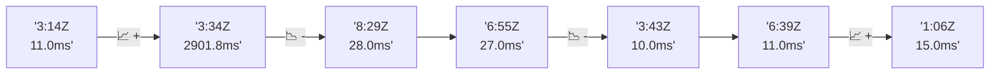

# 📊 Reporte de Performance - PokeAPI

**Fecha de corrida:** 2026-07-29 15:04 UTC

**Enlace:** [30463800683](https://github.com/rba3/Lab_CD_CI_Perfomance/actions/runs/30463800683)

## ✅ Veredicto

```
PASS

1. Los resultados generales muestran un 0% de errores y cumplieron con el SLO de error, lo que indica una buena estabilidad del sistema bajo prueba.
2. El promedio de latencia es de 28.7 ms y el p95 es de 41.0 ms, ambos significativamente por debajo del límite de 800 ms, lo que refleja un rendimiento óptimo.
3. Sin embargo, se detectó un max de 4459 ms en la métrica general; se recomienda investigar este caso extremo para mejorar la consistencia del rendimiento.
4. Considerar la implementación de monitoreo adicional para las métricas de latencia extrema y optimizar los endpoints que reportan mayores tiempos de respuesta, como "pokemon-charizard".
```

## 🔮 Predicciones

✓ STABLE

## 📈 Métricas Globales

| Métrica | Valor | SLO | Estado |
|---------|-------|-----|--------|
| Error Rate | 0.0% | < 0.1% | ✅ PASS |
| Latencia p50 | 23.0ms | - | ℹ️ |
| Latencia p95 | 41.0ms | < 800ms | ✅ PASS |
| Latencia p99 | 117.0ms | - | ℹ️ |
| Throughput | 0.00 req/s | - | ℹ️ |
| Muestras | 0 | - | ℹ️ |

## 📉 Tendencia Histórica (Últimas 7 corridas)



## 🔧 Análisis Técnico Detallado (JSON)

```json
{
  "predictions": {
    "prediction": "STABLE",
    "confidence": 0,
    "slope_ms_per_run": -3.25,
    "current_p95": 41.0,
    "days_to_warn": null,
    "days_to_fail": null,
    "risk_level": "LOW"
  },
  "recommendations": [],
  "correlations": {},
  "root_cause": {
    "issue": null,
    "root_cause": null,
    "confidence": 0,
    "evidence": []
  },
  "timestamp": "2026-07-29T15:04:09.032651"
}
```

## 📦 Datos Completos (JSON)

```json
{
  "scenario": "load",
  "overall": {
    "samples": 15990,
    "errors": 0,
    "error_pct": 0.0,
    "avg_ms": 28.7,
    "min_ms": 13,
    "max_ms": 4459,
    "p50_ms": 23.0,
    "p90_ms": 30.0,
    "p95_ms": 41.0,
    "p99_ms": 117.0,
    "throughput_rps": 133.62,
    "duration_s": 119.7
  },
  "by_endpoint": {
    "ability-static": {
      "samples": 1598,
      "errors": 0,
      "error_pct": 0.0,
      "avg_ms": 27.1,
      "min_ms": 14,
      "max_ms": 516,
      "p50_ms": 23.0,
      "p90_ms": 28.0,
      "p95_ms": 39.1,
      "p99_ms": 133.0,
      "throughput_rps": 13.49,
      "duration_s": 118.4
    },
    "berry-cheri": {
      "samples": 1598,
      "errors": 0,
      "error_pct": 0.0,
      "avg_ms": 24.7,
      "min_ms": 14,
      "max_ms": 485,
      "p50_ms": 22.0,
      "p90_ms": 27.0,
      "p95_ms": 34.0,
      "p99_ms": 99.0,
      "throughput_rps": 13.51,
      "duration_s": 118.3
    },
    "generation-1": {
      "samples": 1598,
      "errors": 0,
      "error_pct": 0.0,
      "avg_ms": 27.9,
      "min_ms": 14,
      "max_ms": 913,
      "p50_ms": 22.0,
      "p90_ms": 28.0,
      "p95_ms": 41.0,
      "p99_ms": 135.7,
      "throughput_rps": 13.53,
      "duration_s": 118.1
    },
    "move-tackle": {
      "samples": 1599,
      "errors": 0,
      "error_pct": 0.0,
      "avg_ms": 26.5,
      "min_ms": 14,
      "max_ms": 526,
      "p50_ms": 23.0,
      "p90_ms": 28.0,
      "p95_ms": 37.0,
      "p99_ms": 122.0,
      "throughput_rps": 13.54,
      "duration_s": 118.1
    },
    "pokemon-charizard": {
      "samples": 1600,
      "errors": 0,
      "error_pct": 0.0,
      "avg_ms": 42.9,
      "min_ms": 18,
      "max_ms": 4459,
      "p50_ms": 29.0,
      "p90_ms": 38.1,
      "p95_ms": 56.0,
      "p99_ms": 312.3,
      "throughput_rps": 13.43,
      "duration_s": 119.1
    },
    "pokemon-ditto": {
      "samples": 1599,
      "errors": 0,
      "error_pct": 0.0,
      "avg_ms": 25.6,
      "min_ms": 14,
      "max_ms": 509,
      "p50_ms": 22.0,
      "p90_ms": 27.0,
      "p95_ms": 32.0,
      "p99_ms": 101.1,
      "throughput_rps": 13.37,
      "duration_s": 119.6
    },
    "pokemon-list": {
      "samples": 1599,
      "errors": 0,
      "error_pct": 0.0,
      "avg_ms": 25.5,
      "min_ms": 14,
      "max_ms": 959,
      "p50_ms": 22.0,
      "p90_ms": 27.0,
      "p95_ms": 33.0,
      "p99_ms": 106.0,
      "throughput_rps": 13.47,
      "duration_s": 118.7
    },
    "pokemon-pikachu": {
      "samples": 1600,
      "errors": 0,
      "error_pct": 0.0,
      "avg_ms": 35.4,
      "min_ms": 17,
      "max_ms": 2312,
      "p50_ms": 27.0,
      "p90_ms": 35.0,
      "p95_ms": 49.0,
      "p99_ms": 238.1,
      "throughput_rps": 13.43,
      "duration_s": 119.2
    },
    "type-fire": {
      "samples": 1600,
      "errors": 0,
      "error_pct": 0.0,
      "avg_ms": 26.3,
      "min_ms": 13,
      "max_ms": 764,
      "p50_ms": 23.0,
      "p90_ms": 28.0,
      "p95_ms": 35.0,
      "p99_ms": 105.0,
      "throughput_rps": 13.5,
      "duration_s": 118.5
    },
    "type-water": {
      "samples": 1599,
      "errors": 0,
      "error_pct": 0.0,
      "avg_ms": 25.4,
      "min_ms": 14,
      "max_ms": 280,
      "p50_ms": 22.0,
      "p90_ms": 28.0,
      "p95_ms": 38.2,
      "p99_ms": 103.1,
      "throughput_rps": 13.48,
      "duration_s": 118.6
    }
  },
  "empty": false
}
```

---

*Reporte generado automáticamente por el workflow de performance.*

*Timestamp: 2026-07-29T15:04:09.033875Z*
