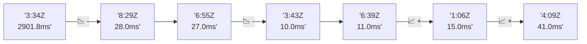

# 📊 Reporte de Performance - PokeAPI

**Fecha de corrida:** 2026-07-30 15:00 UTC

**Enlace:** [30554315199](https://github.com/rba3/Lab_CD_CI_Perfomance/actions/runs/30554315199)

## ✅ Veredicto

```
PASS

1. Todas las métricas de error son 0, cumpliendo con el SLO de error < 1%. Es un excelente resultado, lo que indica una buena estabilidad del servicio bajo carga.
2. El tiempo de respuesta P95 es de 13ms, muy por debajo del límite de 800ms, mostrando un rendimiento sólido en todas las pruebas.
3. La carga de throughput es también satisfactoria, con un promedio de 142.11 RPS durante la prueba de carga, lo que sugiere que el sistema puede manejar un volumen considerable de solicitudes sin problemas.
4. Para la prueba de humo, aunque los tiempos son aceptables, se observó un máximo de 938ms en la solicitud a "pokemon-ditto". Se recomienda investigar esa endpoint específica para optimizar su rendimiento y evitar picos innecesarios.
```

## 🔮 Predicciones

⚠️ **Tendencia de degradación detectada** (LOW risk)
- Pendiente: +3.5ms/corrida
- P95 actual: 13.0ms
- Días hasta WARN: ~224
- Días hasta FAIL: ~424
- Confianza: 80%

## 📈 Métricas Globales

| Métrica | Valor | SLO | Estado |
|---------|-------|-----|--------|
| Error Rate | 0.0% | < 0.1% | ✅ PASS |
| Latencia p50 | 8.0ms | - | ℹ️ |
| Latencia p95 | 13.0ms | < 800ms | ✅ PASS |
| Latencia p99 | 20.0ms | - | ℹ️ |
| Throughput | 0.00 req/s | - | ℹ️ |
| Muestras | 0 | - | ℹ️ |

## 📉 Tendencia Histórica (Últimas 7 corridas)



## 🔧 Análisis Técnico Detallado (JSON)

```json
{
  "predictions": {
    "prediction": "DEGRADATION_TREND",
    "confidence": 80,
    "slope_ms_per_run": 3.5,
    "current_p95": 13.0,
    "days_to_warn": 224,
    "days_to_fail": 424,
    "risk_level": "LOW"
  },
  "recommendations": [],
  "correlations": {},
  "root_cause": {
    "issue": null,
    "root_cause": null,
    "confidence": 0,
    "evidence": []
  },
  "timestamp": "2026-07-30T15:00:41.991091"
}
```

## 📦 Datos Completos (JSON)

```json
{
  "scenario": "load",
  "overall": {
    "samples": 16997,
    "errors": 0,
    "error_pct": 0.0,
    "avg_ms": 9.1,
    "min_ms": 5,
    "max_ms": 241,
    "p50_ms": 8.0,
    "p90_ms": 12.0,
    "p95_ms": 13.0,
    "p99_ms": 20.0,
    "throughput_rps": 142.11,
    "duration_s": 119.6
  },
  "by_endpoint": {
    "ability-static": {
      "samples": 1700,
      "errors": 0,
      "error_pct": 0.0,
      "avg_ms": 9.1,
      "min_ms": 5,
      "max_ms": 30,
      "p50_ms": 9.0,
      "p90_ms": 11.0,
      "p95_ms": 13.0,
      "p99_ms": 20.0,
      "throughput_rps": 14.36,
      "duration_s": 118.4
    },
    "berry-cheri": {
      "samples": 1700,
      "errors": 0,
      "error_pct": 0.0,
      "avg_ms": 8.9,
      "min_ms": 5,
      "max_ms": 49,
      "p50_ms": 8.0,
      "p90_ms": 12.0,
      "p95_ms": 14.0,
      "p99_ms": 19.0,
      "throughput_rps": 14.36,
      "duration_s": 118.4
    },
    "generation-1": {
      "samples": 1699,
      "errors": 0,
      "error_pct": 0.0,
      "avg_ms": 9.1,
      "min_ms": 6,
      "max_ms": 54,
      "p50_ms": 8.0,
      "p90_ms": 12.0,
      "p95_ms": 13.0,
      "p99_ms": 21.0,
      "throughput_rps": 14.39,
      "duration_s": 118.0
    },
    "move-tackle": {
      "samples": 1699,
      "errors": 0,
      "error_pct": 0.0,
      "avg_ms": 9.0,
      "min_ms": 5,
      "max_ms": 38,
      "p50_ms": 8.0,
      "p90_ms": 11.0,
      "p95_ms": 13.0,
      "p99_ms": 20.0,
      "throughput_rps": 14.39,
      "duration_s": 118.1
    },
    "pokemon-charizard": {
      "samples": 1700,
      "errors": 0,
      "error_pct": 0.0,
      "avg_ms": 10.2,
      "min_ms": 6,
      "max_ms": 39,
      "p50_ms": 9.0,
      "p90_ms": 13.0,
      "p95_ms": 15.0,
      "p99_ms": 24.0,
      "throughput_rps": 14.29,
      "duration_s": 119.0
    },
    "pokemon-ditto": {
      "samples": 1701,
      "errors": 0,
      "error_pct": 0.0,
      "avg_ms": 9.1,
      "min_ms": 5,
      "max_ms": 241,
      "p50_ms": 8.0,
      "p90_ms": 12.0,
      "p95_ms": 14.0,
      "p99_ms": 22.0,
      "throughput_rps": 14.22,
      "duration_s": 119.6
    },
    "pokemon-list": {
      "samples": 1699,
      "errors": 0,
      "error_pct": 0.0,
      "avg_ms": 8.3,
      "min_ms": 5,
      "max_ms": 29,
      "p50_ms": 8.0,
      "p90_ms": 10.0,
      "p95_ms": 12.0,
      "p99_ms": 17.0,
      "throughput_rps": 14.32,
      "duration_s": 118.6
    },
    "pokemon-pikachu": {
      "samples": 1700,
      "errors": 0,
      "error_pct": 0.0,
      "avg_ms": 9.8,
      "min_ms": 7,
      "max_ms": 58,
      "p50_ms": 9.0,
      "p90_ms": 12.0,
      "p95_ms": 14.0,
      "p99_ms": 24.0,
      "throughput_rps": 14.28,
      "duration_s": 119.0
    },
    "type-fire": {
      "samples": 1700,
      "errors": 0,
      "error_pct": 0.0,
      "avg_ms": 8.6,
      "min_ms": 5,
      "max_ms": 41,
      "p50_ms": 8.0,
      "p90_ms": 11.0,
      "p95_ms": 12.0,
      "p99_ms": 18.0,
      "throughput_rps": 14.35,
      "duration_s": 118.4
    },
    "type-water": {
      "samples": 1699,
      "errors": 0,
      "error_pct": 0.0,
      "avg_ms": 8.9,
      "min_ms": 6,
      "max_ms": 40,
      "p50_ms": 8.0,
      "p90_ms": 11.0,
      "p95_ms": 13.0,
      "p99_ms": 18.0,
      "throughput_rps": 14.33,
      "duration_s": 118.6
    }
  },
  "empty": false
}
```

---

*Reporte generado automáticamente por el workflow de performance.*

*Timestamp: 2026-07-30T15:00:41.992619Z*
