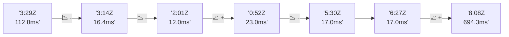

# 📊 Reporte de Performance - PokeAPI

**Fecha de corrida:** 2026-07-30 23:26 UTC

**Enlace:** [30590458105](https://github.com/rba3/Lab_CD_CI_Perfomance/actions/runs/30590458105)

## ✅ Veredicto

```
PASS (fallback por umbrales)

- Error maximo: 0.0%
- p95 maximo: 19.0 ms
```

## 🔮 Predicciones

⚠️ **Tendencia de degradación detectada** (HIGH risk)
- Pendiente: +170.57ms/corrida
- P95 actual: 19.0ms
- Días hasta WARN: ~4
- Días hasta FAIL: ~8
- Confianza: 80%

## 📈 Métricas Globales

| Métrica | Valor | SLO | Estado |
|---------|-------|-----|--------|
| Error Rate | 0.0% | < 0.1% | ✅ PASS |
| Latencia p50 | 12.0ms | - | ℹ️ |
| Latencia p95 | 19.0ms | < 800ms | ✅ PASS |
| Latencia p99 | 43.0ms | - | ℹ️ |
| Throughput | 0.00 req/s | - | ℹ️ |
| Muestras | 0 | - | ℹ️ |

## 📉 Tendencia Histórica (Últimas 7 corridas)



## 🔧 Análisis Técnico Detallado (JSON)

```json
{
  "predictions": {
    "prediction": "DEGRADATION_TREND",
    "confidence": 80,
    "slope_ms_per_run": 170.57,
    "current_p95": 19.0,
    "days_to_warn": 4,
    "days_to_fail": 8,
    "risk_level": "HIGH"
  },
  "recommendations": [],
  "correlations": {},
  "root_cause": {
    "issue": null,
    "root_cause": null,
    "confidence": 0,
    "evidence": []
  },
  "timestamp": "2026-07-30T23:26:16.114300"
}
```

## 📦 Datos Completos (JSON)

```json
{
  "scenario": "smoke",
  "overall": {
    "samples": 160,
    "errors": 0,
    "error_pct": 0.0,
    "avg_ms": 18.9,
    "min_ms": 8,
    "max_ms": 1003,
    "p50_ms": 12.0,
    "p90_ms": 17.0,
    "p95_ms": 19.0,
    "p99_ms": 43.0,
    "throughput_rps": 5.52,
    "duration_s": 29.0
  },
  "by_endpoint": {
    "ability-static": {
      "samples": 12,
      "errors": 0,
      "error_pct": 0.0,
      "avg_ms": 10.8,
      "min_ms": 9,
      "max_ms": 12,
      "p50_ms": 11.0,
      "p90_ms": 12.0,
      "p95_ms": 12.0,
      "p99_ms": 12.0,
      "throughput_rps": 0.49,
      "duration_s": 24.6
    },
    "berry-cheri": {
      "samples": 12,
      "errors": 0,
      "error_pct": 0.0,
      "avg_ms": 10.3,
      "min_ms": 8,
      "max_ms": 12,
      "p50_ms": 10.0,
      "p90_ms": 12.0,
      "p95_ms": 12.0,
      "p99_ms": 12.0,
      "throughput_rps": 0.49,
      "duration_s": 24.4
    },
    "generation-1": {
      "samples": 12,
      "errors": 0,
      "error_pct": 0.0,
      "avg_ms": 13,
      "min_ms": 9,
      "max_ms": 36,
      "p50_ms": 11.0,
      "p90_ms": 12.9,
      "p95_ms": 23.3,
      "p99_ms": 33.5,
      "throughput_rps": 0.49,
      "duration_s": 24.5
    },
    "move-nature-power": {
      "samples": 12,
      "errors": 0,
      "error_pct": 0.0,
      "avg_ms": 11.9,
      "min_ms": 9,
      "max_ms": 16,
      "p50_ms": 11.0,
      "p90_ms": 15.8,
      "p95_ms": 16.0,
      "p99_ms": 16.0,
      "throughput_rps": 0.49,
      "duration_s": 24.5
    },
    "move-tackle": {
      "samples": 12,
      "errors": 0,
      "error_pct": 0.0,
      "avg_ms": 11.5,
      "min_ms": 9,
      "max_ms": 14,
      "p50_ms": 11.5,
      "p90_ms": 14.0,
      "p95_ms": 14.0,
      "p99_ms": 14.0,
      "throughput_rps": 0.49,
      "duration_s": 24.5
    },
    "pokemon-charizard": {
      "samples": 13,
      "errors": 0,
      "error_pct": 0.0,
      "avg_ms": 20.6,
      "min_ms": 15,
      "max_ms": 53,
      "p50_ms": 17.0,
      "p90_ms": 23.6,
      "p95_ms": 35.6,
      "p99_ms": 49.5,
      "throughput_rps": 0.48,
      "duration_s": 27.2
    },
    "pokemon-chikorita": {
      "samples": 12,
      "errors": 0,
      "error_pct": 0.0,
      "avg_ms": 14.8,
      "min_ms": 12,
      "max_ms": 17,
      "p50_ms": 14.5,
      "p90_ms": 17.0,
      "p95_ms": 17.0,
      "p99_ms": 17.0,
      "throughput_rps": 0.49,
      "duration_s": 24.4
    },
    "pokemon-ditto": {
      "samples": 13,
      "errors": 0,
      "error_pct": 0.0,
      "avg_ms": 87.5,
      "min_ms": 9,
      "max_ms": 1003,
      "p50_ms": 11.0,
      "p90_ms": 15.4,
      "p95_ms": 410.8,
      "p99_ms": 884.6,
      "throughput_rps": 0.46,
      "duration_s": 28.5
    },
    "pokemon-list": {
      "samples": 13,
      "errors": 0,
      "error_pct": 0.0,
      "avg_ms": 10.5,
      "min_ms": 8,
      "max_ms": 15,
      "p50_ms": 10.0,
      "p90_ms": 13.8,
      "p95_ms": 14.4,
      "p99_ms": 14.9,
      "throughput_rps": 0.48,
      "duration_s": 27.0
    },
    "pokemon-pikachu": {
      "samples": 13,
      "errors": 0,
      "error_pct": 0.0,
      "avg_ms": 17.5,
      "min_ms": 13,
      "max_ms": 30,
      "p50_ms": 16.0,
      "p90_ms": 20.6,
      "p95_ms": 24.6,
      "p99_ms": 28.9,
      "throughput_rps": 0.48,
      "duration_s": 27.2
    },
    "type-fairy": {
      "samples": 12,
      "errors": 0,
      "error_pct": 0.0,
      "avg_ms": 11.2,
      "min_ms": 9,
      "max_ms": 16,
      "p50_ms": 10.0,
      "p90_ms": 14.9,
      "p95_ms": 15.4,
      "p99_ms": 15.9,
      "throughput_rps": 0.49,
      "duration_s": 24.5
    },
    "type-fire": {
      "samples": 12,
      "errors": 0,
      "error_pct": 0.0,
      "avg_ms": 11,
      "min_ms": 8,
      "max_ms": 15,
      "p50_ms": 11.0,
      "p90_ms": 13.0,
      "p95_ms": 13.9,
      "p99_ms": 14.8,
      "throughput_rps": 0.49,
      "duration_s": 24.6
    },
    "type-water": {
      "samples": 12,
      "errors": 0,
      "error_pct": 0.0,
      "avg_ms": 10.7,
      "min_ms": 8,
      "max_ms": 12,
      "p50_ms": 10.5,
      "p90_ms": 12.0,
      "p95_ms": 12.0,
      "p99_ms": 12.0,
      "throughput_rps": 0.48,
      "duration_s": 24.8
    }
  },
  "empty": false
}
```

---

*Reporte generado automáticamente por el workflow de performance.*

*Timestamp: 2026-07-30T23:26:16.115810Z*
