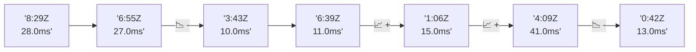

# 📊 Reporte de Performance - PokeAPI

**Fecha de corrida:** 2026-07-31 15:14 UTC

**Enlace:** [30641802997](https://github.com/rba3/Lab_CD_CI_Perfomance/actions/runs/30641802997)

## ✅ Veredicto

```
PASS (fallback por umbrales)

- Error maximo: 0.0%
- p95 maximo: 24.0 ms
```

## 🔮 Predicciones

⚠️ **Tendencia de degradación detectada** (LOW risk)
- Pendiente: +0.75ms/corrida
- P95 actual: 11.0ms
- Días hasta WARN: ~1052
- Días hasta FAIL: ~1985
- Confianza: 80%

## 📈 Métricas Globales

| Métrica | Valor | SLO | Estado |
|---------|-------|-----|--------|
| Error Rate | 0.0% | < 0.1% | ✅ PASS |
| Latencia p50 | 8.0ms | - | ℹ️ |
| Latencia p95 | 11.0ms | < 800ms | ✅ PASS |
| Latencia p99 | 15.0ms | - | ℹ️ |
| Throughput | 0.00 req/s | - | ℹ️ |
| Muestras | 0 | - | ℹ️ |

## 📉 Tendencia Histórica (Últimas 7 corridas)



## 🔧 Análisis Técnico Detallado (JSON)

```json
{
  "predictions": {
    "prediction": "DEGRADATION_TREND",
    "confidence": 80,
    "slope_ms_per_run": 0.75,
    "current_p95": 11.0,
    "days_to_warn": 1052,
    "days_to_fail": 1985,
    "risk_level": "LOW"
  },
  "recommendations": [],
  "correlations": {},
  "root_cause": {
    "issue": null,
    "root_cause": null,
    "confidence": 0,
    "evidence": []
  },
  "timestamp": "2026-07-31T15:14:17.543242"
}
```

## 📦 Datos Completos (JSON)

```json
{
  "scenario": "load",
  "overall": {
    "samples": 17042,
    "errors": 0,
    "error_pct": 0.0,
    "avg_ms": 8.3,
    "min_ms": 5,
    "max_ms": 264,
    "p50_ms": 8.0,
    "p90_ms": 10.0,
    "p95_ms": 11.0,
    "p99_ms": 15.0,
    "throughput_rps": 142.47,
    "duration_s": 119.6
  },
  "by_endpoint": {
    "ability-static": {
      "samples": 1704,
      "errors": 0,
      "error_pct": 0.0,
      "avg_ms": 8.3,
      "min_ms": 6,
      "max_ms": 26,
      "p50_ms": 8.0,
      "p90_ms": 10.0,
      "p95_ms": 11.0,
      "p99_ms": 14.0,
      "throughput_rps": 14.39,
      "duration_s": 118.4
    },
    "berry-cheri": {
      "samples": 1704,
      "errors": 0,
      "error_pct": 0.0,
      "avg_ms": 8.0,
      "min_ms": 5,
      "max_ms": 23,
      "p50_ms": 8.0,
      "p90_ms": 10.0,
      "p95_ms": 11.0,
      "p99_ms": 14.0,
      "throughput_rps": 14.4,
      "duration_s": 118.4
    },
    "generation-1": {
      "samples": 1705,
      "errors": 0,
      "error_pct": 0.0,
      "avg_ms": 8.2,
      "min_ms": 5,
      "max_ms": 36,
      "p50_ms": 8.0,
      "p90_ms": 10.0,
      "p95_ms": 11.0,
      "p99_ms": 17.9,
      "throughput_rps": 14.43,
      "duration_s": 118.2
    },
    "move-tackle": {
      "samples": 1704,
      "errors": 0,
      "error_pct": 0.0,
      "avg_ms": 8.3,
      "min_ms": 5,
      "max_ms": 35,
      "p50_ms": 8.0,
      "p90_ms": 10.0,
      "p95_ms": 11.0,
      "p99_ms": 15.0,
      "throughput_rps": 14.42,
      "duration_s": 118.1
    },
    "pokemon-charizard": {
      "samples": 1704,
      "errors": 0,
      "error_pct": 0.0,
      "avg_ms": 9.0,
      "min_ms": 6,
      "max_ms": 28,
      "p50_ms": 8.0,
      "p90_ms": 11.0,
      "p95_ms": 13.0,
      "p99_ms": 18.0,
      "throughput_rps": 14.32,
      "duration_s": 119.0
    },
    "pokemon-ditto": {
      "samples": 1705,
      "errors": 0,
      "error_pct": 0.0,
      "avg_ms": 8.4,
      "min_ms": 5,
      "max_ms": 264,
      "p50_ms": 8.0,
      "p90_ms": 10.0,
      "p95_ms": 11.0,
      "p99_ms": 16.0,
      "throughput_rps": 14.26,
      "duration_s": 119.6
    },
    "pokemon-list": {
      "samples": 1704,
      "errors": 0,
      "error_pct": 0.0,
      "avg_ms": 7.7,
      "min_ms": 5,
      "max_ms": 21,
      "p50_ms": 7.0,
      "p90_ms": 10.0,
      "p95_ms": 11.0,
      "p99_ms": 14.0,
      "throughput_rps": 14.35,
      "duration_s": 118.7
    },
    "pokemon-pikachu": {
      "samples": 1704,
      "errors": 0,
      "error_pct": 0.0,
      "avg_ms": 8.9,
      "min_ms": 6,
      "max_ms": 42,
      "p50_ms": 8.0,
      "p90_ms": 11.0,
      "p95_ms": 12.0,
      "p99_ms": 17.0,
      "throughput_rps": 14.31,
      "duration_s": 119.0
    },
    "type-fire": {
      "samples": 1704,
      "errors": 0,
      "error_pct": 0.0,
      "avg_ms": 8.0,
      "min_ms": 5,
      "max_ms": 30,
      "p50_ms": 7.0,
      "p90_ms": 10.0,
      "p95_ms": 11.0,
      "p99_ms": 14.0,
      "throughput_rps": 14.39,
      "duration_s": 118.5
    },
    "type-water": {
      "samples": 1704,
      "errors": 0,
      "error_pct": 0.0,
      "avg_ms": 8.4,
      "min_ms": 6,
      "max_ms": 44,
      "p50_ms": 8.0,
      "p90_ms": 10.0,
      "p95_ms": 11.0,
      "p99_ms": 15.0,
      "throughput_rps": 14.36,
      "duration_s": 118.7
    }
  },
  "empty": false
}
```

---

*Reporte generado automáticamente por el workflow de performance.*

*Timestamp: 2026-07-31T15:14:17.545009Z*
