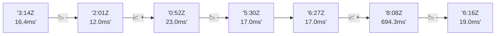

# 📊 Reporte de Performance - PokeAPI

**Fecha de corrida:** 2026-07-31 20:43 UTC

**Enlace:** [30663920706](https://github.com/rba3/Lab_CD_CI_Perfomance/actions/runs/30663920706)

## ✅ Veredicto

```
PASS (fallback por umbrales)

- Error maximo: 0.0%
- p95 maximo: 17.0 ms
```

## 🔮 Predicciones

✓ STABLE

## 📈 Métricas Globales

| Métrica | Valor | SLO | Estado |
|---------|-------|-----|--------|
| Error Rate | 0.0% | < 0.1% | ✅ PASS |
| Latencia p50 | 9.0ms | - | ℹ️ |
| Latencia p95 | 17.0ms | < 800ms | ✅ PASS |
| Latencia p99 | 39.4ms | - | ℹ️ |
| Throughput | 0.00 req/s | - | ℹ️ |
| Muestras | 0 | - | ℹ️ |

## 📉 Tendencia Histórica (Últimas 7 corridas)



## 🔧 Análisis Técnico Detallado (JSON)

```json
{
  "predictions": {
    "prediction": "STABLE",
    "confidence": 0,
    "slope_ms_per_run": -1.0,
    "current_p95": 17.0,
    "days_to_warn": null,
    "days_to_fail": null,
    "risk_level": "LOW"
  },
  "recommendations": [],
  "correlations": {},
  "root_cause": {
    "issue": null,
    "root_cause": null,
    "confidence": 0,
    "evidence": []
  },
  "timestamp": "2026-07-31T20:43:33.330992"
}
```

## 📦 Datos Completos (JSON)

```json
{
  "scenario": "smoke",
  "overall": {
    "samples": 161,
    "errors": 0,
    "error_pct": 0.0,
    "avg_ms": 16.8,
    "min_ms": 7,
    "max_ms": 967,
    "p50_ms": 9.0,
    "p90_ms": 15.0,
    "p95_ms": 17.0,
    "p99_ms": 39.4,
    "throughput_rps": 5.53,
    "duration_s": 29.1
  },
  "by_endpoint": {
    "ability-static": {
      "samples": 12,
      "errors": 0,
      "error_pct": 0.0,
      "avg_ms": 9.5,
      "min_ms": 7,
      "max_ms": 12,
      "p50_ms": 9.0,
      "p90_ms": 11.0,
      "p95_ms": 11.4,
      "p99_ms": 11.9,
      "throughput_rps": 0.49,
      "duration_s": 24.6
    },
    "berry-cheri": {
      "samples": 12,
      "errors": 0,
      "error_pct": 0.0,
      "avg_ms": 8.2,
      "min_ms": 7,
      "max_ms": 9,
      "p50_ms": 8.5,
      "p90_ms": 9.0,
      "p95_ms": 9.0,
      "p99_ms": 9.0,
      "throughput_rps": 0.49,
      "duration_s": 24.3
    },
    "generation-1": {
      "samples": 12,
      "errors": 0,
      "error_pct": 0.0,
      "avg_ms": 10.6,
      "min_ms": 8,
      "max_ms": 28,
      "p50_ms": 9.0,
      "p90_ms": 10.9,
      "p95_ms": 18.6,
      "p99_ms": 26.1,
      "throughput_rps": 0.49,
      "duration_s": 24.5
    },
    "move-nature-power": {
      "samples": 12,
      "errors": 0,
      "error_pct": 0.0,
      "avg_ms": 10.5,
      "min_ms": 8,
      "max_ms": 16,
      "p50_ms": 10.0,
      "p90_ms": 12.9,
      "p95_ms": 14.3,
      "p99_ms": 15.7,
      "throughput_rps": 0.49,
      "duration_s": 24.4
    },
    "move-tackle": {
      "samples": 12,
      "errors": 0,
      "error_pct": 0.0,
      "avg_ms": 9.6,
      "min_ms": 7,
      "max_ms": 14,
      "p50_ms": 9.5,
      "p90_ms": 10.9,
      "p95_ms": 12.3,
      "p99_ms": 13.7,
      "throughput_rps": 0.49,
      "duration_s": 24.4
    },
    "pokemon-charizard": {
      "samples": 13,
      "errors": 0,
      "error_pct": 0.0,
      "avg_ms": 17.8,
      "min_ms": 11,
      "max_ms": 52,
      "p50_ms": 15.0,
      "p90_ms": 18.8,
      "p95_ms": 32.2,
      "p99_ms": 48.0,
      "throughput_rps": 0.48,
      "duration_s": 27.2
    },
    "pokemon-chikorita": {
      "samples": 12,
      "errors": 0,
      "error_pct": 0.0,
      "avg_ms": 13,
      "min_ms": 10,
      "max_ms": 18,
      "p50_ms": 12.0,
      "p90_ms": 16.7,
      "p95_ms": 17.4,
      "p99_ms": 17.9,
      "throughput_rps": 0.49,
      "duration_s": 24.3
    },
    "pokemon-ditto": {
      "samples": 13,
      "errors": 0,
      "error_pct": 0.0,
      "avg_ms": 82.8,
      "min_ms": 7,
      "max_ms": 967,
      "p50_ms": 9.0,
      "p90_ms": 11.6,
      "p95_ms": 394.0,
      "p99_ms": 852.4,
      "throughput_rps": 0.46,
      "duration_s": 28.3
    },
    "pokemon-list": {
      "samples": 13,
      "errors": 0,
      "error_pct": 0.0,
      "avg_ms": 8.9,
      "min_ms": 7,
      "max_ms": 12,
      "p50_ms": 9.0,
      "p90_ms": 11.6,
      "p95_ms": 12.0,
      "p99_ms": 12.0,
      "throughput_rps": 0.48,
      "duration_s": 26.8
    },
    "pokemon-pikachu": {
      "samples": 13,
      "errors": 0,
      "error_pct": 0.0,
      "avg_ms": 15.5,
      "min_ms": 11,
      "max_ms": 31,
      "p50_ms": 15.0,
      "p90_ms": 17.6,
      "p95_ms": 23.2,
      "p99_ms": 29.4,
      "throughput_rps": 0.48,
      "duration_s": 27.1
    },
    "type-fairy": {
      "samples": 12,
      "errors": 0,
      "error_pct": 0.0,
      "avg_ms": 9.2,
      "min_ms": 7,
      "max_ms": 17,
      "p50_ms": 9.0,
      "p90_ms": 10.8,
      "p95_ms": 13.7,
      "p99_ms": 16.3,
      "throughput_rps": 0.49,
      "duration_s": 24.5
    },
    "type-fire": {
      "samples": 12,
      "errors": 0,
      "error_pct": 0.0,
      "avg_ms": 9.4,
      "min_ms": 7,
      "max_ms": 15,
      "p50_ms": 9.0,
      "p90_ms": 10.0,
      "p95_ms": 12.2,
      "p99_ms": 14.5,
      "throughput_rps": 0.49,
      "duration_s": 24.5
    },
    "type-water": {
      "samples": 13,
      "errors": 0,
      "error_pct": 0.0,
      "avg_ms": 8.9,
      "min_ms": 7,
      "max_ms": 12,
      "p50_ms": 9.0,
      "p90_ms": 10.8,
      "p95_ms": 11.4,
      "p99_ms": 11.9,
      "throughput_rps": 0.48,
      "duration_s": 27.0
    }
  },
  "empty": false
}
```

---

*Reporte generado automáticamente por el workflow de performance.*

*Timestamp: 2026-07-31T20:43:33.332669Z*
