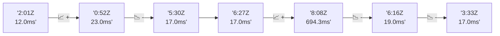

# 📊 Reporte de Performance - PokeAPI

**Fecha de corrida:** 2026-08-01 00:05 UTC

**Enlace:** [30674587303](https://github.com/rba3/Lab_CD_CI_Perfomance/actions/runs/30674587303)

## ✅ Veredicto

```
PASS (fallback por umbrales)

- Error maximo: 0.0%
- p95 maximo: 43.2 ms
```

## 🔮 Predicciones

✓ STABLE

## 📈 Métricas Globales

| Métrica | Valor | SLO | Estado |
|---------|-------|-----|--------|
| Error Rate | 0.0% | < 0.1% | ✅ PASS |
| Latencia p50 | 21.0ms | - | ℹ️ |
| Latencia p95 | 43.2ms | < 800ms | ✅ PASS |
| Latencia p99 | 75.6ms | - | ℹ️ |
| Throughput | 0.00 req/s | - | ℹ️ |
| Muestras | 0 | - | ℹ️ |

## 📉 Tendencia Histórica (Últimas 7 corridas)



## 🔧 Análisis Técnico Detallado (JSON)

```json
{
  "predictions": {
    "prediction": "STABLE",
    "confidence": 0,
    "slope_ms_per_run": 0.0,
    "current_p95": 43.2,
    "days_to_warn": null,
    "days_to_fail": null,
    "risk_level": "LOW"
  },
  "recommendations": [],
  "correlations": {},
  "root_cause": {
    "issue": null,
    "root_cause": null,
    "confidence": 0,
    "evidence": []
  },
  "timestamp": "2026-08-01T00:05:20.020573"
}
```

## 📦 Datos Completos (JSON)

```json
{
  "scenario": "smoke",
  "overall": {
    "samples": 158,
    "errors": 0,
    "error_pct": 0.0,
    "avg_ms": 28.4,
    "min_ms": 16,
    "max_ms": 836,
    "p50_ms": 21.0,
    "p90_ms": 30.6,
    "p95_ms": 43.2,
    "p99_ms": 75.6,
    "throughput_rps": 5.41,
    "duration_s": 29.2
  },
  "by_endpoint": {
    "ability-static": {
      "samples": 12,
      "errors": 0,
      "error_pct": 0.0,
      "avg_ms": 22.4,
      "min_ms": 16,
      "max_ms": 36,
      "p50_ms": 21.5,
      "p90_ms": 26.9,
      "p95_ms": 31.0,
      "p99_ms": 35.0,
      "throughput_rps": 0.48,
      "duration_s": 25.0
    },
    "berry-cheri": {
      "samples": 12,
      "errors": 0,
      "error_pct": 0.0,
      "avg_ms": 21,
      "min_ms": 16,
      "max_ms": 46,
      "p50_ms": 19.0,
      "p90_ms": 21.0,
      "p95_ms": 32.2,
      "p99_ms": 43.3,
      "throughput_rps": 0.48,
      "duration_s": 25.1
    },
    "generation-1": {
      "samples": 12,
      "errors": 0,
      "error_pct": 0.0,
      "avg_ms": 23.6,
      "min_ms": 16,
      "max_ms": 67,
      "p50_ms": 19.5,
      "p90_ms": 26.6,
      "p95_ms": 45.0,
      "p99_ms": 62.6,
      "throughput_rps": 0.48,
      "duration_s": 25.0
    },
    "move-nature-power": {
      "samples": 12,
      "errors": 0,
      "error_pct": 0.0,
      "avg_ms": 19.6,
      "min_ms": 16,
      "max_ms": 24,
      "p50_ms": 19.5,
      "p90_ms": 21.9,
      "p95_ms": 22.9,
      "p99_ms": 23.8,
      "throughput_rps": 0.48,
      "duration_s": 24.9
    },
    "move-tackle": {
      "samples": 12,
      "errors": 0,
      "error_pct": 0.0,
      "avg_ms": 21.1,
      "min_ms": 17,
      "max_ms": 29,
      "p50_ms": 20.0,
      "p90_ms": 24.8,
      "p95_ms": 26.8,
      "p99_ms": 28.6,
      "throughput_rps": 0.48,
      "duration_s": 24.9
    },
    "pokemon-charizard": {
      "samples": 12,
      "errors": 0,
      "error_pct": 0.0,
      "avg_ms": 32.9,
      "min_ms": 21,
      "max_ms": 87,
      "p50_ms": 26.5,
      "p90_ms": 49.2,
      "p95_ms": 67.2,
      "p99_ms": 83.0,
      "throughput_rps": 0.47,
      "duration_s": 25.5
    },
    "pokemon-chikorita": {
      "samples": 12,
      "errors": 0,
      "error_pct": 0.0,
      "avg_ms": 25.4,
      "min_ms": 20,
      "max_ms": 48,
      "p50_ms": 22.5,
      "p90_ms": 28.9,
      "p95_ms": 37.5,
      "p99_ms": 45.9,
      "throughput_rps": 0.48,
      "duration_s": 25.1
    },
    "pokemon-ditto": {
      "samples": 13,
      "errors": 0,
      "error_pct": 0.0,
      "avg_ms": 84,
      "min_ms": 17,
      "max_ms": 836,
      "p50_ms": 20.0,
      "p90_ms": 32.0,
      "p95_ms": 354.8,
      "p99_ms": 739.8,
      "throughput_rps": 0.45,
      "duration_s": 29.0
    },
    "pokemon-list": {
      "samples": 12,
      "errors": 0,
      "error_pct": 0.0,
      "avg_ms": 23,
      "min_ms": 16,
      "max_ms": 39,
      "p50_ms": 19.5,
      "p90_ms": 34.7,
      "p95_ms": 36.8,
      "p99_ms": 38.6,
      "throughput_rps": 0.47,
      "duration_s": 25.3
    },
    "pokemon-pikachu": {
      "samples": 13,
      "errors": 0,
      "error_pct": 0.0,
      "avg_ms": 29.1,
      "min_ms": 20,
      "max_ms": 44,
      "p50_ms": 26.0,
      "p90_ms": 42.6,
      "p95_ms": 43.4,
      "p99_ms": 43.9,
      "throughput_rps": 0.47,
      "duration_s": 27.9
    },
    "type-fairy": {
      "samples": 12,
      "errors": 0,
      "error_pct": 0.0,
      "avg_ms": 23,
      "min_ms": 16,
      "max_ms": 54,
      "p50_ms": 19.5,
      "p90_ms": 26.9,
      "p95_ms": 39.1,
      "p99_ms": 51.0,
      "throughput_rps": 0.48,
      "duration_s": 24.9
    },
    "type-fire": {
      "samples": 12,
      "errors": 0,
      "error_pct": 0.0,
      "avg_ms": 20.1,
      "min_ms": 17,
      "max_ms": 24,
      "p50_ms": 20.5,
      "p90_ms": 22.0,
      "p95_ms": 22.9,
      "p99_ms": 23.8,
      "throughput_rps": 0.48,
      "duration_s": 25.2
    },
    "type-water": {
      "samples": 12,
      "errors": 0,
      "error_pct": 0.0,
      "avg_ms": 19.8,
      "min_ms": 16,
      "max_ms": 27,
      "p50_ms": 19.5,
      "p90_ms": 22.0,
      "p95_ms": 24.2,
      "p99_ms": 26.5,
      "throughput_rps": 0.47,
      "duration_s": 25.3
    }
  },
  "empty": false
}
```

---

*Reporte generado automáticamente por el workflow de performance.*

*Timestamp: 2026-08-01T00:05:20.022176Z*
