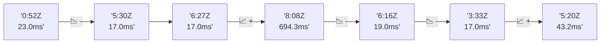

# 📊 Reporte de Performance - PokeAPI

**Fecha de corrida:** 2026-08-01 00:10 UTC

**Enlace:** [30674819470](https://github.com/rba3/Lab_CD_CI_Perfomance/actions/runs/30674819470)

## ✅ Veredicto

```
PASS (fallback por umbrales)

- Error maximo: 0.0%
- p95 maximo: 22.0 ms
```

## 🔮 Predicciones

⚠️ **Tendencia de degradación detectada** (LOW risk)
- Pendiente: +6.55ms/corrida
- P95 actual: 22.0ms
- Días hasta WARN: ~118
- Días hasta FAIL: ~225
- Confianza: 80%

## 📈 Métricas Globales

| Métrica | Valor | SLO | Estado |
|---------|-------|-----|--------|
| Error Rate | 0.0% | < 0.1% | ✅ PASS |
| Latencia p50 | 14.0ms | - | ℹ️ |
| Latencia p95 | 22.0ms | < 800ms | ✅ PASS |
| Latencia p99 | 53.0ms | - | ℹ️ |
| Throughput | 0.00 req/s | - | ℹ️ |
| Muestras | 0 | - | ℹ️ |

## 📉 Tendencia Histórica (Últimas 7 corridas)



## 🔧 Análisis Técnico Detallado (JSON)

```json
{
  "predictions": {
    "prediction": "DEGRADATION_TREND",
    "confidence": 80,
    "slope_ms_per_run": 6.55,
    "current_p95": 22.0,
    "days_to_warn": 118,
    "days_to_fail": 225,
    "risk_level": "LOW"
  },
  "recommendations": [],
  "correlations": {},
  "root_cause": {
    "issue": null,
    "root_cause": null,
    "confidence": 0,
    "evidence": []
  },
  "timestamp": "2026-08-01T00:10:23.796636"
}
```

## 📦 Datos Completos (JSON)

```json
{
  "scenario": "smoke",
  "overall": {
    "samples": 160,
    "errors": 0,
    "error_pct": 0.0,
    "avg_ms": 21.3,
    "min_ms": 10,
    "max_ms": 958,
    "p50_ms": 14.0,
    "p90_ms": 19.0,
    "p95_ms": 22.0,
    "p99_ms": 53.0,
    "throughput_rps": 5.52,
    "duration_s": 29.0
  },
  "by_endpoint": {
    "ability-static": {
      "samples": 12,
      "errors": 0,
      "error_pct": 0.0,
      "avg_ms": 13.7,
      "min_ms": 11,
      "max_ms": 17,
      "p50_ms": 13.5,
      "p90_ms": 15.9,
      "p95_ms": 16.4,
      "p99_ms": 16.9,
      "throughput_rps": 0.48,
      "duration_s": 24.8
    },
    "berry-cheri": {
      "samples": 12,
      "errors": 0,
      "error_pct": 0.0,
      "avg_ms": 13.2,
      "min_ms": 11,
      "max_ms": 16,
      "p50_ms": 13.0,
      "p90_ms": 14.0,
      "p95_ms": 14.9,
      "p99_ms": 15.8,
      "throughput_rps": 0.49,
      "duration_s": 24.4
    },
    "generation-1": {
      "samples": 12,
      "errors": 0,
      "error_pct": 0.0,
      "avg_ms": 16.2,
      "min_ms": 11,
      "max_ms": 44,
      "p50_ms": 14.0,
      "p90_ms": 15.9,
      "p95_ms": 28.6,
      "p99_ms": 40.9,
      "throughput_rps": 0.49,
      "duration_s": 24.7
    },
    "move-nature-power": {
      "samples": 12,
      "errors": 0,
      "error_pct": 0.0,
      "avg_ms": 14.5,
      "min_ms": 11,
      "max_ms": 18,
      "p50_ms": 14.5,
      "p90_ms": 16.8,
      "p95_ms": 17.4,
      "p99_ms": 17.9,
      "throughput_rps": 0.49,
      "duration_s": 24.7
    },
    "move-tackle": {
      "samples": 12,
      "errors": 0,
      "error_pct": 0.0,
      "avg_ms": 14.2,
      "min_ms": 10,
      "max_ms": 17,
      "p50_ms": 15.0,
      "p90_ms": 15.9,
      "p95_ms": 16.4,
      "p99_ms": 16.9,
      "throughput_rps": 0.49,
      "duration_s": 24.7
    },
    "pokemon-charizard": {
      "samples": 13,
      "errors": 0,
      "error_pct": 0.0,
      "avg_ms": 23.7,
      "min_ms": 14,
      "max_ms": 66,
      "p50_ms": 20.0,
      "p90_ms": 28.0,
      "p95_ms": 43.8,
      "p99_ms": 61.6,
      "throughput_rps": 0.47,
      "duration_s": 27.4
    },
    "pokemon-chikorita": {
      "samples": 12,
      "errors": 0,
      "error_pct": 0.0,
      "avg_ms": 17.2,
      "min_ms": 14,
      "max_ms": 22,
      "p50_ms": 17.5,
      "p90_ms": 18.9,
      "p95_ms": 20.3,
      "p99_ms": 21.7,
      "throughput_rps": 0.49,
      "duration_s": 24.4
    },
    "pokemon-ditto": {
      "samples": 13,
      "errors": 0,
      "error_pct": 0.0,
      "avg_ms": 86.5,
      "min_ms": 11,
      "max_ms": 958,
      "p50_ms": 15.0,
      "p90_ms": 17.4,
      "p95_ms": 394.0,
      "p99_ms": 845.2,
      "throughput_rps": 0.46,
      "duration_s": 28.5
    },
    "pokemon-list": {
      "samples": 13,
      "errors": 0,
      "error_pct": 0.0,
      "avg_ms": 13.4,
      "min_ms": 11,
      "max_ms": 17,
      "p50_ms": 14.0,
      "p90_ms": 15.0,
      "p95_ms": 15.8,
      "p99_ms": 16.8,
      "throughput_rps": 0.48,
      "duration_s": 27.0
    },
    "pokemon-pikachu": {
      "samples": 13,
      "errors": 0,
      "error_pct": 0.0,
      "avg_ms": 19.5,
      "min_ms": 14,
      "max_ms": 39,
      "p50_ms": 18.0,
      "p90_ms": 24.0,
      "p95_ms": 30.6,
      "p99_ms": 37.3,
      "throughput_rps": 0.47,
      "duration_s": 27.4
    },
    "type-fairy": {
      "samples": 12,
      "errors": 0,
      "error_pct": 0.0,
      "avg_ms": 13.2,
      "min_ms": 11,
      "max_ms": 17,
      "p50_ms": 13.5,
      "p90_ms": 14.9,
      "p95_ms": 15.9,
      "p99_ms": 16.8,
      "throughput_rps": 0.49,
      "duration_s": 24.7
    },
    "type-fire": {
      "samples": 12,
      "errors": 0,
      "error_pct": 0.0,
      "avg_ms": 13.6,
      "min_ms": 11,
      "max_ms": 17,
      "p50_ms": 14.0,
      "p90_ms": 15.0,
      "p95_ms": 15.9,
      "p99_ms": 16.8,
      "throughput_rps": 0.48,
      "duration_s": 24.8
    },
    "type-water": {
      "samples": 12,
      "errors": 0,
      "error_pct": 0.0,
      "avg_ms": 13.3,
      "min_ms": 11,
      "max_ms": 15,
      "p50_ms": 14.0,
      "p90_ms": 14.0,
      "p95_ms": 14.4,
      "p99_ms": 14.9,
      "throughput_rps": 0.48,
      "duration_s": 24.8
    }
  },
  "empty": false
}
```

---

*Reporte generado automáticamente por el workflow de performance.*

*Timestamp: 2026-08-01T00:10:23.798291Z*
