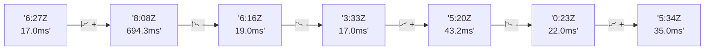

# 📊 Reporte de Performance - PokeAPI

**Fecha de corrida:** 2026-08-01 01:17 UTC

**Enlace:** [30677480044](https://github.com/rba3/Lab_CD_CI_Perfomance/actions/runs/30677480044)

## ✅ Veredicto

```
PASS (fallback por umbrales)

- Error maximo: 0.0%
- p95 maximo: 17.0 ms
```

## 🔮 Predicciones

⚠️ **Tendencia de degradación detectada** (LOW risk)
- Pendiente: +4.0ms/corrida
- P95 actual: 17.0ms
- Días hasta WARN: ~195
- Días hasta FAIL: ~370
- Confianza: 80%

## 📈 Métricas Globales

| Métrica | Valor | SLO | Estado |
|---------|-------|-----|--------|
| Error Rate | 0.0% | < 0.1% | ✅ PASS |
| Latencia p50 | 13.0ms | - | ℹ️ |
| Latencia p95 | 17.0ms | < 800ms | ✅ PASS |
| Latencia p99 | 26.0ms | - | ℹ️ |
| Throughput | 0.00 req/s | - | ℹ️ |
| Muestras | 0 | - | ℹ️ |

## 📉 Tendencia Histórica (Últimas 7 corridas)



## 🔧 Análisis Técnico Detallado (JSON)

```json
{
  "predictions": {
    "prediction": "DEGRADATION_TREND",
    "confidence": 80,
    "slope_ms_per_run": 4.0,
    "current_p95": 17.0,
    "days_to_warn": 195,
    "days_to_fail": 370,
    "risk_level": "LOW"
  },
  "recommendations": [],
  "correlations": {},
  "root_cause": {
    "issue": null,
    "root_cause": null,
    "confidence": 0,
    "evidence": []
  },
  "timestamp": "2026-08-01T01:17:03.061614"
}
```

## 📦 Datos Completos (JSON)

```json
{
  "scenario": "load",
  "overall": {
    "samples": 16759,
    "errors": 0,
    "error_pct": 0.0,
    "avg_ms": 13.3,
    "min_ms": 8,
    "max_ms": 396,
    "p50_ms": 13.0,
    "p90_ms": 16.0,
    "p95_ms": 17.0,
    "p99_ms": 26.0,
    "throughput_rps": 140.22,
    "duration_s": 119.5
  },
  "by_endpoint": {
    "ability-static": {
      "samples": 1289,
      "errors": 0,
      "error_pct": 0.0,
      "avg_ms": 12.5,
      "min_ms": 9,
      "max_ms": 47,
      "p50_ms": 12.0,
      "p90_ms": 15.0,
      "p95_ms": 16.0,
      "p99_ms": 19.0,
      "throughput_rps": 10.9,
      "duration_s": 118.3
    },
    "berry-cheri": {
      "samples": 1289,
      "errors": 0,
      "error_pct": 0.0,
      "avg_ms": 12.2,
      "min_ms": 8,
      "max_ms": 83,
      "p50_ms": 12.0,
      "p90_ms": 14.0,
      "p95_ms": 15.0,
      "p99_ms": 21.4,
      "throughput_rps": 10.91,
      "duration_s": 118.1
    },
    "generation-1": {
      "samples": 1289,
      "errors": 0,
      "error_pct": 0.0,
      "avg_ms": 12.8,
      "min_ms": 10,
      "max_ms": 35,
      "p50_ms": 13.0,
      "p90_ms": 15.0,
      "p95_ms": 16.0,
      "p99_ms": 19.0,
      "throughput_rps": 10.93,
      "duration_s": 118.0
    },
    "move-nature-power": {
      "samples": 1289,
      "errors": 0,
      "error_pct": 0.0,
      "avg_ms": 13.0,
      "min_ms": 9,
      "max_ms": 38,
      "p50_ms": 13.0,
      "p90_ms": 15.0,
      "p95_ms": 16.0,
      "p99_ms": 20.0,
      "throughput_rps": 10.95,
      "duration_s": 117.7
    },
    "move-tackle": {
      "samples": 1289,
      "errors": 0,
      "error_pct": 0.0,
      "avg_ms": 12.7,
      "min_ms": 9,
      "max_ms": 39,
      "p50_ms": 12.0,
      "p90_ms": 15.0,
      "p95_ms": 16.0,
      "p99_ms": 19.1,
      "throughput_rps": 10.92,
      "duration_s": 118.0
    },
    "pokemon-charizard": {
      "samples": 1290,
      "errors": 0,
      "error_pct": 0.0,
      "avg_ms": 16.5,
      "min_ms": 12,
      "max_ms": 72,
      "p50_ms": 16.0,
      "p90_ms": 20.0,
      "p95_ms": 22.5,
      "p99_ms": 36.1,
      "throughput_rps": 10.86,
      "duration_s": 118.8
    },
    "pokemon-chikorita": {
      "samples": 1289,
      "errors": 0,
      "error_pct": 0.0,
      "avg_ms": 14.7,
      "min_ms": 11,
      "max_ms": 54,
      "p50_ms": 14.0,
      "p90_ms": 17.0,
      "p95_ms": 19.0,
      "p99_ms": 26.0,
      "throughput_rps": 10.94,
      "duration_s": 117.8
    },
    "pokemon-ditto": {
      "samples": 1289,
      "errors": 0,
      "error_pct": 0.0,
      "avg_ms": 12.6,
      "min_ms": 9,
      "max_ms": 396,
      "p50_ms": 12.0,
      "p90_ms": 14.0,
      "p95_ms": 15.0,
      "p99_ms": 18.0,
      "throughput_rps": 10.79,
      "duration_s": 119.4
    },
    "pokemon-list": {
      "samples": 1290,
      "errors": 0,
      "error_pct": 0.0,
      "avg_ms": 12.4,
      "min_ms": 8,
      "max_ms": 72,
      "p50_ms": 12.0,
      "p90_ms": 14.0,
      "p95_ms": 15.0,
      "p99_ms": 26.1,
      "throughput_rps": 10.87,
      "duration_s": 118.6
    },
    "pokemon-pikachu": {
      "samples": 1290,
      "errors": 0,
      "error_pct": 0.0,
      "avg_ms": 15.7,
      "min_ms": 11,
      "max_ms": 77,
      "p50_ms": 15.0,
      "p90_ms": 19.0,
      "p95_ms": 20.0,
      "p99_ms": 31.1,
      "throughput_rps": 10.84,
      "duration_s": 119.0
    },
    "type-fairy": {
      "samples": 1288,
      "errors": 0,
      "error_pct": 0.0,
      "avg_ms": 12.5,
      "min_ms": 9,
      "max_ms": 54,
      "p50_ms": 12.0,
      "p90_ms": 15.0,
      "p95_ms": 16.0,
      "p99_ms": 20.0,
      "throughput_rps": 10.95,
      "duration_s": 117.7
    },
    "type-fire": {
      "samples": 1289,
      "errors": 0,
      "error_pct": 0.0,
      "avg_ms": 12.6,
      "min_ms": 9,
      "max_ms": 52,
      "p50_ms": 13.0,
      "p90_ms": 15.0,
      "p95_ms": 16.0,
      "p99_ms": 19.1,
      "throughput_rps": 10.89,
      "duration_s": 118.4
    },
    "type-water": {
      "samples": 1289,
      "errors": 0,
      "error_pct": 0.0,
      "avg_ms": 12.3,
      "min_ms": 9,
      "max_ms": 70,
      "p50_ms": 12.0,
      "p90_ms": 14.0,
      "p95_ms": 15.0,
      "p99_ms": 20.0,
      "throughput_rps": 10.89,
      "duration_s": 118.4
    }
  },
  "empty": false
}
```

---

*Reporte generado automáticamente por el workflow de performance.*

*Timestamp: 2026-08-01T01:17:03.063243Z*
