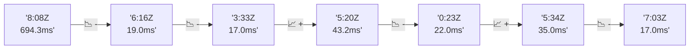

# 📊 Reporte de Performance - PokeAPI

**Fecha de corrida:** 2026-08-01 01:27 UTC

**Enlace:** [30677921135](https://github.com/rba3/Lab_CD_CI_Perfomance/actions/runs/30677921135)

## ✅ Veredicto

```
PASS (fallback por umbrales)

- Error maximo: 0.0%
- p95 maximo: 27.8 ms
```

## 🔮 Predicciones

✓ STABLE

## 📈 Métricas Globales

| Métrica | Valor | SLO | Estado |
|---------|-------|-----|--------|
| Error Rate | 0.0% | < 0.05% | ✅ PASS |
| Latencia p50 | 14.0ms | - | ℹ️ |
| Latencia p95 | 27.8ms | < 800ms | ✅ PASS |
| Latencia p99 | 421.1ms | - | ℹ️ |
| Throughput | 0.00 req/s | - | ℹ️ |
| Muestras | 0 | - | ℹ️ |

## 📉 Tendencia Histórica (Últimas 7 corridas)



## 🔧 Análisis Técnico Detallado (JSON)

```json
{
  "predictions": {
    "prediction": "STABLE",
    "confidence": 0,
    "slope_ms_per_run": 0.0,
    "current_p95": 27.8,
    "days_to_warn": null,
    "days_to_fail": null,
    "risk_level": "LOW"
  },
  "recommendations": [],
  "correlations": {},
  "root_cause": {
    "issue": null,
    "root_cause": null,
    "confidence": 0,
    "evidence": []
  },
  "timestamp": "2026-08-01T01:27:25.713804"
}
```

## 📦 Datos Completos (JSON)

```json
{
  "scenario": "smoke",
  "overall": {
    "samples": 156,
    "errors": 0,
    "error_pct": 0.0,
    "avg_ms": 36.4,
    "min_ms": 10,
    "max_ms": 2379,
    "p50_ms": 14.0,
    "p90_ms": 21.5,
    "p95_ms": 27.8,
    "p99_ms": 421.1,
    "throughput_rps": 5.34,
    "duration_s": 29.2
  },
  "by_endpoint": {
    "ability-static": {
      "samples": 12,
      "errors": 0,
      "error_pct": 0.0,
      "avg_ms": 13.8,
      "min_ms": 12,
      "max_ms": 16,
      "p50_ms": 13.0,
      "p90_ms": 15.9,
      "p95_ms": 16.0,
      "p99_ms": 16.0,
      "throughput_rps": 0.49,
      "duration_s": 24.7
    },
    "berry-cheri": {
      "samples": 12,
      "errors": 0,
      "error_pct": 0.0,
      "avg_ms": 12.8,
      "min_ms": 11,
      "max_ms": 17,
      "p50_ms": 12.5,
      "p90_ms": 14.0,
      "p95_ms": 15.3,
      "p99_ms": 16.7,
      "throughput_rps": 0.49,
      "duration_s": 24.4
    },
    "generation-1": {
      "samples": 12,
      "errors": 0,
      "error_pct": 0.0,
      "avg_ms": 13.8,
      "min_ms": 12,
      "max_ms": 17,
      "p50_ms": 13.5,
      "p90_ms": 15.0,
      "p95_ms": 15.9,
      "p99_ms": 16.8,
      "throughput_rps": 0.49,
      "duration_s": 24.7
    },
    "move-nature-power": {
      "samples": 12,
      "errors": 0,
      "error_pct": 0.0,
      "avg_ms": 14.2,
      "min_ms": 12,
      "max_ms": 17,
      "p50_ms": 14.0,
      "p90_ms": 16.0,
      "p95_ms": 16.4,
      "p99_ms": 16.9,
      "throughput_rps": 0.49,
      "duration_s": 24.7
    },
    "move-tackle": {
      "samples": 12,
      "errors": 0,
      "error_pct": 0.0,
      "avg_ms": 14.2,
      "min_ms": 12,
      "max_ms": 16,
      "p50_ms": 14.5,
      "p90_ms": 15.0,
      "p95_ms": 15.4,
      "p99_ms": 15.9,
      "throughput_rps": 0.49,
      "duration_s": 24.7
    },
    "pokemon-charizard": {
      "samples": 12,
      "errors": 0,
      "error_pct": 0.0,
      "avg_ms": 25,
      "min_ms": 16,
      "max_ms": 38,
      "p50_ms": 23.0,
      "p90_ms": 34.5,
      "p95_ms": 36.3,
      "p99_ms": 37.7,
      "throughput_rps": 0.48,
      "duration_s": 24.8
    },
    "pokemon-chikorita": {
      "samples": 12,
      "errors": 0,
      "error_pct": 0.0,
      "avg_ms": 19.2,
      "min_ms": 15,
      "max_ms": 34,
      "p50_ms": 18.0,
      "p90_ms": 22.6,
      "p95_ms": 27.9,
      "p99_ms": 32.8,
      "throughput_rps": 0.49,
      "duration_s": 24.4
    },
    "pokemon-ditto": {
      "samples": 12,
      "errors": 0,
      "error_pct": 0.0,
      "avg_ms": 210.6,
      "min_ms": 12,
      "max_ms": 2379,
      "p50_ms": 13.5,
      "p90_ms": 15.9,
      "p95_ms": 1079.3,
      "p99_ms": 2119.1,
      "throughput_rps": 0.44,
      "duration_s": 27.1
    },
    "pokemon-list": {
      "samples": 12,
      "errors": 0,
      "error_pct": 0.0,
      "avg_ms": 13.1,
      "min_ms": 11,
      "max_ms": 15,
      "p50_ms": 13.0,
      "p90_ms": 14.9,
      "p95_ms": 15.0,
      "p99_ms": 15.0,
      "throughput_rps": 0.49,
      "duration_s": 24.7
    },
    "pokemon-pikachu": {
      "samples": 12,
      "errors": 0,
      "error_pct": 0.0,
      "avg_ms": 89.2,
      "min_ms": 13,
      "max_ms": 854,
      "p50_ms": 20.0,
      "p90_ms": 25.5,
      "p95_ms": 398.6,
      "p99_ms": 762.9,
      "throughput_rps": 0.47,
      "duration_s": 25.6
    },
    "type-fairy": {
      "samples": 12,
      "errors": 0,
      "error_pct": 0.0,
      "avg_ms": 12.7,
      "min_ms": 10,
      "max_ms": 14,
      "p50_ms": 13.5,
      "p90_ms": 14.0,
      "p95_ms": 14.0,
      "p99_ms": 14.0,
      "throughput_rps": 0.49,
      "duration_s": 24.7
    },
    "type-fire": {
      "samples": 12,
      "errors": 0,
      "error_pct": 0.0,
      "avg_ms": 13.4,
      "min_ms": 11,
      "max_ms": 16,
      "p50_ms": 14.0,
      "p90_ms": 14.9,
      "p95_ms": 15.4,
      "p99_ms": 15.9,
      "throughput_rps": 0.49,
      "duration_s": 24.7
    },
    "type-water": {
      "samples": 12,
      "errors": 0,
      "error_pct": 0.0,
      "avg_ms": 20.7,
      "min_ms": 12,
      "max_ms": 67,
      "p50_ms": 13.5,
      "p90_ms": 44.7,
      "p95_ms": 56.5,
      "p99_ms": 64.9,
      "throughput_rps": 0.49,
      "duration_s": 24.5
    }
  },
  "empty": false
}
```

---

*Reporte generado automáticamente por el workflow de performance.*

*Timestamp: 2026-08-01T01:27:25.715266Z*
