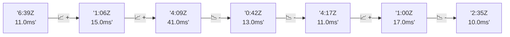

# 📊 Reporte de Performance - PokeAPI

**Fecha de corrida:** 2026-08-03 15:36 UTC

**Enlace:** [30828074475](https://github.com/rba3/Lab_CD_CI_Perfomance/actions/runs/30828074475)

## ✅ Veredicto

```
PASS (fallback por umbrales)

- Error maximo: 0.05%
- p95 maximo: 49.0 ms
```

## 🔮 Predicciones

✓ STABLE

## 📈 Métricas Globales

| Métrica | Valor | SLO | Estado |
|---------|-------|-----|--------|
| Error Rate | 0.05% | < 0.1% | ✅ PASS |
| Latencia p50 | 22.0ms | - | ℹ️ |
| Latencia p95 | 30.0ms | < 800ms | ✅ PASS |
| Latencia p99 | 55.0ms | - | ℹ️ |
| Throughput | 0.00 req/s | - | ℹ️ |
| Muestras | 0 | - | ℹ️ |

## 📉 Tendencia Histórica (Últimas 7 corridas)



## 🔧 Análisis Técnico Detallado (JSON)

```json
{
  "predictions": {
    "prediction": "STABLE",
    "confidence": 0,
    "slope_ms_per_run": -7.75,
    "current_p95": 30.0,
    "days_to_warn": null,
    "days_to_fail": null,
    "risk_level": "LOW"
  },
  "recommendations": [],
  "correlations": {},
  "root_cause": {
    "issue": null,
    "root_cause": null,
    "confidence": 0,
    "evidence": []
  },
  "timestamp": "2026-08-03T15:36:32.279406"
}
```

## 📦 Datos Completos (JSON)

```json
{
  "scenario": "load",
  "overall": {
    "samples": 16246,
    "errors": 8,
    "error_pct": 0.05,
    "avg_ms": 23.5,
    "min_ms": 16,
    "max_ms": 263,
    "p50_ms": 22.0,
    "p90_ms": 28.0,
    "p95_ms": 30.0,
    "p99_ms": 55.0,
    "throughput_rps": 135.76,
    "duration_s": 119.7
  },
  "by_endpoint": {
    "ability-static": {
      "samples": 1625,
      "errors": 1,
      "error_pct": 0.06,
      "avg_ms": 22.7,
      "min_ms": 17,
      "max_ms": 128,
      "p50_ms": 22.0,
      "p90_ms": 26.0,
      "p95_ms": 28.0,
      "p99_ms": 48.5,
      "throughput_rps": 13.72,
      "duration_s": 118.4
    },
    "berry-cheri": {
      "samples": 1625,
      "errors": 0,
      "error_pct": 0.0,
      "avg_ms": 22.5,
      "min_ms": 16,
      "max_ms": 256,
      "p50_ms": 22.0,
      "p90_ms": 25.0,
      "p95_ms": 27.0,
      "p99_ms": 49.0,
      "throughput_rps": 13.73,
      "duration_s": 118.3
    },
    "generation-1": {
      "samples": 1623,
      "errors": 0,
      "error_pct": 0.0,
      "avg_ms": 23.0,
      "min_ms": 16,
      "max_ms": 263,
      "p50_ms": 22.0,
      "p90_ms": 26.0,
      "p95_ms": 28.0,
      "p99_ms": 47.6,
      "throughput_rps": 13.75,
      "duration_s": 118.0
    },
    "move-tackle": {
      "samples": 1625,
      "errors": 0,
      "error_pct": 0.0,
      "avg_ms": 22.8,
      "min_ms": 16,
      "max_ms": 143,
      "p50_ms": 22.0,
      "p90_ms": 26.0,
      "p95_ms": 28.0,
      "p99_ms": 43.3,
      "throughput_rps": 13.76,
      "duration_s": 118.1
    },
    "pokemon-charizard": {
      "samples": 1624,
      "errors": 1,
      "error_pct": 0.06,
      "avg_ms": 28.9,
      "min_ms": 18,
      "max_ms": 124,
      "p50_ms": 27.0,
      "p90_ms": 33.0,
      "p95_ms": 41.8,
      "p99_ms": 71.5,
      "throughput_rps": 13.64,
      "duration_s": 119.0
    },
    "pokemon-ditto": {
      "samples": 1624,
      "errors": 2,
      "error_pct": 0.12,
      "avg_ms": 22.8,
      "min_ms": 16,
      "max_ms": 206,
      "p50_ms": 22.0,
      "p90_ms": 26.0,
      "p95_ms": 28.0,
      "p99_ms": 41.8,
      "throughput_rps": 13.58,
      "duration_s": 119.6
    },
    "pokemon-list": {
      "samples": 1625,
      "errors": 1,
      "error_pct": 0.06,
      "avg_ms": 21.6,
      "min_ms": 17,
      "max_ms": 242,
      "p50_ms": 21.0,
      "p90_ms": 24.0,
      "p95_ms": 26.0,
      "p99_ms": 38.5,
      "throughput_rps": 13.68,
      "duration_s": 118.7
    },
    "pokemon-pikachu": {
      "samples": 1625,
      "errors": 2,
      "error_pct": 0.12,
      "avg_ms": 26.6,
      "min_ms": 19,
      "max_ms": 145,
      "p50_ms": 24.0,
      "p90_ms": 30.0,
      "p95_ms": 36.0,
      "p99_ms": 74.8,
      "throughput_rps": 13.64,
      "duration_s": 119.2
    },
    "type-fire": {
      "samples": 1625,
      "errors": 0,
      "error_pct": 0.0,
      "avg_ms": 22.4,
      "min_ms": 16,
      "max_ms": 182,
      "p50_ms": 22.0,
      "p90_ms": 26.0,
      "p95_ms": 28.0,
      "p99_ms": 46.8,
      "throughput_rps": 13.71,
      "duration_s": 118.5
    },
    "type-water": {
      "samples": 1625,
      "errors": 1,
      "error_pct": 0.06,
      "avg_ms": 21.8,
      "min_ms": 16,
      "max_ms": 102,
      "p50_ms": 21.0,
      "p90_ms": 25.0,
      "p95_ms": 27.0,
      "p99_ms": 42.3,
      "throughput_rps": 13.7,
      "duration_s": 118.7
    }
  },
  "empty": false
}
```

---

*Reporte generado automáticamente por el workflow de performance.*

*Timestamp: 2026-08-03T15:36:32.280503Z*
