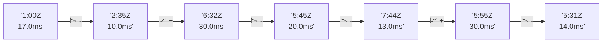

# 📊 Reporte de Performance - PokeAPI

**Fecha de corrida:** 2026-08-08 13:38 UTC

**Enlace:** [31259915746](https://github.com/rba3/Lab_CD_CI_Perfomance/actions/runs/31259915746)

## ✅ Veredicto

```
PASS (fallback por umbrales)

- Error maximo: 0.01%
- p95 maximo: 16.0 ms
```

## 🔮 Predicciones

✓ STABLE

## 📈 Métricas Globales

| Métrica | Valor | SLO | Estado |
|---------|-------|-----|--------|
| Error Rate | 0.01% | < 0.1% | ✅ PASS |
| Latencia p50 | 7.0ms | - | ℹ️ |
| Latencia p95 | 10.0ms | < 800ms | ✅ PASS |
| Latencia p99 | 14.0ms | - | ℹ️ |
| Throughput | 0.00 req/s | - | ℹ️ |
| Muestras | 0 | - | ℹ️ |

## 📉 Tendencia Histórica (Últimas 7 corridas)



## 🔧 Análisis Técnico Detallado (JSON)

```json
{
  "predictions": {
    "prediction": "STABLE",
    "confidence": 0,
    "slope_ms_per_run": -4.0,
    "current_p95": 10.0,
    "days_to_warn": null,
    "days_to_fail": null,
    "risk_level": "LOW"
  },
  "recommendations": [],
  "correlations": {},
  "root_cause": {
    "issue": null,
    "root_cause": null,
    "confidence": 0,
    "evidence": []
  },
  "timestamp": "2026-08-08T13:38:41.351361"
}
```

## 📦 Datos Completos (JSON)

```json
{
  "scenario": "load",
  "overall": {
    "samples": 17081,
    "errors": 1,
    "error_pct": 0.01,
    "avg_ms": 7.5,
    "min_ms": 4,
    "max_ms": 406,
    "p50_ms": 7.0,
    "p90_ms": 9.0,
    "p95_ms": 10.0,
    "p99_ms": 14.0,
    "throughput_rps": 142.8,
    "duration_s": 119.6
  },
  "by_endpoint": {
    "ability-static": {
      "samples": 1708,
      "errors": 0,
      "error_pct": 0.0,
      "avg_ms": 7.5,
      "min_ms": 5,
      "max_ms": 41,
      "p50_ms": 7.0,
      "p90_ms": 9.0,
      "p95_ms": 10.0,
      "p99_ms": 14.0,
      "throughput_rps": 14.43,
      "duration_s": 118.3
    },
    "berry-cheri": {
      "samples": 1708,
      "errors": 0,
      "error_pct": 0.0,
      "avg_ms": 7.2,
      "min_ms": 4,
      "max_ms": 32,
      "p50_ms": 7.0,
      "p90_ms": 9.0,
      "p95_ms": 9.0,
      "p99_ms": 11.0,
      "throughput_rps": 14.43,
      "duration_s": 118.3
    },
    "generation-1": {
      "samples": 1708,
      "errors": 0,
      "error_pct": 0.0,
      "avg_ms": 7.7,
      "min_ms": 4,
      "max_ms": 406,
      "p50_ms": 7.0,
      "p90_ms": 9.0,
      "p95_ms": 10.0,
      "p99_ms": 14.9,
      "throughput_rps": 14.47,
      "duration_s": 118.1
    },
    "move-tackle": {
      "samples": 1708,
      "errors": 0,
      "error_pct": 0.0,
      "avg_ms": 7.4,
      "min_ms": 5,
      "max_ms": 39,
      "p50_ms": 7.0,
      "p90_ms": 9.0,
      "p95_ms": 10.0,
      "p99_ms": 13.0,
      "throughput_rps": 14.46,
      "duration_s": 118.1
    },
    "pokemon-charizard": {
      "samples": 1708,
      "errors": 0,
      "error_pct": 0.0,
      "avg_ms": 8.5,
      "min_ms": 5,
      "max_ms": 218,
      "p50_ms": 8.0,
      "p90_ms": 10.0,
      "p95_ms": 11.0,
      "p99_ms": 16.9,
      "throughput_rps": 14.36,
      "duration_s": 119.0
    },
    "pokemon-ditto": {
      "samples": 1708,
      "errors": 0,
      "error_pct": 0.0,
      "avg_ms": 7.5,
      "min_ms": 5,
      "max_ms": 252,
      "p50_ms": 7.0,
      "p90_ms": 9.0,
      "p95_ms": 10.0,
      "p99_ms": 13.0,
      "throughput_rps": 14.29,
      "duration_s": 119.5
    },
    "pokemon-list": {
      "samples": 1708,
      "errors": 0,
      "error_pct": 0.0,
      "avg_ms": 7.0,
      "min_ms": 4,
      "max_ms": 38,
      "p50_ms": 7.0,
      "p90_ms": 8.0,
      "p95_ms": 9.0,
      "p99_ms": 13.0,
      "throughput_rps": 14.4,
      "duration_s": 118.6
    },
    "pokemon-pikachu": {
      "samples": 1708,
      "errors": 1,
      "error_pct": 0.06,
      "avg_ms": 8.2,
      "min_ms": 6,
      "max_ms": 97,
      "p50_ms": 8.0,
      "p90_ms": 10.0,
      "p95_ms": 11.0,
      "p99_ms": 15.9,
      "throughput_rps": 14.35,
      "duration_s": 119.0
    },
    "type-fire": {
      "samples": 1708,
      "errors": 0,
      "error_pct": 0.0,
      "avg_ms": 7.2,
      "min_ms": 4,
      "max_ms": 28,
      "p50_ms": 7.0,
      "p90_ms": 9.0,
      "p95_ms": 10.0,
      "p99_ms": 13.0,
      "throughput_rps": 14.42,
      "duration_s": 118.4
    },
    "type-water": {
      "samples": 1709,
      "errors": 0,
      "error_pct": 0.0,
      "avg_ms": 7.3,
      "min_ms": 5,
      "max_ms": 58,
      "p50_ms": 7.0,
      "p90_ms": 9.0,
      "p95_ms": 9.0,
      "p99_ms": 12.0,
      "throughput_rps": 14.39,
      "duration_s": 118.7
    }
  },
  "empty": false
}
```

---

*Reporte generado automáticamente por el workflow de performance.*

*Timestamp: 2026-08-08T13:38:41.352867Z*
