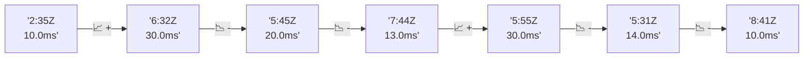

# 📊 Reporte de Performance - PokeAPI

**Fecha de corrida:** 2026-08-09 13:41 UTC

**Enlace:** [31316345296](https://github.com/rba3/Lab_CD_CI_Perfomance/actions/runs/31316345296)

## ✅ Veredicto

```
PASS (fallback por umbrales)

- Error maximo: 0.0%
- p95 maximo: 20.0 ms
```

## 🔮 Predicciones

✓ STABLE

## 📈 Métricas Globales

| Métrica | Valor | SLO | Estado |
|---------|-------|-----|--------|
| Error Rate | 0.0% | < 0.1% | ✅ PASS |
| Latencia p50 | 11.0ms | - | ℹ️ |
| Latencia p95 | 14.0ms | < 800ms | ✅ PASS |
| Latencia p99 | 24.0ms | - | ℹ️ |
| Throughput | 0.00 req/s | - | ℹ️ |
| Muestras | 0 | - | ℹ️ |

## 📉 Tendencia Histórica (Últimas 7 corridas)



## 🔧 Análisis Técnico Detallado (JSON)

```json
{
  "predictions": {
    "prediction": "STABLE",
    "confidence": 0,
    "slope_ms_per_run": -2.5,
    "current_p95": 14.0,
    "days_to_warn": null,
    "days_to_fail": null,
    "risk_level": "LOW"
  },
  "recommendations": [],
  "correlations": {},
  "root_cause": {
    "issue": null,
    "root_cause": null,
    "confidence": 0,
    "evidence": []
  },
  "timestamp": "2026-08-09T13:41:33.083199"
}
```

## 📦 Datos Completos (JSON)

```json
{
  "scenario": "load",
  "overall": {
    "samples": 16867,
    "errors": 0,
    "error_pct": 0.0,
    "avg_ms": 11.5,
    "min_ms": 8,
    "max_ms": 233,
    "p50_ms": 11.0,
    "p90_ms": 13.0,
    "p95_ms": 14.0,
    "p99_ms": 24.0,
    "throughput_rps": 141.01,
    "duration_s": 119.6
  },
  "by_endpoint": {
    "ability-static": {
      "samples": 1687,
      "errors": 0,
      "error_pct": 0.0,
      "avg_ms": 11.0,
      "min_ms": 8,
      "max_ms": 34,
      "p50_ms": 11.0,
      "p90_ms": 12.0,
      "p95_ms": 13.0,
      "p99_ms": 16.0,
      "throughput_rps": 14.25,
      "duration_s": 118.4
    },
    "berry-cheri": {
      "samples": 1687,
      "errors": 0,
      "error_pct": 0.0,
      "avg_ms": 11.0,
      "min_ms": 8,
      "max_ms": 40,
      "p50_ms": 11.0,
      "p90_ms": 12.0,
      "p95_ms": 13.0,
      "p99_ms": 20.0,
      "throughput_rps": 14.25,
      "duration_s": 118.4
    },
    "generation-1": {
      "samples": 1686,
      "errors": 0,
      "error_pct": 0.0,
      "avg_ms": 11.3,
      "min_ms": 9,
      "max_ms": 52,
      "p50_ms": 11.0,
      "p90_ms": 13.0,
      "p95_ms": 14.0,
      "p99_ms": 18.0,
      "throughput_rps": 14.28,
      "duration_s": 118.0
    },
    "move-tackle": {
      "samples": 1686,
      "errors": 0,
      "error_pct": 0.0,
      "avg_ms": 11.4,
      "min_ms": 9,
      "max_ms": 49,
      "p50_ms": 11.0,
      "p90_ms": 13.0,
      "p95_ms": 14.0,
      "p99_ms": 18.2,
      "throughput_rps": 14.28,
      "duration_s": 118.1
    },
    "pokemon-charizard": {
      "samples": 1687,
      "errors": 0,
      "error_pct": 0.0,
      "avg_ms": 14.0,
      "min_ms": 11,
      "max_ms": 56,
      "p50_ms": 13.0,
      "p90_ms": 16.0,
      "p95_ms": 20.0,
      "p99_ms": 38.7,
      "throughput_rps": 14.17,
      "duration_s": 119.1
    },
    "pokemon-ditto": {
      "samples": 1687,
      "errors": 0,
      "error_pct": 0.0,
      "avg_ms": 11.4,
      "min_ms": 9,
      "max_ms": 233,
      "p50_ms": 11.0,
      "p90_ms": 13.0,
      "p95_ms": 14.0,
      "p99_ms": 18.0,
      "throughput_rps": 14.11,
      "duration_s": 119.6
    },
    "pokemon-list": {
      "samples": 1687,
      "errors": 0,
      "error_pct": 0.0,
      "avg_ms": 10.3,
      "min_ms": 8,
      "max_ms": 35,
      "p50_ms": 10.0,
      "p90_ms": 11.0,
      "p95_ms": 12.0,
      "p99_ms": 15.0,
      "throughput_rps": 14.21,
      "duration_s": 118.7
    },
    "pokemon-pikachu": {
      "samples": 1687,
      "errors": 0,
      "error_pct": 0.0,
      "avg_ms": 13.3,
      "min_ms": 10,
      "max_ms": 63,
      "p50_ms": 12.0,
      "p90_ms": 14.0,
      "p95_ms": 17.0,
      "p99_ms": 42.3,
      "throughput_rps": 14.17,
      "duration_s": 119.1
    },
    "type-fire": {
      "samples": 1686,
      "errors": 0,
      "error_pct": 0.0,
      "avg_ms": 10.8,
      "min_ms": 8,
      "max_ms": 41,
      "p50_ms": 10.0,
      "p90_ms": 12.0,
      "p95_ms": 13.0,
      "p99_ms": 15.2,
      "throughput_rps": 14.24,
      "duration_s": 118.4
    },
    "type-water": {
      "samples": 1687,
      "errors": 0,
      "error_pct": 0.0,
      "avg_ms": 10.8,
      "min_ms": 9,
      "max_ms": 33,
      "p50_ms": 11.0,
      "p90_ms": 12.0,
      "p95_ms": 13.0,
      "p99_ms": 15.1,
      "throughput_rps": 14.21,
      "duration_s": 118.7
    }
  },
  "empty": false
}
```

---

*Reporte generado automáticamente por el workflow de performance.*

*Timestamp: 2026-08-09T13:41:33.084721Z*
