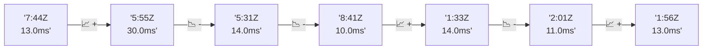

# 📊 Reporte de Performance - PokeAPI

**Fecha de corrida:** 2026-08-12 14:12 UTC

**Enlace:** [31605279700](https://github.com/rba3/Lab_CD_CI_Perfomance/actions/runs/31605279700)

## ✅ Veredicto

```
PASS (fallback por umbrales)

- Error maximo: 0.0%
- p95 maximo: 541.4 ms
```

## 🔮 Predicciones

✓ STABLE

## 🎯 Causa Raíz Identificada

**Latencia inconsistente (outliers)**
- Causa probable: Spikes de latencia, posible GC o context switching
- Confianza: 75%
- Evidencia:
  - p50 (98.0ms) mucho menor que p95 (541.4ms)
  - Diferencia de 3x+ indica distribución anómala

## 📈 Métricas Globales

| Métrica | Valor | SLO | Estado |
|---------|-------|-----|--------|
| Error Rate | 0.0% | < 0.1% | ✅ PASS |
| Latencia p50 | 98.0ms | - | ℹ️ |
| Latencia p95 | 541.4ms | < 800ms | ✅ PASS |
| Latencia p99 | 1092.7ms | - | ℹ️ |
| Throughput | 0.00 req/s | - | ℹ️ |
| Muestras | 0 | - | ℹ️ |

## 📉 Tendencia Histórica (Últimas 7 corridas)



## 🔧 Análisis Técnico Detallado (JSON)

```json
{
  "predictions": {
    "prediction": "STABLE",
    "confidence": 0,
    "slope_ms_per_run": -0.25,
    "current_p95": 541.4,
    "days_to_warn": null,
    "days_to_fail": null,
    "risk_level": "LOW"
  },
  "recommendations": [],
  "correlations": {},
  "root_cause": {
    "issue": "Latencia inconsistente (outliers)",
    "root_cause": "Spikes de latencia, posible GC o context switching",
    "confidence": 75,
    "evidence": [
      "p50 (98.0ms) mucho menor que p95 (541.4ms)",
      "Diferencia de 3x+ indica distribuci\u00f3n an\u00f3mala"
    ]
  },
  "timestamp": "2026-08-12T14:12:41.968241"
}
```

## 📦 Datos Completos (JSON)

```json
{
  "scenario": "load",
  "overall": {
    "samples": 11227,
    "errors": 0,
    "error_pct": 0.0,
    "avg_ms": 168.5,
    "min_ms": 24,
    "max_ms": 6135,
    "p50_ms": 98.0,
    "p90_ms": 365.4,
    "p95_ms": 541.4,
    "p99_ms": 1092.7,
    "throughput_rps": 92.95,
    "duration_s": 120.8
  },
  "by_endpoint": {
    "ability-static": {
      "samples": 1123,
      "errors": 0,
      "error_pct": 0.0,
      "avg_ms": 110.8,
      "min_ms": 25,
      "max_ms": 928,
      "p50_ms": 95.0,
      "p90_ms": 167.0,
      "p95_ms": 225.0,
      "p99_ms": 487.8,
      "throughput_rps": 9.51,
      "duration_s": 118.1
    },
    "berry-cheri": {
      "samples": 1122,
      "errors": 0,
      "error_pct": 0.0,
      "avg_ms": 83.7,
      "min_ms": 24,
      "max_ms": 719,
      "p50_ms": 78.0,
      "p90_ms": 110.9,
      "p95_ms": 133.0,
      "p99_ms": 323.8,
      "throughput_rps": 9.52,
      "duration_s": 117.8
    },
    "generation-1": {
      "samples": 1122,
      "errors": 0,
      "error_pct": 0.0,
      "avg_ms": 108.2,
      "min_ms": 27,
      "max_ms": 2799,
      "p50_ms": 90.0,
      "p90_ms": 161.8,
      "p95_ms": 213.0,
      "p99_ms": 538.9,
      "throughput_rps": 9.53,
      "duration_s": 117.8
    },
    "move-tackle": {
      "samples": 1122,
      "errors": 0,
      "error_pct": 0.0,
      "avg_ms": 143.1,
      "min_ms": 26,
      "max_ms": 1075,
      "p50_ms": 110.0,
      "p90_ms": 234.9,
      "p95_ms": 338.9,
      "p99_ms": 698.6,
      "throughput_rps": 9.52,
      "duration_s": 117.9
    },
    "pokemon-charizard": {
      "samples": 1123,
      "errors": 0,
      "error_pct": 0.0,
      "avg_ms": 451.0,
      "min_ms": 36,
      "max_ms": 5000,
      "p50_ms": 351.0,
      "p90_ms": 903.8,
      "p95_ms": 1266.7,
      "p99_ms": 2250.2,
      "throughput_rps": 9.43,
      "duration_s": 119.1
    },
    "pokemon-ditto": {
      "samples": 1123,
      "errors": 0,
      "error_pct": 0.0,
      "avg_ms": 115.5,
      "min_ms": 28,
      "max_ms": 874,
      "p50_ms": 96.0,
      "p90_ms": 195.6,
      "p95_ms": 252.0,
      "p99_ms": 506.1,
      "throughput_rps": 9.39,
      "duration_s": 119.6
    },
    "pokemon-list": {
      "samples": 1123,
      "errors": 0,
      "error_pct": 0.0,
      "avg_ms": 82.9,
      "min_ms": 25,
      "max_ms": 703,
      "p50_ms": 74.0,
      "p90_ms": 103.0,
      "p95_ms": 110.0,
      "p99_ms": 409.7,
      "throughput_rps": 9.48,
      "duration_s": 118.5
    },
    "pokemon-pikachu": {
      "samples": 1123,
      "errors": 0,
      "error_pct": 0.0,
      "avg_ms": 370.0,
      "min_ms": 43,
      "max_ms": 6135,
      "p50_ms": 292.0,
      "p90_ms": 701.0,
      "p95_ms": 915.9,
      "p99_ms": 1755.1,
      "throughput_rps": 9.34,
      "duration_s": 120.3
    },
    "type-fire": {
      "samples": 1123,
      "errors": 0,
      "error_pct": 0.0,
      "avg_ms": 102.3,
      "min_ms": 26,
      "max_ms": 1030,
      "p50_ms": 89.0,
      "p90_ms": 133.0,
      "p95_ms": 199.9,
      "p99_ms": 509.1,
      "throughput_rps": 9.48,
      "duration_s": 118.5
    },
    "type-water": {
      "samples": 1123,
      "errors": 0,
      "error_pct": 0.0,
      "avg_ms": 117.0,
      "min_ms": 25,
      "max_ms": 1290,
      "p50_ms": 95.0,
      "p90_ms": 185.0,
      "p95_ms": 283.1,
      "p99_ms": 582.8,
      "throughput_rps": 9.48,
      "duration_s": 118.4
    }
  },
  "empty": false
}
```

---

*Reporte generado automáticamente por el workflow de performance.*

*Timestamp: 2026-08-12T14:12:41.969587Z*
