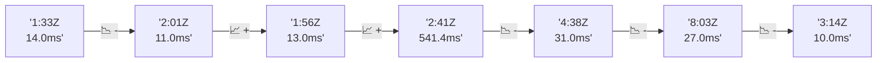

# 📊 Reporte de Performance - PokeAPI

**Fecha de corrida:** 2026-08-16 13:24 UTC

**Enlace:** [31949599186](https://github.com/rba3/Lab_CD_CI_Perfomance/actions/runs/31949599186)

## ✅ Veredicto

```
PASS (fallback por umbrales)

- Error maximo: 0.0%
- p95 maximo: 32.8 ms
```

## 🔮 Predicciones

✓ STABLE

## 📈 Métricas Globales

| Métrica | Valor | SLO | Estado |
|---------|-------|-----|--------|
| Error Rate | 0.0% | < 0.1% | ✅ PASS |
| Latencia p50 | 16.0ms | - | ℹ️ |
| Latencia p95 | 21.0ms | < 800ms | ✅ PASS |
| Latencia p99 | 37.0ms | - | ℹ️ |
| Throughput | 0.00 req/s | - | ℹ️ |
| Muestras | 0 | - | ℹ️ |

## 📉 Tendencia Histórica (Últimas 7 corridas)



## 🔧 Análisis Técnico Detallado (JSON)

```json
{
  "predictions": {
    "prediction": "STABLE",
    "confidence": 0,
    "slope_ms_per_run": -0.75,
    "current_p95": 21.0,
    "days_to_warn": null,
    "days_to_fail": null,
    "risk_level": "LOW"
  },
  "recommendations": [],
  "correlations": {},
  "root_cause": {
    "issue": null,
    "root_cause": null,
    "confidence": 0,
    "evidence": []
  },
  "timestamp": "2026-08-16T13:24:32.819162"
}
```

## 📦 Datos Completos (JSON)

```json
{
  "scenario": "load",
  "overall": {
    "samples": 16571,
    "errors": 0,
    "error_pct": 0.0,
    "avg_ms": 17.1,
    "min_ms": 12,
    "max_ms": 245,
    "p50_ms": 16.0,
    "p90_ms": 20.0,
    "p95_ms": 21.0,
    "p99_ms": 37.0,
    "throughput_rps": 138.5,
    "duration_s": 119.6
  },
  "by_endpoint": {
    "ability-static": {
      "samples": 1657,
      "errors": 0,
      "error_pct": 0.0,
      "avg_ms": 16.5,
      "min_ms": 12,
      "max_ms": 53,
      "p50_ms": 16.0,
      "p90_ms": 19.0,
      "p95_ms": 21.0,
      "p99_ms": 28.0,
      "throughput_rps": 13.99,
      "duration_s": 118.5
    },
    "berry-cheri": {
      "samples": 1657,
      "errors": 0,
      "error_pct": 0.0,
      "avg_ms": 16.6,
      "min_ms": 12,
      "max_ms": 107,
      "p50_ms": 16.0,
      "p90_ms": 19.0,
      "p95_ms": 20.0,
      "p99_ms": 28.4,
      "throughput_rps": 14.0,
      "duration_s": 118.4
    },
    "generation-1": {
      "samples": 1656,
      "errors": 0,
      "error_pct": 0.0,
      "avg_ms": 16.7,
      "min_ms": 12,
      "max_ms": 65,
      "p50_ms": 16.0,
      "p90_ms": 19.0,
      "p95_ms": 21.0,
      "p99_ms": 28.7,
      "throughput_rps": 14.03,
      "duration_s": 118.1
    },
    "move-tackle": {
      "samples": 1657,
      "errors": 0,
      "error_pct": 0.0,
      "avg_ms": 16.9,
      "min_ms": 13,
      "max_ms": 47,
      "p50_ms": 16.0,
      "p90_ms": 20.0,
      "p95_ms": 21.0,
      "p99_ms": 25.0,
      "throughput_rps": 14.02,
      "duration_s": 118.2
    },
    "pokemon-charizard": {
      "samples": 1657,
      "errors": 0,
      "error_pct": 0.0,
      "avg_ms": 20.4,
      "min_ms": 16,
      "max_ms": 87,
      "p50_ms": 19.0,
      "p90_ms": 23.0,
      "p95_ms": 28.0,
      "p99_ms": 42.4,
      "throughput_rps": 13.92,
      "duration_s": 119.0
    },
    "pokemon-ditto": {
      "samples": 1658,
      "errors": 0,
      "error_pct": 0.0,
      "avg_ms": 17.4,
      "min_ms": 13,
      "max_ms": 245,
      "p50_ms": 16.0,
      "p90_ms": 19.0,
      "p95_ms": 20.0,
      "p99_ms": 38.4,
      "throughput_rps": 13.86,
      "duration_s": 119.6
    },
    "pokemon-list": {
      "samples": 1657,
      "errors": 0,
      "error_pct": 0.0,
      "avg_ms": 15.6,
      "min_ms": 12,
      "max_ms": 57,
      "p50_ms": 15.0,
      "p90_ms": 18.0,
      "p95_ms": 19.0,
      "p99_ms": 27.4,
      "throughput_rps": 13.96,
      "duration_s": 118.7
    },
    "pokemon-pikachu": {
      "samples": 1657,
      "errors": 0,
      "error_pct": 0.0,
      "avg_ms": 19.1,
      "min_ms": 14,
      "max_ms": 79,
      "p50_ms": 18.0,
      "p90_ms": 21.0,
      "p95_ms": 26.0,
      "p99_ms": 44.4,
      "throughput_rps": 13.92,
      "duration_s": 119.1
    },
    "type-fire": {
      "samples": 1657,
      "errors": 0,
      "error_pct": 0.0,
      "avg_ms": 16.2,
      "min_ms": 13,
      "max_ms": 62,
      "p50_ms": 16.0,
      "p90_ms": 19.0,
      "p95_ms": 20.0,
      "p99_ms": 24.0,
      "throughput_rps": 13.99,
      "duration_s": 118.5
    },
    "type-water": {
      "samples": 1658,
      "errors": 0,
      "error_pct": 0.0,
      "avg_ms": 15.8,
      "min_ms": 13,
      "max_ms": 55,
      "p50_ms": 15.0,
      "p90_ms": 18.0,
      "p95_ms": 19.0,
      "p99_ms": 24.0,
      "throughput_rps": 13.96,
      "duration_s": 118.7
    }
  },
  "empty": false
}
```

---

*Reporte generado automáticamente por el workflow de performance.*

*Timestamp: 2026-08-16T13:24:32.820338Z*
