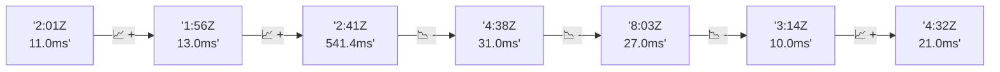

# 📊 Reporte de Performance - PokeAPI

**Fecha de corrida:** 2026-08-17 13:32 UTC

**Enlace:** [32035433547](https://github.com/rba3/Lab_CD_CI_Perfomance/actions/runs/32035433547)

## ✅ Veredicto

```
PASS (fallback por umbrales)

- Error maximo: 0.0%
- p95 maximo: 50.0 ms
```

## 🔮 Predicciones

✓ STABLE

## 📈 Métricas Globales

| Métrica | Valor | SLO | Estado |
|---------|-------|-----|--------|
| Error Rate | 0.0% | < 0.1% | ✅ PASS |
| Latencia p50 | 22.0ms | - | ℹ️ |
| Latencia p95 | 31.0ms | < 800ms | ✅ PASS |
| Latencia p99 | 64.0ms | - | ℹ️ |
| Throughput | 0.00 req/s | - | ℹ️ |
| Muestras | 0 | - | ℹ️ |

## 📉 Tendencia Histórica (Últimas 7 corridas)



## 🔧 Análisis Técnico Detallado (JSON)

```json
{
  "predictions": {
    "prediction": "STABLE",
    "confidence": 0,
    "slope_ms_per_run": -130.1,
    "current_p95": 31.0,
    "days_to_warn": null,
    "days_to_fail": null,
    "risk_level": "LOW"
  },
  "recommendations": [],
  "correlations": {},
  "root_cause": {
    "issue": null,
    "root_cause": null,
    "confidence": 0,
    "evidence": []
  },
  "timestamp": "2026-08-17T13:32:37.695920"
}
```

## 📦 Datos Completos (JSON)

```json
{
  "scenario": "load",
  "overall": {
    "samples": 16243,
    "errors": 0,
    "error_pct": 0.0,
    "avg_ms": 23.5,
    "min_ms": 16,
    "max_ms": 337,
    "p50_ms": 22.0,
    "p90_ms": 28.0,
    "p95_ms": 31.0,
    "p99_ms": 64.0,
    "throughput_rps": 135.75,
    "duration_s": 119.7
  },
  "by_endpoint": {
    "ability-static": {
      "samples": 1625,
      "errors": 0,
      "error_pct": 0.0,
      "avg_ms": 22.4,
      "min_ms": 16,
      "max_ms": 97,
      "p50_ms": 22.0,
      "p90_ms": 26.0,
      "p95_ms": 28.0,
      "p99_ms": 34.0,
      "throughput_rps": 13.72,
      "duration_s": 118.5
    },
    "berry-cheri": {
      "samples": 1624,
      "errors": 0,
      "error_pct": 0.0,
      "avg_ms": 26.4,
      "min_ms": 16,
      "max_ms": 337,
      "p50_ms": 21.0,
      "p90_ms": 61.0,
      "p95_ms": 65.0,
      "p99_ms": 69.0,
      "throughput_rps": 13.72,
      "duration_s": 118.3
    },
    "generation-1": {
      "samples": 1624,
      "errors": 0,
      "error_pct": 0.0,
      "avg_ms": 22.2,
      "min_ms": 16,
      "max_ms": 67,
      "p50_ms": 22.0,
      "p90_ms": 26.0,
      "p95_ms": 27.0,
      "p99_ms": 35.0,
      "throughput_rps": 13.75,
      "duration_s": 118.1
    },
    "move-tackle": {
      "samples": 1624,
      "errors": 0,
      "error_pct": 0.0,
      "avg_ms": 22.4,
      "min_ms": 16,
      "max_ms": 67,
      "p50_ms": 22.0,
      "p90_ms": 26.0,
      "p95_ms": 27.0,
      "p99_ms": 33.8,
      "throughput_rps": 13.75,
      "duration_s": 118.1
    },
    "pokemon-charizard": {
      "samples": 1625,
      "errors": 0,
      "error_pct": 0.0,
      "avg_ms": 28.4,
      "min_ms": 21,
      "max_ms": 138,
      "p50_ms": 26.0,
      "p90_ms": 33.0,
      "p95_ms": 40.0,
      "p99_ms": 66.0,
      "throughput_rps": 13.64,
      "duration_s": 119.1
    },
    "pokemon-ditto": {
      "samples": 1624,
      "errors": 0,
      "error_pct": 0.0,
      "avg_ms": 22.3,
      "min_ms": 16,
      "max_ms": 190,
      "p50_ms": 21.0,
      "p90_ms": 26.0,
      "p95_ms": 28.0,
      "p99_ms": 34.0,
      "throughput_rps": 13.58,
      "duration_s": 119.6
    },
    "pokemon-list": {
      "samples": 1624,
      "errors": 0,
      "error_pct": 0.0,
      "avg_ms": 21.4,
      "min_ms": 16,
      "max_ms": 131,
      "p50_ms": 21.0,
      "p90_ms": 24.0,
      "p95_ms": 26.0,
      "p99_ms": 32.0,
      "throughput_rps": 13.68,
      "duration_s": 118.7
    },
    "pokemon-pikachu": {
      "samples": 1625,
      "errors": 0,
      "error_pct": 0.0,
      "avg_ms": 26.0,
      "min_ms": 20,
      "max_ms": 101,
      "p50_ms": 24.0,
      "p90_ms": 29.0,
      "p95_ms": 36.0,
      "p99_ms": 62.8,
      "throughput_rps": 13.64,
      "duration_s": 119.2
    },
    "type-fire": {
      "samples": 1624,
      "errors": 0,
      "error_pct": 0.0,
      "avg_ms": 22.3,
      "min_ms": 16,
      "max_ms": 71,
      "p50_ms": 22.0,
      "p90_ms": 26.0,
      "p95_ms": 28.0,
      "p99_ms": 53.5,
      "throughput_rps": 13.71,
      "duration_s": 118.5
    },
    "type-water": {
      "samples": 1624,
      "errors": 0,
      "error_pct": 0.0,
      "avg_ms": 21.7,
      "min_ms": 16,
      "max_ms": 66,
      "p50_ms": 21.0,
      "p90_ms": 25.0,
      "p95_ms": 26.0,
      "p99_ms": 32.0,
      "throughput_rps": 13.69,
      "duration_s": 118.7
    }
  },
  "empty": false
}
```

---

*Reporte generado automáticamente por el workflow de performance.*

*Timestamp: 2026-08-17T13:32:37.696924Z*
