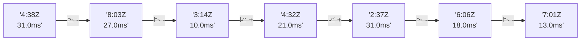

# 📊 Reporte de Performance - PokeAPI

**Fecha de corrida:** 2026-08-20 13:39 UTC

**Enlace:** [32375214955](https://github.com/rba3/Lab_CD_CI_Perfomance/actions/runs/32375214955)

## ✅ Veredicto

```
PASS (fallback por umbrales)

- Error maximo: 0.0%
- p95 maximo: 354.1 ms
```

## 🔮 Predicciones

⚠️ **Tendencia de degradación detectada** (LOW risk)
- Pendiente: +0.75ms/corrida
- P95 actual: 41.0ms
- Días hasta WARN: ~1012
- Días hasta FAIL: ~1945
- Confianza: 80%

## 📈 Métricas Globales

| Métrica | Valor | SLO | Estado |
|---------|-------|-----|--------|
| Error Rate | 0.0% | < 0.1% | ✅ PASS |
| Latencia p50 | 28.0ms | - | ℹ️ |
| Latencia p95 | 41.0ms | < 800ms | ✅ PASS |
| Latencia p99 | 72.1ms | - | ℹ️ |
| Throughput | 0.00 req/s | - | ℹ️ |
| Muestras | 0 | - | ℹ️ |

## 📉 Tendencia Histórica (Últimas 7 corridas)



## 🔧 Análisis Técnico Detallado (JSON)

```json
{
  "predictions": {
    "prediction": "DEGRADATION_TREND",
    "confidence": 80,
    "slope_ms_per_run": 0.75,
    "current_p95": 41.0,
    "days_to_warn": 1012,
    "days_to_fail": 1945,
    "risk_level": "LOW"
  },
  "recommendations": [],
  "correlations": {},
  "root_cause": {
    "issue": null,
    "root_cause": null,
    "confidence": 0,
    "evidence": []
  },
  "timestamp": "2026-08-20T13:39:07.051877"
}
```

## 📦 Datos Completos (JSON)

```json
{
  "scenario": "load",
  "overall": {
    "samples": 15895,
    "errors": 0,
    "error_pct": 0.0,
    "avg_ms": 30.7,
    "min_ms": 22,
    "max_ms": 3937,
    "p50_ms": 28.0,
    "p90_ms": 36.0,
    "p95_ms": 41.0,
    "p99_ms": 72.1,
    "throughput_rps": 132.87,
    "duration_s": 119.6
  },
  "by_endpoint": {
    "ability-static": {
      "samples": 1589,
      "errors": 0,
      "error_pct": 0.0,
      "avg_ms": 28.6,
      "min_ms": 23,
      "max_ms": 183,
      "p50_ms": 27.0,
      "p90_ms": 32.0,
      "p95_ms": 36.0,
      "p99_ms": 63.0,
      "throughput_rps": 13.44,
      "duration_s": 118.2
    },
    "berry-cheri": {
      "samples": 1590,
      "errors": 0,
      "error_pct": 0.0,
      "avg_ms": 28.7,
      "min_ms": 22,
      "max_ms": 354,
      "p50_ms": 27.0,
      "p90_ms": 32.0,
      "p95_ms": 36.0,
      "p99_ms": 70.0,
      "throughput_rps": 13.45,
      "duration_s": 118.2
    },
    "generation-1": {
      "samples": 1590,
      "errors": 0,
      "error_pct": 0.0,
      "avg_ms": 29.3,
      "min_ms": 22,
      "max_ms": 202,
      "p50_ms": 27.0,
      "p90_ms": 34.0,
      "p95_ms": 38.0,
      "p99_ms": 68.1,
      "throughput_rps": 13.48,
      "duration_s": 118.0
    },
    "move-tackle": {
      "samples": 1590,
      "errors": 0,
      "error_pct": 0.0,
      "avg_ms": 29.7,
      "min_ms": 22,
      "max_ms": 204,
      "p50_ms": 28.0,
      "p90_ms": 34.0,
      "p95_ms": 37.5,
      "p99_ms": 68.0,
      "throughput_rps": 13.46,
      "duration_s": 118.1
    },
    "pokemon-charizard": {
      "samples": 1589,
      "errors": 0,
      "error_pct": 0.0,
      "avg_ms": 37.3,
      "min_ms": 28,
      "max_ms": 226,
      "p50_ms": 34.0,
      "p90_ms": 43.0,
      "p95_ms": 53.0,
      "p99_ms": 84.1,
      "throughput_rps": 13.36,
      "duration_s": 119.0
    },
    "pokemon-ditto": {
      "samples": 1590,
      "errors": 0,
      "error_pct": 0.0,
      "avg_ms": 29.5,
      "min_ms": 23,
      "max_ms": 305,
      "p50_ms": 27.0,
      "p90_ms": 33.0,
      "p95_ms": 38.0,
      "p99_ms": 71.1,
      "throughput_rps": 13.29,
      "duration_s": 119.6
    },
    "pokemon-list": {
      "samples": 1589,
      "errors": 0,
      "error_pct": 0.0,
      "avg_ms": 29.3,
      "min_ms": 22,
      "max_ms": 3937,
      "p50_ms": 26.0,
      "p90_ms": 30.0,
      "p95_ms": 32.0,
      "p99_ms": 48.1,
      "throughput_rps": 13.4,
      "duration_s": 118.6
    },
    "pokemon-pikachu": {
      "samples": 1589,
      "errors": 0,
      "error_pct": 0.0,
      "avg_ms": 37.4,
      "min_ms": 28,
      "max_ms": 229,
      "p50_ms": 34.0,
      "p90_ms": 44.0,
      "p95_ms": 52.0,
      "p99_ms": 119.1,
      "throughput_rps": 13.35,
      "duration_s": 119.1
    },
    "type-fire": {
      "samples": 1589,
      "errors": 0,
      "error_pct": 0.0,
      "avg_ms": 28.6,
      "min_ms": 23,
      "max_ms": 189,
      "p50_ms": 27.0,
      "p90_ms": 32.0,
      "p95_ms": 36.0,
      "p99_ms": 58.4,
      "throughput_rps": 13.42,
      "duration_s": 118.4
    },
    "type-water": {
      "samples": 1590,
      "errors": 0,
      "error_pct": 0.0,
      "avg_ms": 28.3,
      "min_ms": 22,
      "max_ms": 274,
      "p50_ms": 27.0,
      "p90_ms": 32.0,
      "p95_ms": 35.0,
      "p99_ms": 65.0,
      "throughput_rps": 13.41,
      "duration_s": 118.6
    }
  },
  "empty": false
}
```

---

*Reporte generado automáticamente por el workflow de performance.*

*Timestamp: 2026-08-20T13:39:07.053324Z*
