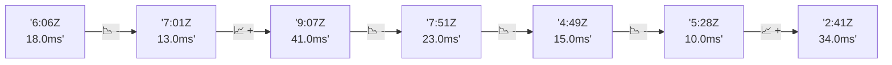

# 📊 Reporte de Performance - PokeAPI

**Fecha de corrida:** 2026-08-25 13:41 UTC

**Enlace:** [32854538613](https://github.com/rba3/Lab_CD_CI_Perfomance/actions/runs/32854538613)

## ✅ Veredicto

```
PASS (fallback por umbrales)

- Error maximo: 0.0%
- p95 maximo: 21.0 ms
```

## 🔮 Predicciones

✓ STABLE

## 📈 Métricas Globales

| Métrica | Valor | SLO | Estado |
|---------|-------|-----|--------|
| Error Rate | 0.0% | < 0.1% | ✅ PASS |
| Latencia p50 | 10.0ms | - | ℹ️ |
| Latencia p95 | 18.0ms | < 800ms | ✅ PASS |
| Latencia p99 | 27.0ms | - | ℹ️ |
| Throughput | 0.00 req/s | - | ℹ️ |
| Muestras | 0 | - | ℹ️ |

## 📉 Tendencia Histórica (Últimas 7 corridas)



## 🔧 Análisis Técnico Detallado (JSON)

```json
{
  "predictions": {
    "prediction": "STABLE",
    "confidence": 0,
    "slope_ms_per_run": -1.75,
    "current_p95": 18.0,
    "days_to_warn": null,
    "days_to_fail": null,
    "risk_level": "LOW"
  },
  "recommendations": [],
  "correlations": {},
  "root_cause": {
    "issue": null,
    "root_cause": null,
    "confidence": 0,
    "evidence": []
  },
  "timestamp": "2026-08-25T13:41:04.600045"
}
```

## 📦 Datos Completos (JSON)

```json
{
  "scenario": "load",
  "overall": {
    "samples": 16884,
    "errors": 0,
    "error_pct": 0.0,
    "avg_ms": 11.3,
    "min_ms": 5,
    "max_ms": 3222,
    "p50_ms": 10.0,
    "p90_ms": 15.0,
    "p95_ms": 18.0,
    "p99_ms": 27.0,
    "throughput_rps": 141.07,
    "duration_s": 119.7
  },
  "by_endpoint": {
    "ability-static": {
      "samples": 1688,
      "errors": 0,
      "error_pct": 0.0,
      "avg_ms": 10.7,
      "min_ms": 6,
      "max_ms": 62,
      "p50_ms": 10.0,
      "p90_ms": 14.0,
      "p95_ms": 17.0,
      "p99_ms": 24.1,
      "throughput_rps": 14.26,
      "duration_s": 118.4
    },
    "berry-cheri": {
      "samples": 1688,
      "errors": 0,
      "error_pct": 0.0,
      "avg_ms": 12.6,
      "min_ms": 6,
      "max_ms": 3222,
      "p50_ms": 10.0,
      "p90_ms": 14.0,
      "p95_ms": 17.0,
      "p99_ms": 25.1,
      "throughput_rps": 14.26,
      "duration_s": 118.3
    },
    "generation-1": {
      "samples": 1688,
      "errors": 0,
      "error_pct": 0.0,
      "avg_ms": 10.9,
      "min_ms": 6,
      "max_ms": 49,
      "p50_ms": 10.0,
      "p90_ms": 15.0,
      "p95_ms": 18.0,
      "p99_ms": 27.0,
      "throughput_rps": 14.3,
      "duration_s": 118.0
    },
    "move-tackle": {
      "samples": 1689,
      "errors": 0,
      "error_pct": 0.0,
      "avg_ms": 11.2,
      "min_ms": 6,
      "max_ms": 98,
      "p50_ms": 10.0,
      "p90_ms": 16.0,
      "p95_ms": 18.0,
      "p99_ms": 27.0,
      "throughput_rps": 14.29,
      "duration_s": 118.2
    },
    "pokemon-charizard": {
      "samples": 1689,
      "errors": 0,
      "error_pct": 0.0,
      "avg_ms": 12.7,
      "min_ms": 7,
      "max_ms": 228,
      "p50_ms": 11.0,
      "p90_ms": 17.0,
      "p95_ms": 20.0,
      "p99_ms": 37.1,
      "throughput_rps": 14.19,
      "duration_s": 119.1
    },
    "pokemon-ditto": {
      "samples": 1688,
      "errors": 0,
      "error_pct": 0.0,
      "avg_ms": 10.8,
      "min_ms": 6,
      "max_ms": 244,
      "p50_ms": 10.0,
      "p90_ms": 14.3,
      "p95_ms": 17.0,
      "p99_ms": 25.1,
      "throughput_rps": 14.12,
      "duration_s": 119.5
    },
    "pokemon-list": {
      "samples": 1688,
      "errors": 0,
      "error_pct": 0.0,
      "avg_ms": 10.1,
      "min_ms": 6,
      "max_ms": 69,
      "p50_ms": 9.0,
      "p90_ms": 13.0,
      "p95_ms": 16.0,
      "p99_ms": 24.0,
      "throughput_rps": 14.23,
      "duration_s": 118.7
    },
    "pokemon-pikachu": {
      "samples": 1689,
      "errors": 0,
      "error_pct": 0.0,
      "avg_ms": 12.0,
      "min_ms": 7,
      "max_ms": 106,
      "p50_ms": 11.0,
      "p90_ms": 16.0,
      "p95_ms": 18.0,
      "p99_ms": 32.0,
      "throughput_rps": 14.17,
      "duration_s": 119.2
    },
    "type-fire": {
      "samples": 1689,
      "errors": 0,
      "error_pct": 0.0,
      "avg_ms": 11.0,
      "min_ms": 6,
      "max_ms": 78,
      "p50_ms": 10.0,
      "p90_ms": 15.0,
      "p95_ms": 17.0,
      "p99_ms": 27.0,
      "throughput_rps": 14.25,
      "duration_s": 118.5
    },
    "type-water": {
      "samples": 1688,
      "errors": 0,
      "error_pct": 0.0,
      "avg_ms": 10.6,
      "min_ms": 5,
      "max_ms": 37,
      "p50_ms": 10.0,
      "p90_ms": 14.0,
      "p95_ms": 16.0,
      "p99_ms": 22.1,
      "throughput_rps": 14.23,
      "duration_s": 118.7
    }
  },
  "empty": false
}
```

---

*Reporte generado automáticamente por el workflow de performance.*

*Timestamp: 2026-08-25T13:41:04.601575Z*
