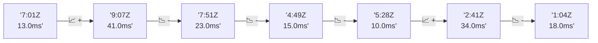

# 📊 Reporte de Performance - PokeAPI

**Fecha de corrida:** 2026-08-26 13:45 UTC

**Enlace:** [32975852564](https://github.com/rba3/Lab_CD_CI_Perfomance/actions/runs/32975852564)

## ✅ Veredicto

```
PASS (fallback por umbrales)

- Error maximo: 0.0%
- p95 maximo: 68.4 ms
```

## 🔮 Predicciones

✓ STABLE

## 📈 Métricas Globales

| Métrica | Valor | SLO | Estado |
|---------|-------|-----|--------|
| Error Rate | 0.0% | < 0.1% | ✅ PASS |
| Latencia p50 | 41.0ms | - | ℹ️ |
| Latencia p95 | 55.0ms | < 800ms | ✅ PASS |
| Latencia p99 | 108.0ms | - | ℹ️ |
| Throughput | 0.00 req/s | - | ℹ️ |
| Muestras | 0 | - | ℹ️ |

## 📉 Tendencia Histórica (Últimas 7 corridas)



## 🔧 Análisis Técnico Detallado (JSON)

```json
{
  "predictions": {
    "prediction": "STABLE",
    "confidence": 0,
    "slope_ms_per_run": -1.25,
    "current_p95": 55.0,
    "days_to_warn": null,
    "days_to_fail": null,
    "risk_level": "LOW"
  },
  "recommendations": [],
  "correlations": {},
  "root_cause": {
    "issue": null,
    "root_cause": null,
    "confidence": 0,
    "evidence": []
  },
  "timestamp": "2026-08-26T13:45:53.477052"
}
```

## 📦 Datos Completos (JSON)

```json
{
  "scenario": "load",
  "overall": {
    "samples": 15290,
    "errors": 0,
    "error_pct": 0.0,
    "avg_ms": 43.8,
    "min_ms": 29,
    "max_ms": 816,
    "p50_ms": 41.0,
    "p90_ms": 52.0,
    "p95_ms": 55.0,
    "p99_ms": 108.0,
    "throughput_rps": 127.78,
    "duration_s": 119.7
  },
  "by_endpoint": {
    "ability-static": {
      "samples": 1529,
      "errors": 0,
      "error_pct": 0.0,
      "avg_ms": 40.9,
      "min_ms": 31,
      "max_ms": 128,
      "p50_ms": 40.0,
      "p90_ms": 44.0,
      "p95_ms": 46.0,
      "p99_ms": 51.0,
      "throughput_rps": 12.92,
      "duration_s": 118.3
    },
    "berry-cheri": {
      "samples": 1529,
      "errors": 0,
      "error_pct": 0.0,
      "avg_ms": 40.3,
      "min_ms": 31,
      "max_ms": 125,
      "p50_ms": 39.0,
      "p90_ms": 43.0,
      "p95_ms": 45.0,
      "p99_ms": 55.7,
      "throughput_rps": 12.93,
      "duration_s": 118.3
    },
    "generation-1": {
      "samples": 1529,
      "errors": 0,
      "error_pct": 0.0,
      "avg_ms": 41.3,
      "min_ms": 31,
      "max_ms": 135,
      "p50_ms": 41.0,
      "p90_ms": 45.0,
      "p95_ms": 47.0,
      "p99_ms": 52.0,
      "throughput_rps": 12.96,
      "duration_s": 118.0
    },
    "move-tackle": {
      "samples": 1529,
      "errors": 0,
      "error_pct": 0.0,
      "avg_ms": 42.4,
      "min_ms": 33,
      "max_ms": 131,
      "p50_ms": 42.0,
      "p90_ms": 46.0,
      "p95_ms": 48.0,
      "p99_ms": 55.7,
      "throughput_rps": 12.95,
      "duration_s": 118.1
    },
    "pokemon-charizard": {
      "samples": 1529,
      "errors": 0,
      "error_pct": 0.0,
      "avg_ms": 56.4,
      "min_ms": 43,
      "max_ms": 241,
      "p50_ms": 53.0,
      "p90_ms": 60.0,
      "p95_ms": 75.0,
      "p99_ms": 132.0,
      "throughput_rps": 12.84,
      "duration_s": 119.1
    },
    "pokemon-ditto": {
      "samples": 1529,
      "errors": 0,
      "error_pct": 0.0,
      "avg_ms": 42.1,
      "min_ms": 31,
      "max_ms": 256,
      "p50_ms": 41.0,
      "p90_ms": 46.0,
      "p95_ms": 48.0,
      "p99_ms": 61.4,
      "throughput_rps": 12.78,
      "duration_s": 119.6
    },
    "pokemon-list": {
      "samples": 1529,
      "errors": 0,
      "error_pct": 0.0,
      "avg_ms": 39.6,
      "min_ms": 29,
      "max_ms": 280,
      "p50_ms": 38.0,
      "p90_ms": 42.0,
      "p95_ms": 43.6,
      "p99_ms": 90.4,
      "throughput_rps": 12.89,
      "duration_s": 118.6
    },
    "pokemon-pikachu": {
      "samples": 1529,
      "errors": 0,
      "error_pct": 0.0,
      "avg_ms": 53.7,
      "min_ms": 39,
      "max_ms": 231,
      "p50_ms": 49.0,
      "p90_ms": 58.0,
      "p95_ms": 77.6,
      "p99_ms": 187.3,
      "throughput_rps": 12.84,
      "duration_s": 119.1
    },
    "type-fire": {
      "samples": 1529,
      "errors": 0,
      "error_pct": 0.0,
      "avg_ms": 40.3,
      "min_ms": 31,
      "max_ms": 125,
      "p50_ms": 39.0,
      "p90_ms": 44.0,
      "p95_ms": 45.0,
      "p99_ms": 53.0,
      "throughput_rps": 12.9,
      "duration_s": 118.5
    },
    "type-water": {
      "samples": 1529,
      "errors": 0,
      "error_pct": 0.0,
      "avg_ms": 41.3,
      "min_ms": 30,
      "max_ms": 816,
      "p50_ms": 39.0,
      "p90_ms": 43.0,
      "p95_ms": 45.0,
      "p99_ms": 68.9,
      "throughput_rps": 12.89,
      "duration_s": 118.6
    }
  },
  "empty": false
}
```

---

*Reporte generado automáticamente por el workflow de performance.*

*Timestamp: 2026-08-26T13:45:53.478040Z*
