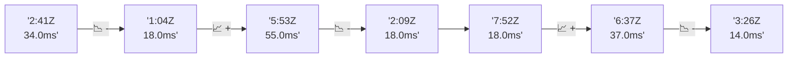

# 📊 Reporte de Performance - PokeAPI

**Fecha de corrida:** 2026-08-31 19:18 UTC

**Enlace:** [33429606911](https://github.com/rba3/Lab_CD_CI_Perfomance/actions/runs/33429606911)

## ✅ Veredicto

```
PASS (fallback por umbrales)

- Error maximo: 0.0%
- p95 maximo: 164.0 ms
```

## 🔮 Predicciones

✓ STABLE

## 📈 Métricas Globales

| Métrica | Valor | SLO | Estado |
|---------|-------|-----|--------|
| Error Rate | 0.0% | < 0.1% | ✅ PASS |
| Latencia p50 | 74.0ms | - | ℹ️ |
| Latencia p95 | 157.0ms | < 800ms | ✅ PASS |
| Latencia p99 | 227.0ms | - | ℹ️ |
| Throughput | 0.00 req/s | - | ℹ️ |
| Muestras | 0 | - | ℹ️ |

## 📉 Tendencia Histórica (Últimas 7 corridas)



## 🔧 Análisis Técnico Detallado (JSON)

```json
{
  "predictions": {
    "prediction": "STABLE",
    "confidence": 0,
    "slope_ms_per_run": -10.25,
    "current_p95": 157.0,
    "days_to_warn": null,
    "days_to_fail": null,
    "risk_level": "LOW"
  },
  "recommendations": [],
  "correlations": {},
  "root_cause": {
    "issue": null,
    "root_cause": null,
    "confidence": 0,
    "evidence": []
  },
  "timestamp": "2026-08-31T19:18:48.873651"
}
```

## 📦 Datos Completos (JSON)

```json
{
  "scenario": "load",
  "overall": {
    "samples": 13818,
    "errors": 0,
    "error_pct": 0.0,
    "avg_ms": 80.5,
    "min_ms": 40,
    "max_ms": 1186,
    "p50_ms": 74.0,
    "p90_ms": 117.0,
    "p95_ms": 157.0,
    "p99_ms": 227.0,
    "throughput_rps": 115.4,
    "duration_s": 119.7
  },
  "by_endpoint": {
    "ability-static": {
      "samples": 1381,
      "errors": 0,
      "error_pct": 0.0,
      "avg_ms": 76.1,
      "min_ms": 41,
      "max_ms": 491,
      "p50_ms": 74.0,
      "p90_ms": 117.0,
      "p95_ms": 119.0,
      "p99_ms": 161.2,
      "throughput_rps": 11.69,
      "duration_s": 118.2
    },
    "berry-cheri": {
      "samples": 1381,
      "errors": 0,
      "error_pct": 0.0,
      "avg_ms": 72.1,
      "min_ms": 40,
      "max_ms": 461,
      "p50_ms": 73.0,
      "p90_ms": 113.0,
      "p95_ms": 114.0,
      "p99_ms": 156.2,
      "throughput_rps": 11.69,
      "duration_s": 118.1
    },
    "generation-1": {
      "samples": 1381,
      "errors": 0,
      "error_pct": 0.0,
      "avg_ms": 73.2,
      "min_ms": 41,
      "max_ms": 449,
      "p50_ms": 73.0,
      "p90_ms": 116.0,
      "p95_ms": 119.0,
      "p99_ms": 159.0,
      "throughput_rps": 11.72,
      "duration_s": 117.8
    },
    "move-tackle": {
      "samples": 1382,
      "errors": 0,
      "error_pct": 0.0,
      "avg_ms": 77.0,
      "min_ms": 42,
      "max_ms": 633,
      "p50_ms": 76.0,
      "p90_ms": 121.0,
      "p95_ms": 124.0,
      "p99_ms": 169.2,
      "throughput_rps": 11.72,
      "duration_s": 118.0
    },
    "pokemon-charizard": {
      "samples": 1382,
      "errors": 0,
      "error_pct": 0.0,
      "avg_ms": 107.0,
      "min_ms": 53,
      "max_ms": 602,
      "p50_ms": 103.0,
      "p90_ms": 170.0,
      "p95_ms": 174.0,
      "p99_ms": 272.0,
      "throughput_rps": 11.61,
      "duration_s": 119.1
    },
    "pokemon-ditto": {
      "samples": 1382,
      "errors": 0,
      "error_pct": 0.0,
      "avg_ms": 74.8,
      "min_ms": 41,
      "max_ms": 354,
      "p50_ms": 74.0,
      "p90_ms": 117.0,
      "p95_ms": 127.0,
      "p99_ms": 164.2,
      "throughput_rps": 11.55,
      "duration_s": 119.6
    },
    "pokemon-list": {
      "samples": 1382,
      "errors": 0,
      "error_pct": 0.0,
      "avg_ms": 71.8,
      "min_ms": 40,
      "max_ms": 350,
      "p50_ms": 72.0,
      "p90_ms": 114.0,
      "p95_ms": 116.0,
      "p99_ms": 154.0,
      "throughput_rps": 11.66,
      "duration_s": 118.6
    },
    "pokemon-pikachu": {
      "samples": 1383,
      "errors": 0,
      "error_pct": 0.0,
      "avg_ms": 102.2,
      "min_ms": 50,
      "max_ms": 1186,
      "p50_ms": 96.0,
      "p90_ms": 160.0,
      "p95_ms": 215.0,
      "p99_ms": 378.2,
      "throughput_rps": 11.6,
      "duration_s": 119.2
    },
    "type-fire": {
      "samples": 1382,
      "errors": 0,
      "error_pct": 0.0,
      "avg_ms": 75.6,
      "min_ms": 40,
      "max_ms": 356,
      "p50_ms": 74.0,
      "p90_ms": 115.0,
      "p95_ms": 117.0,
      "p99_ms": 164.4,
      "throughput_rps": 11.66,
      "duration_s": 118.5
    },
    "type-water": {
      "samples": 1382,
      "errors": 0,
      "error_pct": 0.0,
      "avg_ms": 75.0,
      "min_ms": 41,
      "max_ms": 352,
      "p50_ms": 74.0,
      "p90_ms": 116.0,
      "p95_ms": 117.0,
      "p99_ms": 210.1,
      "throughput_rps": 11.66,
      "duration_s": 118.6
    }
  },
  "empty": false
}
```

---

*Reporte generado automáticamente por el workflow de performance.*

*Timestamp: 2026-08-31T19:18:48.874947Z*
