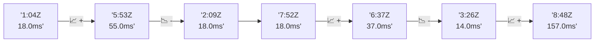

# 📊 Reporte de Performance - PokeAPI

**Fecha de corrida:** 2026-09-01 17:02 UTC

**Enlace:** [33535160520](https://github.com/rba3/Lab_CD_CI_Perfomance/actions/runs/33535160520)

## ✅ Veredicto

```
PASS (fallback por umbrales)

- Error maximo: 0.08%
- p95 maximo: 156.0 ms
```

## 🔮 Predicciones

⚠️ **Tendencia de degradación detectada** (MEDIUM risk)
- Pendiente: +34.75ms/corrida
- P95 actual: 156.0ms
- Días hasta WARN: ~18
- Días hasta FAIL: ~38
- Confianza: 80%

## 🎯 Causa Raíz Identificada

**Latencia inconsistente (outliers)**
- Causa probable: Spikes de latencia, posible GC o context switching
- Confianza: 75%
- Evidencia:
  - p50 (25.0ms) mucho menor que p95 (156.0ms)
  - Diferencia de 3x+ indica distribución anómala

## 📈 Métricas Globales

| Métrica | Valor | SLO | Estado |
|---------|-------|-----|--------|
| Error Rate | 0.08% | < 0.1% | ✅ PASS |
| Latencia p50 | 25.0ms | - | ℹ️ |
| Latencia p95 | 156.0ms | < 800ms | ✅ PASS |
| Latencia p99 | 218.0ms | - | ℹ️ |
| Throughput | 0.00 req/s | - | ℹ️ |
| Muestras | 0 | - | ℹ️ |

## 📉 Tendencia Histórica (Últimas 7 corridas)



## 🔧 Análisis Técnico Detallado (JSON)

```json
{
  "predictions": {
    "prediction": "DEGRADATION_TREND",
    "confidence": 80,
    "slope_ms_per_run": 34.75,
    "current_p95": 156.0,
    "days_to_warn": 18,
    "days_to_fail": 38,
    "risk_level": "MEDIUM"
  },
  "recommendations": [],
  "correlations": {},
  "root_cause": {
    "issue": "Latencia inconsistente (outliers)",
    "root_cause": "Spikes de latencia, posible GC o context switching",
    "confidence": 75,
    "evidence": [
      "p50 (25.0ms) mucho menor que p95 (156.0ms)",
      "Diferencia de 3x+ indica distribuci\u00f3n an\u00f3mala"
    ]
  },
  "timestamp": "2026-09-01T17:02:52.346437"
}
```

## 📦 Datos Completos (JSON)

```json
{
  "scenario": "load",
  "overall": {
    "samples": 15337,
    "errors": 13,
    "error_pct": 0.08,
    "avg_ms": 42.7,
    "min_ms": 0,
    "max_ms": 3475,
    "p50_ms": 25.0,
    "p90_ms": 113.0,
    "p95_ms": 156.0,
    "p99_ms": 218.0,
    "throughput_rps": 128.12,
    "duration_s": 119.7
  },
  "by_endpoint": {
    "ability-static": {
      "samples": 1533,
      "errors": 1,
      "error_pct": 0.07,
      "avg_ms": 39.5,
      "min_ms": 6,
      "max_ms": 459,
      "p50_ms": 26.0,
      "p90_ms": 92.0,
      "p95_ms": 155.0,
      "p99_ms": 166.0,
      "throughput_rps": 12.96,
      "duration_s": 118.3
    },
    "berry-cheri": {
      "samples": 1533,
      "errors": 0,
      "error_pct": 0.0,
      "avg_ms": 38.9,
      "min_ms": 7,
      "max_ms": 444,
      "p50_ms": 27.0,
      "p90_ms": 88.8,
      "p95_ms": 149.0,
      "p99_ms": 155.0,
      "throughput_rps": 12.96,
      "duration_s": 118.3
    },
    "generation-1": {
      "samples": 1533,
      "errors": 1,
      "error_pct": 0.07,
      "avg_ms": 39.9,
      "min_ms": 6,
      "max_ms": 3475,
      "p50_ms": 24.0,
      "p90_ms": 89.8,
      "p95_ms": 153.0,
      "p99_ms": 163.0,
      "throughput_rps": 12.99,
      "duration_s": 118.0
    },
    "move-tackle": {
      "samples": 1533,
      "errors": 1,
      "error_pct": 0.07,
      "avg_ms": 41.0,
      "min_ms": 7,
      "max_ms": 483,
      "p50_ms": 26.0,
      "p90_ms": 92.0,
      "p95_ms": 160.0,
      "p99_ms": 175.4,
      "throughput_rps": 12.98,
      "duration_s": 118.1
    },
    "pokemon-charizard": {
      "samples": 1534,
      "errors": 1,
      "error_pct": 0.07,
      "avg_ms": 55.7,
      "min_ms": 8,
      "max_ms": 910,
      "p50_ms": 21.0,
      "p90_ms": 138.4,
      "p95_ms": 223.0,
      "p99_ms": 329.7,
      "throughput_rps": 12.89,
      "duration_s": 119.0
    },
    "pokemon-ditto": {
      "samples": 1535,
      "errors": 0,
      "error_pct": 0.0,
      "avg_ms": 45.9,
      "min_ms": 8,
      "max_ms": 460,
      "p50_ms": 27.0,
      "p90_ms": 100.8,
      "p95_ms": 161.0,
      "p99_ms": 178.0,
      "throughput_rps": 12.83,
      "duration_s": 119.7
    },
    "pokemon-list": {
      "samples": 1534,
      "errors": 1,
      "error_pct": 0.07,
      "avg_ms": 36.4,
      "min_ms": 6,
      "max_ms": 447,
      "p50_ms": 20.0,
      "p90_ms": 86.0,
      "p95_ms": 149.0,
      "p99_ms": 156.7,
      "throughput_rps": 12.92,
      "duration_s": 118.8
    },
    "pokemon-pikachu": {
      "samples": 1534,
      "errors": 3,
      "error_pct": 0.2,
      "avg_ms": 51.8,
      "min_ms": 0,
      "max_ms": 825,
      "p50_ms": 23.0,
      "p90_ms": 121.0,
      "p95_ms": 208.0,
      "p99_ms": 289.4,
      "throughput_rps": 12.87,
      "duration_s": 119.2
    },
    "type-fire": {
      "samples": 1534,
      "errors": 0,
      "error_pct": 0.0,
      "avg_ms": 38.3,
      "min_ms": 7,
      "max_ms": 550,
      "p50_ms": 25.0,
      "p90_ms": 91.0,
      "p95_ms": 153.0,
      "p99_ms": 162.7,
      "throughput_rps": 12.93,
      "duration_s": 118.6
    },
    "type-water": {
      "samples": 1534,
      "errors": 5,
      "error_pct": 0.33,
      "avg_ms": 39.3,
      "min_ms": 0,
      "max_ms": 469,
      "p50_ms": 23.0,
      "p90_ms": 91.0,
      "p95_ms": 155.0,
      "p99_ms": 165.0,
      "throughput_rps": 12.92,
      "duration_s": 118.7
    }
  },
  "empty": false
}
```

---

*Reporte generado automáticamente por el workflow de performance.*

*Timestamp: 2026-09-01T17:02:52.347987Z*
