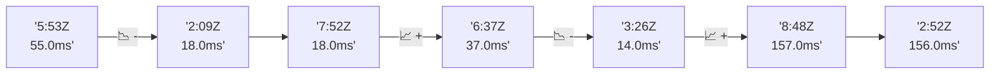

# 📊 Reporte de Performance - PokeAPI

**Fecha de corrida:** 2026-09-02 16:56 UTC

**Enlace:** [33657656182](https://github.com/rba3/Lab_CD_CI_Perfomance/actions/runs/33657656182)

## ✅ Veredicto

```
PASS (fallback por umbrales)

- Error maximo: 0.01%
- p95 maximo: 224.0 ms
```

## 🔮 Predicciones

⚠️ **Tendencia de degradación detectada** (MEDIUM risk)
- Pendiente: +34.5ms/corrida
- P95 actual: 214.0ms
- Días hasta WARN: ~16
- Días hasta FAIL: ~37
- Confianza: 80%

## 📈 Métricas Globales

| Métrica | Valor | SLO | Estado |
|---------|-------|-----|--------|
| Error Rate | 0.01% | < 0.1% | ✅ PASS |
| Latencia p50 | 92.0ms | - | ℹ️ |
| Latencia p95 | 214.0ms | < 800ms | ✅ PASS |
| Latencia p99 | 307.7ms | - | ℹ️ |
| Throughput | 0.00 req/s | - | ℹ️ |
| Muestras | 0 | - | ℹ️ |

## 📉 Tendencia Histórica (Últimas 7 corridas)



## 🔧 Análisis Técnico Detallado (JSON)

```json
{
  "predictions": {
    "prediction": "DEGRADATION_TREND",
    "confidence": 80,
    "slope_ms_per_run": 34.5,
    "current_p95": 214.0,
    "days_to_warn": 16,
    "days_to_fail": 37,
    "risk_level": "MEDIUM"
  },
  "recommendations": [],
  "correlations": {},
  "root_cause": {
    "issue": null,
    "root_cause": null,
    "confidence": 0,
    "evidence": []
  },
  "timestamp": "2026-09-02T16:56:03.593530"
}
```

## 📦 Datos Completos (JSON)

```json
{
  "scenario": "load",
  "overall": {
    "samples": 12867,
    "errors": 1,
    "error_pct": 0.01,
    "avg_ms": 108.5,
    "min_ms": 6,
    "max_ms": 934,
    "p50_ms": 92.0,
    "p90_ms": 167.0,
    "p95_ms": 214.0,
    "p99_ms": 307.7,
    "throughput_rps": 107.48,
    "duration_s": 119.7
  },
  "by_endpoint": {
    "ability-static": {
      "samples": 1286,
      "errors": 0,
      "error_pct": 0.0,
      "avg_ms": 98.3,
      "min_ms": 7,
      "max_ms": 454,
      "p50_ms": 88.0,
      "p90_ms": 160.0,
      "p95_ms": 162.8,
      "p99_ms": 170.0,
      "throughput_rps": 10.91,
      "duration_s": 117.9
    },
    "berry-cheri": {
      "samples": 1287,
      "errors": 0,
      "error_pct": 0.0,
      "avg_ms": 97.7,
      "min_ms": 7,
      "max_ms": 466,
      "p50_ms": 87.0,
      "p90_ms": 154.0,
      "p95_ms": 156.0,
      "p99_ms": 175.6,
      "throughput_rps": 10.91,
      "duration_s": 117.9
    },
    "generation-1": {
      "samples": 1286,
      "errors": 0,
      "error_pct": 0.0,
      "avg_ms": 97.9,
      "min_ms": 6,
      "max_ms": 443,
      "p50_ms": 87.0,
      "p90_ms": 159.0,
      "p95_ms": 161.0,
      "p99_ms": 174.2,
      "throughput_rps": 10.94,
      "duration_s": 117.5
    },
    "move-tackle": {
      "samples": 1286,
      "errors": 0,
      "error_pct": 0.0,
      "avg_ms": 103.3,
      "min_ms": 8,
      "max_ms": 473,
      "p50_ms": 92.0,
      "p90_ms": 167.0,
      "p95_ms": 170.0,
      "p99_ms": 197.0,
      "throughput_rps": 10.91,
      "duration_s": 117.8
    },
    "pokemon-charizard": {
      "samples": 1287,
      "errors": 0,
      "error_pct": 0.0,
      "avg_ms": 151.1,
      "min_ms": 8,
      "max_ms": 934,
      "p50_ms": 126.0,
      "p90_ms": 233.0,
      "p95_ms": 252.0,
      "p99_ms": 569.8,
      "throughput_rps": 10.82,
      "duration_s": 118.9
    },
    "pokemon-ditto": {
      "samples": 1288,
      "errors": 0,
      "error_pct": 0.0,
      "avg_ms": 99.6,
      "min_ms": 9,
      "max_ms": 470,
      "p50_ms": 89.0,
      "p90_ms": 160.3,
      "p95_ms": 163.0,
      "p99_ms": 177.3,
      "throughput_rps": 10.76,
      "duration_s": 119.7
    },
    "pokemon-list": {
      "samples": 1287,
      "errors": 0,
      "error_pct": 0.0,
      "avg_ms": 96.1,
      "min_ms": 7,
      "max_ms": 462,
      "p50_ms": 87.0,
      "p90_ms": 154.0,
      "p95_ms": 156.0,
      "p99_ms": 164.0,
      "throughput_rps": 10.86,
      "duration_s": 118.5
    },
    "pokemon-pikachu": {
      "samples": 1287,
      "errors": 1,
      "error_pct": 0.08,
      "avg_ms": 138.7,
      "min_ms": 9,
      "max_ms": 870,
      "p50_ms": 117.0,
      "p90_ms": 217.0,
      "p95_ms": 227.7,
      "p99_ms": 492.4,
      "throughput_rps": 10.81,
      "duration_s": 119.1
    },
    "type-fire": {
      "samples": 1286,
      "errors": 0,
      "error_pct": 0.0,
      "avg_ms": 100.7,
      "min_ms": 7,
      "max_ms": 471,
      "p50_ms": 90.0,
      "p90_ms": 159.0,
      "p95_ms": 161.0,
      "p99_ms": 184.1,
      "throughput_rps": 10.91,
      "duration_s": 117.9
    },
    "type-water": {
      "samples": 1287,
      "errors": 0,
      "error_pct": 0.0,
      "avg_ms": 101.9,
      "min_ms": 8,
      "max_ms": 473,
      "p50_ms": 90.0,
      "p90_ms": 161.0,
      "p95_ms": 164.0,
      "p99_ms": 174.1,
      "throughput_rps": 10.88,
      "duration_s": 118.3
    }
  },
  "empty": false
}
```

---

*Reporte generado automáticamente por el workflow de performance.*

*Timestamp: 2026-09-02T16:56:03.594930Z*
