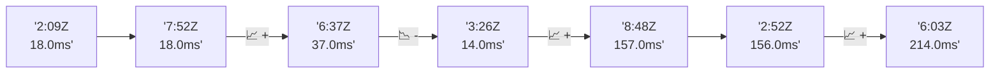

# 📊 Reporte de Performance - PokeAPI

**Fecha de corrida:** 2026-09-03 16:45 UTC

**Enlace:** [33780281202](https://github.com/rba3/Lab_CD_CI_Perfomance/actions/runs/33780281202)

## ✅ Veredicto

```
PASS (fallback por umbrales)

- Error maximo: 0.0%
- p95 maximo: 133.0 ms
```

## 🔮 Predicciones

⚠️ **Tendencia de degradación detectada** (MEDIUM risk)
- Pendiente: +44.25ms/corrida
- P95 actual: 133.0ms
- Días hasta WARN: ~15
- Días hasta FAIL: ~30
- Confianza: 80%

## 🎯 Causa Raíz Identificada

**Latencia inconsistente (outliers)**
- Causa probable: Spikes de latencia, posible GC o context switching
- Confianza: 75%
- Evidencia:
  - p50 (25.0ms) mucho menor que p95 (133.0ms)
  - Diferencia de 3x+ indica distribución anómala

## 📈 Métricas Globales

| Métrica | Valor | SLO | Estado |
|---------|-------|-----|--------|
| Error Rate | 0.0% | < 0.1% | ✅ PASS |
| Latencia p50 | 25.0ms | - | ℹ️ |
| Latencia p95 | 133.0ms | < 800ms | ✅ PASS |
| Latencia p99 | 159.0ms | - | ℹ️ |
| Throughput | 0.00 req/s | - | ℹ️ |
| Muestras | 0 | - | ℹ️ |

## 📉 Tendencia Histórica (Últimas 7 corridas)



## 🔧 Análisis Técnico Detallado (JSON)

```json
{
  "predictions": {
    "prediction": "DEGRADATION_TREND",
    "confidence": 80,
    "slope_ms_per_run": 44.25,
    "current_p95": 133.0,
    "days_to_warn": 15,
    "days_to_fail": 30,
    "risk_level": "MEDIUM"
  },
  "recommendations": [],
  "correlations": {},
  "root_cause": {
    "issue": "Latencia inconsistente (outliers)",
    "root_cause": "Spikes de latencia, posible GC o context switching",
    "confidence": 75,
    "evidence": [
      "p50 (25.0ms) mucho menor que p95 (133.0ms)",
      "Diferencia de 3x+ indica distribuci\u00f3n an\u00f3mala"
    ]
  },
  "timestamp": "2026-09-03T16:45:47.514205"
}
```

## 📦 Datos Completos (JSON)

```json
{
  "scenario": "load",
  "overall": {
    "samples": 15161,
    "errors": 0,
    "error_pct": 0.0,
    "avg_ms": 46.7,
    "min_ms": 7,
    "max_ms": 621,
    "p50_ms": 25.0,
    "p90_ms": 111.0,
    "p95_ms": 133.0,
    "p99_ms": 159.0,
    "throughput_rps": 126.69,
    "duration_s": 119.7
  },
  "by_endpoint": {
    "ability-static": {
      "samples": 1516,
      "errors": 0,
      "error_pct": 0.0,
      "avg_ms": 46.2,
      "min_ms": 7,
      "max_ms": 333,
      "p50_ms": 26.0,
      "p90_ms": 110.0,
      "p95_ms": 114.0,
      "p99_ms": 122.0,
      "throughput_rps": 12.8,
      "duration_s": 118.5
    },
    "berry-cheri": {
      "samples": 1516,
      "errors": 0,
      "error_pct": 0.0,
      "avg_ms": 44.4,
      "min_ms": 7,
      "max_ms": 317,
      "p50_ms": 26.0,
      "p90_ms": 106.0,
      "p95_ms": 112.0,
      "p99_ms": 151.8,
      "throughput_rps": 12.81,
      "duration_s": 118.4
    },
    "generation-1": {
      "samples": 1516,
      "errors": 0,
      "error_pct": 0.0,
      "avg_ms": 42.4,
      "min_ms": 7,
      "max_ms": 319,
      "p50_ms": 21.5,
      "p90_ms": 108.0,
      "p95_ms": 111.0,
      "p99_ms": 120.0,
      "throughput_rps": 12.83,
      "duration_s": 118.2
    },
    "move-tackle": {
      "samples": 1516,
      "errors": 0,
      "error_pct": 0.0,
      "avg_ms": 42.3,
      "min_ms": 7,
      "max_ms": 342,
      "p50_ms": 18.0,
      "p90_ms": 112.0,
      "p95_ms": 116.0,
      "p99_ms": 129.8,
      "throughput_rps": 12.83,
      "duration_s": 118.1
    },
    "pokemon-charizard": {
      "samples": 1516,
      "errors": 0,
      "error_pct": 0.0,
      "avg_ms": 62.3,
      "min_ms": 9,
      "max_ms": 621,
      "p50_ms": 34.0,
      "p90_ms": 151.5,
      "p95_ms": 160.0,
      "p99_ms": 314.0,
      "throughput_rps": 12.74,
      "duration_s": 119.0
    },
    "pokemon-ditto": {
      "samples": 1517,
      "errors": 0,
      "error_pct": 0.0,
      "avg_ms": 43.2,
      "min_ms": 8,
      "max_ms": 306,
      "p50_ms": 21.0,
      "p90_ms": 108.0,
      "p95_ms": 112.0,
      "p99_ms": 121.0,
      "throughput_rps": 12.68,
      "duration_s": 119.6
    },
    "pokemon-list": {
      "samples": 1516,
      "errors": 0,
      "error_pct": 0.0,
      "avg_ms": 41.6,
      "min_ms": 8,
      "max_ms": 302,
      "p50_ms": 25.5,
      "p90_ms": 105.0,
      "p95_ms": 109.0,
      "p99_ms": 115.8,
      "throughput_rps": 12.77,
      "duration_s": 118.7
    },
    "pokemon-pikachu": {
      "samples": 1516,
      "errors": 0,
      "error_pct": 0.0,
      "avg_ms": 56.0,
      "min_ms": 9,
      "max_ms": 543,
      "p50_ms": 25.0,
      "p90_ms": 142.0,
      "p95_ms": 149.0,
      "p99_ms": 232.4,
      "throughput_rps": 12.74,
      "duration_s": 119.0
    },
    "type-fire": {
      "samples": 1516,
      "errors": 0,
      "error_pct": 0.0,
      "avg_ms": 44.6,
      "min_ms": 7,
      "max_ms": 310,
      "p50_ms": 23.0,
      "p90_ms": 108.5,
      "p95_ms": 112.0,
      "p99_ms": 123.0,
      "throughput_rps": 12.79,
      "duration_s": 118.5
    },
    "type-water": {
      "samples": 1516,
      "errors": 0,
      "error_pct": 0.0,
      "avg_ms": 43.8,
      "min_ms": 7,
      "max_ms": 323,
      "p50_ms": 26.0,
      "p90_ms": 108.0,
      "p95_ms": 113.0,
      "p99_ms": 122.0,
      "throughput_rps": 12.76,
      "duration_s": 118.8
    }
  },
  "empty": false
}
```

---

*Reporte generado automáticamente por el workflow de performance.*

*Timestamp: 2026-09-03T16:45:47.515633Z*
