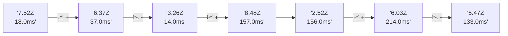

# 📊 Reporte de Performance - PokeAPI

**Fecha de corrida:** 2026-09-04 16:40 UTC

**Enlace:** [33896194015](https://github.com/rba3/Lab_CD_CI_Perfomance/actions/runs/33896194015)

## ✅ Veredicto

```
PASS (fallback por umbrales)

- Error maximo: 0.0%
- p95 maximo: 112.0 ms
```

## 🔮 Predicciones

⚠️ **Tendencia de degradación detectada** (MEDIUM risk)
- Pendiente: +29.75ms/corrida
- P95 actual: 88.0ms
- Días hasta WARN: ~23
- Días hasta FAIL: ~47
- Confianza: 80%

## 📈 Métricas Globales

| Métrica | Valor | SLO | Estado |
|---------|-------|-----|--------|
| Error Rate | 0.0% | < 0.1% | ✅ PASS |
| Latencia p50 | 54.0ms | - | ℹ️ |
| Latencia p95 | 88.0ms | < 800ms | ✅ PASS |
| Latencia p99 | 131.0ms | - | ℹ️ |
| Throughput | 0.00 req/s | - | ℹ️ |
| Muestras | 0 | - | ℹ️ |

## 📉 Tendencia Histórica (Últimas 7 corridas)



## 🔧 Análisis Técnico Detallado (JSON)

```json
{
  "predictions": {
    "prediction": "DEGRADATION_TREND",
    "confidence": 80,
    "slope_ms_per_run": 29.75,
    "current_p95": 88.0,
    "days_to_warn": 23,
    "days_to_fail": 47,
    "risk_level": "MEDIUM"
  },
  "recommendations": [],
  "correlations": {},
  "root_cause": {
    "issue": null,
    "root_cause": null,
    "confidence": 0,
    "evidence": []
  },
  "timestamp": "2026-09-04T16:40:31.629631"
}
```

## 📦 Datos Completos (JSON)

```json
{
  "scenario": "load",
  "overall": {
    "samples": 14792,
    "errors": 0,
    "error_pct": 0.0,
    "avg_ms": 55.3,
    "min_ms": 23,
    "max_ms": 530,
    "p50_ms": 54.0,
    "p90_ms": 75.0,
    "p95_ms": 88.0,
    "p99_ms": 131.0,
    "throughput_rps": 123.57,
    "duration_s": 119.7
  },
  "by_endpoint": {
    "ability-static": {
      "samples": 1479,
      "errors": 0,
      "error_pct": 0.0,
      "avg_ms": 53.0,
      "min_ms": 24,
      "max_ms": 284,
      "p50_ms": 54.0,
      "p90_ms": 71.0,
      "p95_ms": 87.0,
      "p99_ms": 97.2,
      "throughput_rps": 12.52,
      "duration_s": 118.2
    },
    "berry-cheri": {
      "samples": 1479,
      "errors": 0,
      "error_pct": 0.0,
      "avg_ms": 52.0,
      "min_ms": 23,
      "max_ms": 212,
      "p50_ms": 53.0,
      "p90_ms": 70.0,
      "p95_ms": 78.5,
      "p99_ms": 89.0,
      "throughput_rps": 12.52,
      "duration_s": 118.1
    },
    "generation-1": {
      "samples": 1479,
      "errors": 0,
      "error_pct": 0.0,
      "avg_ms": 52.6,
      "min_ms": 23,
      "max_ms": 178,
      "p50_ms": 54.0,
      "p90_ms": 72.0,
      "p95_ms": 88.0,
      "p99_ms": 93.0,
      "throughput_rps": 12.54,
      "duration_s": 117.9
    },
    "move-tackle": {
      "samples": 1480,
      "errors": 0,
      "error_pct": 0.0,
      "avg_ms": 54.5,
      "min_ms": 24,
      "max_ms": 178,
      "p50_ms": 56.0,
      "p90_ms": 72.0,
      "p95_ms": 80.0,
      "p99_ms": 93.2,
      "throughput_rps": 12.54,
      "duration_s": 118.0
    },
    "pokemon-charizard": {
      "samples": 1479,
      "errors": 0,
      "error_pct": 0.0,
      "avg_ms": 70.5,
      "min_ms": 32,
      "max_ms": 530,
      "p50_ms": 61.0,
      "p90_ms": 101.0,
      "p95_ms": 125.0,
      "p99_ms": 209.9,
      "throughput_rps": 12.43,
      "duration_s": 119.0
    },
    "pokemon-ditto": {
      "samples": 1479,
      "errors": 0,
      "error_pct": 0.0,
      "avg_ms": 52.8,
      "min_ms": 24,
      "max_ms": 337,
      "p50_ms": 48.0,
      "p90_ms": 73.2,
      "p95_ms": 87.0,
      "p99_ms": 96.2,
      "throughput_rps": 12.37,
      "duration_s": 119.6
    },
    "pokemon-list": {
      "samples": 1479,
      "errors": 0,
      "error_pct": 0.0,
      "avg_ms": 48.4,
      "min_ms": 23,
      "max_ms": 182,
      "p50_ms": 44.0,
      "p90_ms": 61.0,
      "p95_ms": 75.1,
      "p99_ms": 90.2,
      "throughput_rps": 12.48,
      "duration_s": 118.5
    },
    "pokemon-pikachu": {
      "samples": 1479,
      "errors": 0,
      "error_pct": 0.0,
      "avg_ms": 67.1,
      "min_ms": 29,
      "max_ms": 293,
      "p50_ms": 58.0,
      "p90_ms": 99.0,
      "p95_ms": 119.0,
      "p99_ms": 185.2,
      "throughput_rps": 12.41,
      "duration_s": 119.2
    },
    "type-fire": {
      "samples": 1479,
      "errors": 0,
      "error_pct": 0.0,
      "avg_ms": 51.5,
      "min_ms": 23,
      "max_ms": 258,
      "p50_ms": 52.0,
      "p90_ms": 63.0,
      "p95_ms": 74.0,
      "p99_ms": 90.0,
      "throughput_rps": 12.48,
      "duration_s": 118.5
    },
    "type-water": {
      "samples": 1480,
      "errors": 0,
      "error_pct": 0.0,
      "avg_ms": 50.9,
      "min_ms": 24,
      "max_ms": 216,
      "p50_ms": 48.0,
      "p90_ms": 64.0,
      "p95_ms": 76.0,
      "p99_ms": 92.0,
      "throughput_rps": 12.49,
      "duration_s": 118.5
    }
  },
  "empty": false
}
```

---

*Reporte generado automáticamente por el workflow de performance.*

*Timestamp: 2026-09-04T16:40:31.630745Z*
