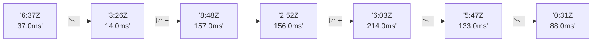

# 📊 Reporte de Performance - PokeAPI

**Fecha de corrida:** 2026-09-05 15:42 UTC

**Enlace:** [33975492966](https://github.com/rba3/Lab_CD_CI_Perfomance/actions/runs/33975492966)

## ✅ Veredicto

```
PASS (fallback por umbrales)

- Error maximo: 0.0%
- p95 maximo: 27.0 ms
```

## 🔮 Predicciones

✓ STABLE

## 📈 Métricas Globales

| Métrica | Valor | SLO | Estado |
|---------|-------|-----|--------|
| Error Rate | 0.0% | < 0.1% | ✅ PASS |
| Latencia p50 | 13.0ms | - | ℹ️ |
| Latencia p95 | 17.0ms | < 800ms | ✅ PASS |
| Latencia p99 | 27.0ms | - | ℹ️ |
| Throughput | 0.00 req/s | - | ℹ️ |
| Muestras | 0 | - | ℹ️ |

## 📉 Tendencia Histórica (Últimas 7 corridas)



## 🔧 Análisis Técnico Detallado (JSON)

```json
{
  "predictions": {
    "prediction": "STABLE",
    "confidence": 0,
    "slope_ms_per_run": -17.25,
    "current_p95": 17.0,
    "days_to_warn": null,
    "days_to_fail": null,
    "risk_level": "LOW"
  },
  "recommendations": [],
  "correlations": {},
  "root_cause": {
    "issue": null,
    "root_cause": null,
    "confidence": 0,
    "evidence": []
  },
  "timestamp": "2026-09-05T15:42:47.528296"
}
```

## 📦 Datos Completos (JSON)

```json
{
  "scenario": "load",
  "overall": {
    "samples": 16771,
    "errors": 0,
    "error_pct": 0.0,
    "avg_ms": 13.2,
    "min_ms": 9,
    "max_ms": 249,
    "p50_ms": 13.0,
    "p90_ms": 16.0,
    "p95_ms": 17.0,
    "p99_ms": 27.0,
    "throughput_rps": 140.22,
    "duration_s": 119.6
  },
  "by_endpoint": {
    "ability-static": {
      "samples": 1678,
      "errors": 0,
      "error_pct": 0.0,
      "avg_ms": 12.8,
      "min_ms": 9,
      "max_ms": 31,
      "p50_ms": 12.0,
      "p90_ms": 15.0,
      "p95_ms": 17.0,
      "p99_ms": 21.0,
      "throughput_rps": 14.17,
      "duration_s": 118.4
    },
    "berry-cheri": {
      "samples": 1677,
      "errors": 0,
      "error_pct": 0.0,
      "avg_ms": 12.7,
      "min_ms": 9,
      "max_ms": 46,
      "p50_ms": 12.0,
      "p90_ms": 15.0,
      "p95_ms": 17.0,
      "p99_ms": 26.0,
      "throughput_rps": 14.17,
      "duration_s": 118.3
    },
    "generation-1": {
      "samples": 1677,
      "errors": 0,
      "error_pct": 0.0,
      "avg_ms": 13.0,
      "min_ms": 9,
      "max_ms": 62,
      "p50_ms": 12.0,
      "p90_ms": 16.0,
      "p95_ms": 17.0,
      "p99_ms": 30.0,
      "throughput_rps": 14.21,
      "duration_s": 118.0
    },
    "move-tackle": {
      "samples": 1677,
      "errors": 0,
      "error_pct": 0.0,
      "avg_ms": 13.1,
      "min_ms": 10,
      "max_ms": 44,
      "p50_ms": 12.0,
      "p90_ms": 16.0,
      "p95_ms": 17.0,
      "p99_ms": 22.0,
      "throughput_rps": 14.2,
      "duration_s": 118.1
    },
    "pokemon-charizard": {
      "samples": 1677,
      "errors": 0,
      "error_pct": 0.0,
      "avg_ms": 15.8,
      "min_ms": 11,
      "max_ms": 60,
      "p50_ms": 15.0,
      "p90_ms": 18.0,
      "p95_ms": 23.0,
      "p99_ms": 34.0,
      "throughput_rps": 14.09,
      "duration_s": 119.0
    },
    "pokemon-ditto": {
      "samples": 1677,
      "errors": 0,
      "error_pct": 0.0,
      "avg_ms": 13.1,
      "min_ms": 10,
      "max_ms": 249,
      "p50_ms": 12.0,
      "p90_ms": 16.0,
      "p95_ms": 17.0,
      "p99_ms": 22.0,
      "throughput_rps": 14.03,
      "duration_s": 119.5
    },
    "pokemon-list": {
      "samples": 1677,
      "errors": 0,
      "error_pct": 0.0,
      "avg_ms": 11.9,
      "min_ms": 9,
      "max_ms": 39,
      "p50_ms": 11.0,
      "p90_ms": 14.0,
      "p95_ms": 15.0,
      "p99_ms": 18.2,
      "throughput_rps": 14.13,
      "duration_s": 118.6
    },
    "pokemon-pikachu": {
      "samples": 1677,
      "errors": 0,
      "error_pct": 0.0,
      "avg_ms": 14.8,
      "min_ms": 11,
      "max_ms": 67,
      "p50_ms": 14.0,
      "p90_ms": 17.0,
      "p95_ms": 19.0,
      "p99_ms": 44.2,
      "throughput_rps": 14.09,
      "duration_s": 119.0
    },
    "type-fire": {
      "samples": 1677,
      "errors": 0,
      "error_pct": 0.0,
      "avg_ms": 12.5,
      "min_ms": 9,
      "max_ms": 46,
      "p50_ms": 12.0,
      "p90_ms": 15.0,
      "p95_ms": 16.0,
      "p99_ms": 20.0,
      "throughput_rps": 14.16,
      "duration_s": 118.4
    },
    "type-water": {
      "samples": 1677,
      "errors": 0,
      "error_pct": 0.0,
      "avg_ms": 12.5,
      "min_ms": 10,
      "max_ms": 39,
      "p50_ms": 12.0,
      "p90_ms": 14.0,
      "p95_ms": 16.0,
      "p99_ms": 22.5,
      "throughput_rps": 14.14,
      "duration_s": 118.6
    }
  },
  "empty": false
}
```

---

*Reporte generado automáticamente por el workflow de performance.*

*Timestamp: 2026-09-05T15:42:47.529710Z*
