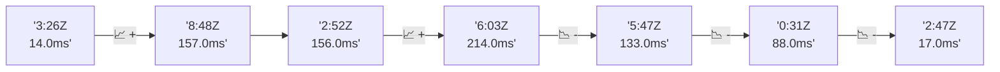

# 📊 Reporte de Performance - PokeAPI

**Fecha de corrida:** 2026-09-06 15:53 UTC

**Enlace:** [34043600091](https://github.com/rba3/Lab_CD_CI_Perfomance/actions/runs/34043600091)

## ✅ Veredicto

```
PASS (fallback por umbrales)

- Error maximo: 0.0%
- p95 maximo: 22.0 ms
```

## 🔮 Predicciones

✓ STABLE

## 📈 Métricas Globales

| Métrica | Valor | SLO | Estado |
|---------|-------|-----|--------|
| Error Rate | 0.0% | < 0.1% | ✅ PASS |
| Latencia p50 | 8.0ms | - | ℹ️ |
| Latencia p95 | 13.0ms | < 800ms | ✅ PASS |
| Latencia p99 | 20.0ms | - | ℹ️ |
| Throughput | 0.00 req/s | - | ℹ️ |
| Muestras | 0 | - | ℹ️ |

## 📉 Tendencia Histórica (Últimas 7 corridas)



## 🔧 Análisis Técnico Detallado (JSON)

```json
{
  "predictions": {
    "prediction": "STABLE",
    "confidence": 0,
    "slope_ms_per_run": -34.75,
    "current_p95": 13.0,
    "days_to_warn": null,
    "days_to_fail": null,
    "risk_level": "LOW"
  },
  "recommendations": [],
  "correlations": {},
  "root_cause": {
    "issue": null,
    "root_cause": null,
    "confidence": 0,
    "evidence": []
  },
  "timestamp": "2026-09-06T15:53:59.242534"
}
```

## 📦 Datos Completos (JSON)

```json
{
  "scenario": "load",
  "overall": {
    "samples": 16993,
    "errors": 0,
    "error_pct": 0.0,
    "avg_ms": 9.2,
    "min_ms": 5,
    "max_ms": 228,
    "p50_ms": 8.0,
    "p90_ms": 12.0,
    "p95_ms": 13.0,
    "p99_ms": 20.0,
    "throughput_rps": 142.08,
    "duration_s": 119.6
  },
  "by_endpoint": {
    "ability-static": {
      "samples": 1699,
      "errors": 0,
      "error_pct": 0.0,
      "avg_ms": 9.2,
      "min_ms": 6,
      "max_ms": 119,
      "p50_ms": 9.0,
      "p90_ms": 12.0,
      "p95_ms": 13.0,
      "p99_ms": 19.0,
      "throughput_rps": 14.35,
      "duration_s": 118.4
    },
    "berry-cheri": {
      "samples": 1699,
      "errors": 0,
      "error_pct": 0.0,
      "avg_ms": 8.9,
      "min_ms": 5,
      "max_ms": 70,
      "p50_ms": 8.0,
      "p90_ms": 11.0,
      "p95_ms": 13.0,
      "p99_ms": 20.0,
      "throughput_rps": 14.35,
      "duration_s": 118.4
    },
    "generation-1": {
      "samples": 1699,
      "errors": 0,
      "error_pct": 0.0,
      "avg_ms": 9.1,
      "min_ms": 6,
      "max_ms": 37,
      "p50_ms": 8.0,
      "p90_ms": 12.0,
      "p95_ms": 14.0,
      "p99_ms": 24.0,
      "throughput_rps": 14.39,
      "duration_s": 118.1
    },
    "move-tackle": {
      "samples": 1699,
      "errors": 0,
      "error_pct": 0.0,
      "avg_ms": 9.1,
      "min_ms": 6,
      "max_ms": 42,
      "p50_ms": 8.0,
      "p90_ms": 12.0,
      "p95_ms": 14.0,
      "p99_ms": 20.0,
      "throughput_rps": 14.38,
      "duration_s": 118.1
    },
    "pokemon-charizard": {
      "samples": 1699,
      "errors": 0,
      "error_pct": 0.0,
      "avg_ms": 10.1,
      "min_ms": 7,
      "max_ms": 52,
      "p50_ms": 10.0,
      "p90_ms": 12.0,
      "p95_ms": 14.0,
      "p99_ms": 21.0,
      "throughput_rps": 14.28,
      "duration_s": 119.0
    },
    "pokemon-ditto": {
      "samples": 1701,
      "errors": 0,
      "error_pct": 0.0,
      "avg_ms": 9.1,
      "min_ms": 6,
      "max_ms": 228,
      "p50_ms": 8.0,
      "p90_ms": 12.0,
      "p95_ms": 13.0,
      "p99_ms": 18.0,
      "throughput_rps": 14.22,
      "duration_s": 119.6
    },
    "pokemon-list": {
      "samples": 1699,
      "errors": 0,
      "error_pct": 0.0,
      "avg_ms": 8.6,
      "min_ms": 6,
      "max_ms": 221,
      "p50_ms": 8.0,
      "p90_ms": 11.0,
      "p95_ms": 12.0,
      "p99_ms": 17.0,
      "throughput_rps": 14.32,
      "duration_s": 118.7
    },
    "pokemon-pikachu": {
      "samples": 1700,
      "errors": 0,
      "error_pct": 0.0,
      "avg_ms": 10.0,
      "min_ms": 7,
      "max_ms": 51,
      "p50_ms": 9.0,
      "p90_ms": 13.0,
      "p95_ms": 15.0,
      "p99_ms": 26.0,
      "throughput_rps": 14.28,
      "duration_s": 119.1
    },
    "type-fire": {
      "samples": 1699,
      "errors": 0,
      "error_pct": 0.0,
      "avg_ms": 8.9,
      "min_ms": 5,
      "max_ms": 34,
      "p50_ms": 8.0,
      "p90_ms": 11.0,
      "p95_ms": 13.0,
      "p99_ms": 19.0,
      "throughput_rps": 14.35,
      "duration_s": 118.4
    },
    "type-water": {
      "samples": 1699,
      "errors": 0,
      "error_pct": 0.0,
      "avg_ms": 8.9,
      "min_ms": 6,
      "max_ms": 41,
      "p50_ms": 8.0,
      "p90_ms": 11.0,
      "p95_ms": 13.0,
      "p99_ms": 19.0,
      "throughput_rps": 14.32,
      "duration_s": 118.7
    }
  },
  "empty": false
}
```

---

*Reporte generado automáticamente por el workflow de performance.*

*Timestamp: 2026-09-06T15:53:59.243934Z*
