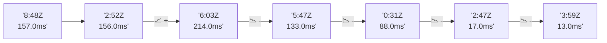

# 📊 Reporte de Performance - PokeAPI

**Fecha de corrida:** 2026-09-07 18:00 UTC

**Enlace:** [34149704486](https://github.com/rba3/Lab_CD_CI_Perfomance/actions/runs/34149704486)

## ✅ Veredicto

```
PASS (fallback por umbrales)

- Error maximo: 0.0%
- p95 maximo: 82.0 ms
```

## 🔮 Predicciones

✓ STABLE

## 📈 Métricas Globales

| Métrica | Valor | SLO | Estado |
|---------|-------|-----|--------|
| Error Rate | 0.0% | < 0.1% | ✅ PASS |
| Latencia p50 | 43.0ms | - | ℹ️ |
| Latencia p95 | 61.0ms | < 800ms | ✅ PASS |
| Latencia p99 | 112.0ms | - | ℹ️ |
| Throughput | 0.00 req/s | - | ℹ️ |
| Muestras | 0 | - | ℹ️ |

## 📉 Tendencia Histórica (Últimas 7 corridas)



## 🔧 Análisis Técnico Detallado (JSON)

```json
{
  "predictions": {
    "prediction": "STABLE",
    "confidence": 0,
    "slope_ms_per_run": -50.25,
    "current_p95": 61.0,
    "days_to_warn": null,
    "days_to_fail": null,
    "risk_level": "LOW"
  },
  "recommendations": [],
  "correlations": {},
  "root_cause": {
    "issue": null,
    "root_cause": null,
    "confidence": 0,
    "evidence": []
  },
  "timestamp": "2026-09-07T18:00:25.736503"
}
```

## 📦 Datos Completos (JSON)

```json
{
  "scenario": "load",
  "overall": {
    "samples": 15155,
    "errors": 0,
    "error_pct": 0.0,
    "avg_ms": 46.7,
    "min_ms": 35,
    "max_ms": 592,
    "p50_ms": 43.0,
    "p90_ms": 56.0,
    "p95_ms": 61.0,
    "p99_ms": 112.0,
    "throughput_rps": 126.67,
    "duration_s": 119.6
  },
  "by_endpoint": {
    "ability-static": {
      "samples": 1516,
      "errors": 0,
      "error_pct": 0.0,
      "avg_ms": 43.8,
      "min_ms": 37,
      "max_ms": 592,
      "p50_ms": 42.0,
      "p90_ms": 49.0,
      "p95_ms": 53.0,
      "p99_ms": 72.8,
      "throughput_rps": 12.82,
      "duration_s": 118.3
    },
    "berry-cheri": {
      "samples": 1515,
      "errors": 0,
      "error_pct": 0.0,
      "avg_ms": 43.7,
      "min_ms": 35,
      "max_ms": 158,
      "p50_ms": 41.0,
      "p90_ms": 50.0,
      "p95_ms": 56.0,
      "p99_ms": 91.0,
      "throughput_rps": 12.82,
      "duration_s": 118.2
    },
    "generation-1": {
      "samples": 1515,
      "errors": 0,
      "error_pct": 0.0,
      "avg_ms": 45.5,
      "min_ms": 36,
      "max_ms": 537,
      "p50_ms": 42.0,
      "p90_ms": 52.0,
      "p95_ms": 59.0,
      "p99_ms": 103.9,
      "throughput_rps": 12.85,
      "duration_s": 117.9
    },
    "move-tackle": {
      "samples": 1515,
      "errors": 0,
      "error_pct": 0.0,
      "avg_ms": 45.3,
      "min_ms": 37,
      "max_ms": 312,
      "p50_ms": 43.0,
      "p90_ms": 50.0,
      "p95_ms": 55.0,
      "p99_ms": 93.9,
      "throughput_rps": 12.84,
      "duration_s": 118.0
    },
    "pokemon-charizard": {
      "samples": 1515,
      "errors": 0,
      "error_pct": 0.0,
      "avg_ms": 60.3,
      "min_ms": 47,
      "max_ms": 237,
      "p50_ms": 55.0,
      "p90_ms": 68.6,
      "p95_ms": 84.3,
      "p99_ms": 139.9,
      "throughput_rps": 12.74,
      "duration_s": 119.0
    },
    "pokemon-ditto": {
      "samples": 1516,
      "errors": 0,
      "error_pct": 0.0,
      "avg_ms": 44.9,
      "min_ms": 36,
      "max_ms": 305,
      "p50_ms": 42.0,
      "p90_ms": 51.0,
      "p95_ms": 59.0,
      "p99_ms": 108.0,
      "throughput_rps": 12.68,
      "duration_s": 119.6
    },
    "pokemon-list": {
      "samples": 1516,
      "errors": 0,
      "error_pct": 0.0,
      "avg_ms": 41.3,
      "min_ms": 36,
      "max_ms": 140,
      "p50_ms": 39.0,
      "p90_ms": 46.0,
      "p95_ms": 50.0,
      "p99_ms": 77.7,
      "throughput_rps": 12.78,
      "duration_s": 118.6
    },
    "pokemon-pikachu": {
      "samples": 1516,
      "errors": 0,
      "error_pct": 0.0,
      "avg_ms": 55.2,
      "min_ms": 45,
      "max_ms": 212,
      "p50_ms": 52.0,
      "p90_ms": 60.0,
      "p95_ms": 74.0,
      "p99_ms": 116.8,
      "throughput_rps": 12.73,
      "duration_s": 119.1
    },
    "type-fire": {
      "samples": 1516,
      "errors": 0,
      "error_pct": 0.0,
      "avg_ms": 44.3,
      "min_ms": 37,
      "max_ms": 157,
      "p50_ms": 42.0,
      "p90_ms": 50.0,
      "p95_ms": 55.0,
      "p99_ms": 100.4,
      "throughput_rps": 12.79,
      "duration_s": 118.5
    },
    "type-water": {
      "samples": 1515,
      "errors": 0,
      "error_pct": 0.0,
      "avg_ms": 43.1,
      "min_ms": 36,
      "max_ms": 335,
      "p50_ms": 41.0,
      "p90_ms": 47.0,
      "p95_ms": 51.0,
      "p99_ms": 98.6,
      "throughput_rps": 12.79,
      "duration_s": 118.5
    }
  },
  "empty": false
}
```

---

*Reporte generado automáticamente por el workflow de performance.*

*Timestamp: 2026-09-07T18:00:25.737590Z*
