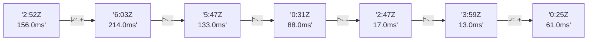

# 📊 Reporte de Performance - PokeAPI

**Fecha de corrida:** 2026-09-08 16:55 UTC

**Enlace:** [34253685530](https://github.com/rba3/Lab_CD_CI_Perfomance/actions/runs/34253685530)

## ✅ Veredicto

```
PASS (fallback por umbrales)

- Error maximo: 0.0%
- p95 maximo: 63.8 ms
```

## 🔮 Predicciones

✓ STABLE

## 📈 Métricas Globales

| Métrica | Valor | SLO | Estado |
|---------|-------|-----|--------|
| Error Rate | 0.0% | < 0.1% | ✅ PASS |
| Latencia p50 | 32.0ms | - | ℹ️ |
| Latencia p95 | 54.0ms | < 800ms | ✅ PASS |
| Latencia p99 | 82.0ms | - | ℹ️ |
| Throughput | 0.00 req/s | - | ℹ️ |
| Muestras | 0 | - | ℹ️ |

## 📉 Tendencia Histórica (Últimas 7 corridas)



## 🔧 Análisis Técnico Detallado (JSON)

```json
{
  "predictions": {
    "prediction": "STABLE",
    "confidence": 0,
    "slope_ms_per_run": -18.0,
    "current_p95": 54.0,
    "days_to_warn": null,
    "days_to_fail": null,
    "risk_level": "LOW"
  },
  "recommendations": [],
  "correlations": {},
  "root_cause": {
    "issue": null,
    "root_cause": null,
    "confidence": 0,
    "evidence": []
  },
  "timestamp": "2026-09-08T16:55:09.314672"
}
```

## 📦 Datos Completos (JSON)

```json
{
  "scenario": "load",
  "overall": {
    "samples": 15650,
    "errors": 0,
    "error_pct": 0.0,
    "avg_ms": 35.8,
    "min_ms": 22,
    "max_ms": 1293,
    "p50_ms": 32.0,
    "p90_ms": 47.0,
    "p95_ms": 54.0,
    "p99_ms": 82.0,
    "throughput_rps": 130.83,
    "duration_s": 119.6
  },
  "by_endpoint": {
    "ability-static": {
      "samples": 1565,
      "errors": 0,
      "error_pct": 0.0,
      "avg_ms": 34.4,
      "min_ms": 24,
      "max_ms": 266,
      "p50_ms": 31.0,
      "p90_ms": 46.0,
      "p95_ms": 50.0,
      "p99_ms": 68.4,
      "throughput_rps": 13.23,
      "duration_s": 118.3
    },
    "berry-cheri": {
      "samples": 1565,
      "errors": 0,
      "error_pct": 0.0,
      "avg_ms": 33.4,
      "min_ms": 23,
      "max_ms": 363,
      "p50_ms": 30.0,
      "p90_ms": 45.0,
      "p95_ms": 48.0,
      "p99_ms": 73.0,
      "throughput_rps": 13.23,
      "duration_s": 118.3
    },
    "generation-1": {
      "samples": 1565,
      "errors": 0,
      "error_pct": 0.0,
      "avg_ms": 34.4,
      "min_ms": 22,
      "max_ms": 511,
      "p50_ms": 30.0,
      "p90_ms": 46.6,
      "p95_ms": 49.0,
      "p99_ms": 65.1,
      "throughput_rps": 13.27,
      "duration_s": 118.0
    },
    "move-tackle": {
      "samples": 1565,
      "errors": 0,
      "error_pct": 0.0,
      "avg_ms": 35.6,
      "min_ms": 24,
      "max_ms": 550,
      "p50_ms": 31.0,
      "p90_ms": 48.0,
      "p95_ms": 50.0,
      "p99_ms": 78.0,
      "throughput_rps": 13.25,
      "duration_s": 118.1
    },
    "pokemon-charizard": {
      "samples": 1565,
      "errors": 0,
      "error_pct": 0.0,
      "avg_ms": 45.2,
      "min_ms": 30,
      "max_ms": 1293,
      "p50_ms": 38.0,
      "p90_ms": 63.0,
      "p95_ms": 73.0,
      "p99_ms": 134.4,
      "throughput_rps": 13.15,
      "duration_s": 119.0
    },
    "pokemon-ditto": {
      "samples": 1565,
      "errors": 0,
      "error_pct": 0.0,
      "avg_ms": 34.9,
      "min_ms": 24,
      "max_ms": 296,
      "p50_ms": 30.0,
      "p90_ms": 48.0,
      "p95_ms": 51.0,
      "p99_ms": 77.4,
      "throughput_rps": 13.09,
      "duration_s": 119.6
    },
    "pokemon-list": {
      "samples": 1565,
      "errors": 0,
      "error_pct": 0.0,
      "avg_ms": 31.1,
      "min_ms": 23,
      "max_ms": 138,
      "p50_ms": 29.0,
      "p90_ms": 43.0,
      "p95_ms": 46.0,
      "p99_ms": 60.8,
      "throughput_rps": 13.19,
      "duration_s": 118.6
    },
    "pokemon-pikachu": {
      "samples": 1565,
      "errors": 0,
      "error_pct": 0.0,
      "avg_ms": 40.0,
      "min_ms": 28,
      "max_ms": 229,
      "p50_ms": 36.0,
      "p90_ms": 57.0,
      "p95_ms": 63.0,
      "p99_ms": 123.4,
      "throughput_rps": 13.14,
      "duration_s": 119.1
    },
    "type-fire": {
      "samples": 1565,
      "errors": 0,
      "error_pct": 0.0,
      "avg_ms": 35.9,
      "min_ms": 24,
      "max_ms": 443,
      "p50_ms": 32.0,
      "p90_ms": 46.0,
      "p95_ms": 50.0,
      "p99_ms": 78.4,
      "throughput_rps": 13.21,
      "duration_s": 118.5
    },
    "type-water": {
      "samples": 1565,
      "errors": 0,
      "error_pct": 0.0,
      "avg_ms": 33.5,
      "min_ms": 23,
      "max_ms": 460,
      "p50_ms": 30.0,
      "p90_ms": 45.6,
      "p95_ms": 49.0,
      "p99_ms": 77.4,
      "throughput_rps": 13.2,
      "duration_s": 118.6
    }
  },
  "empty": false
}
```

---

*Reporte generado automáticamente por el workflow de performance.*

*Timestamp: 2026-09-08T16:55:09.316063Z*
