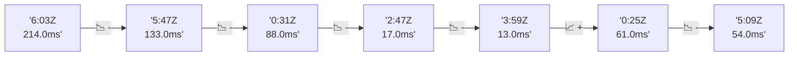

# 📊 Reporte de Performance - PokeAPI

**Fecha de corrida:** 2026-09-09 16:57 UTC

**Enlace:** [34379675081](https://github.com/rba3/Lab_CD_CI_Perfomance/actions/runs/34379675081)

## ✅ Veredicto

```
PASS (fallback por umbrales)

- Error maximo: 0.0%
- p95 maximo: 176.0 ms
```

## 🔮 Predicciones

✓ STABLE

## 🎯 Causa Raíz Identificada

**Latencia inconsistente (outliers)**
- Causa probable: Spikes de latencia, posible GC o context switching
- Confianza: 75%
- Evidencia:
  - p50 (19.0ms) mucho menor que p95 (176.0ms)
  - Diferencia de 3x+ indica distribución anómala

## 📈 Métricas Globales

| Métrica | Valor | SLO | Estado |
|---------|-------|-----|--------|
| Error Rate | 0.0% | < 0.1% | ✅ PASS |
| Latencia p50 | 19.0ms | - | ℹ️ |
| Latencia p95 | 176.0ms | < 800ms | ✅ PASS |
| Latencia p99 | 535.1ms | - | ℹ️ |
| Throughput | 0.00 req/s | - | ℹ️ |
| Muestras | 0 | - | ℹ️ |

## 📉 Tendencia Histórica (Últimas 7 corridas)



## 🔧 Análisis Técnico Detallado (JSON)

```json
{
  "predictions": {
    "prediction": "STABLE",
    "confidence": 0,
    "slope_ms_per_run": -8.5,
    "current_p95": 176.0,
    "days_to_warn": null,
    "days_to_fail": null,
    "risk_level": "LOW"
  },
  "recommendations": [],
  "correlations": {},
  "root_cause": {
    "issue": "Latencia inconsistente (outliers)",
    "root_cause": "Spikes de latencia, posible GC o context switching",
    "confidence": 75,
    "evidence": [
      "p50 (19.0ms) mucho menor que p95 (176.0ms)",
      "Diferencia de 3x+ indica distribuci\u00f3n an\u00f3mala"
    ]
  },
  "timestamp": "2026-09-09T16:57:42.656683"
}
```

## 📦 Datos Completos (JSON)

```json
{
  "scenario": "load",
  "overall": {
    "samples": 14946,
    "errors": 0,
    "error_pct": 0.0,
    "avg_ms": 52.0,
    "min_ms": 10,
    "max_ms": 6538,
    "p50_ms": 19.0,
    "p90_ms": 112.0,
    "p95_ms": 176.0,
    "p99_ms": 535.1,
    "throughput_rps": 119.93,
    "duration_s": 124.6
  },
  "by_endpoint": {
    "ability-static": {
      "samples": 1495,
      "errors": 0,
      "error_pct": 0.0,
      "avg_ms": 45.3,
      "min_ms": 10,
      "max_ms": 1348,
      "p50_ms": 18.0,
      "p90_ms": 86.6,
      "p95_ms": 168.3,
      "p99_ms": 445.4,
      "throughput_rps": 12.63,
      "duration_s": 118.4
    },
    "berry-cheri": {
      "samples": 1495,
      "errors": 0,
      "error_pct": 0.0,
      "avg_ms": 48.9,
      "min_ms": 10,
      "max_ms": 6264,
      "p50_ms": 18.0,
      "p90_ms": 81.0,
      "p95_ms": 162.0,
      "p99_ms": 528.2,
      "throughput_rps": 12.63,
      "duration_s": 118.4
    },
    "generation-1": {
      "samples": 1494,
      "errors": 0,
      "error_pct": 0.0,
      "avg_ms": 45.8,
      "min_ms": 11,
      "max_ms": 2587,
      "p50_ms": 19.0,
      "p90_ms": 78.0,
      "p95_ms": 166.0,
      "p99_ms": 255.1,
      "throughput_rps": 12.65,
      "duration_s": 118.1
    },
    "move-tackle": {
      "samples": 1494,
      "errors": 0,
      "error_pct": 0.0,
      "avg_ms": 45.9,
      "min_ms": 12,
      "max_ms": 1691,
      "p50_ms": 19.0,
      "p90_ms": 83.7,
      "p95_ms": 174.0,
      "p99_ms": 258.3,
      "throughput_rps": 12.64,
      "duration_s": 118.2
    },
    "pokemon-charizard": {
      "samples": 1495,
      "errors": 0,
      "error_pct": 0.0,
      "avg_ms": 69.6,
      "min_ms": 14,
      "max_ms": 2829,
      "p50_ms": 23.0,
      "p90_ms": 213.0,
      "p95_ms": 248.3,
      "p99_ms": 610.0,
      "throughput_rps": 12.56,
      "duration_s": 119.0
    },
    "pokemon-ditto": {
      "samples": 1495,
      "errors": 0,
      "error_pct": 0.0,
      "avg_ms": 54.5,
      "min_ms": 10,
      "max_ms": 6127,
      "p50_ms": 18.0,
      "p90_ms": 146.0,
      "p95_ms": 176.0,
      "p99_ms": 552.2,
      "throughput_rps": 12.5,
      "duration_s": 119.6
    },
    "pokemon-list": {
      "samples": 1495,
      "errors": 0,
      "error_pct": 0.0,
      "avg_ms": 47.0,
      "min_ms": 10,
      "max_ms": 3209,
      "p50_ms": 18.0,
      "p90_ms": 141.0,
      "p95_ms": 163.0,
      "p99_ms": 525.7,
      "throughput_rps": 12.59,
      "duration_s": 118.7
    },
    "pokemon-pikachu": {
      "samples": 1495,
      "errors": 0,
      "error_pct": 0.0,
      "avg_ms": 71.4,
      "min_ms": 12,
      "max_ms": 6538,
      "p50_ms": 21.0,
      "p90_ms": 153.0,
      "p95_ms": 232.3,
      "p99_ms": 659.5,
      "throughput_rps": 12.05,
      "duration_s": 124.1
    },
    "type-fire": {
      "samples": 1494,
      "errors": 0,
      "error_pct": 0.0,
      "avg_ms": 44.5,
      "min_ms": 10,
      "max_ms": 1061,
      "p50_ms": 19.0,
      "p90_ms": 85.0,
      "p95_ms": 166.0,
      "p99_ms": 272.4,
      "throughput_rps": 12.62,
      "duration_s": 118.4
    },
    "type-water": {
      "samples": 1494,
      "errors": 0,
      "error_pct": 0.0,
      "avg_ms": 46.8,
      "min_ms": 11,
      "max_ms": 932,
      "p50_ms": 19.0,
      "p90_ms": 154.0,
      "p95_ms": 169.0,
      "p99_ms": 297.0,
      "throughput_rps": 12.6,
      "duration_s": 118.6
    }
  },
  "empty": false
}
```

---

*Reporte generado automáticamente por el workflow de performance.*

*Timestamp: 2026-09-09T16:57:42.658076Z*
