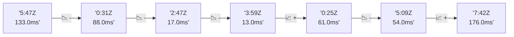

# 📊 Reporte de Performance - PokeAPI

**Fecha de corrida:** 2026-09-10 16:45 UTC

**Enlace:** [34503756675](https://github.com/rba3/Lab_CD_CI_Perfomance/actions/runs/34503756675)

## ✅ Veredicto

```
PASS (fallback por umbrales)

- Error maximo: 0.0%
- p95 maximo: 97.0 ms
```

## 🔮 Predicciones

⚠️ **Tendencia de degradación detectada** (MEDIUM risk)
- Pendiente: +39.75ms/corrida
- P95 actual: 97.0ms
- Días hasta WARN: ~17
- Días hasta FAIL: ~35
- Confianza: 80%

## 🎯 Causa Raíz Identificada

**Latencia inconsistente (outliers)**
- Causa probable: Spikes de latencia, posible GC o context switching
- Confianza: 75%
- Evidencia:
  - p50 (27.0ms) mucho menor que p95 (97.0ms)
  - Diferencia de 3x+ indica distribución anómala

## 📈 Métricas Globales

| Métrica | Valor | SLO | Estado |
|---------|-------|-----|--------|
| Error Rate | 0.0% | < 0.1% | ✅ PASS |
| Latencia p50 | 27.0ms | - | ℹ️ |
| Latencia p95 | 97.0ms | < 800ms | ✅ PASS |
| Latencia p99 | 190.0ms | - | ℹ️ |
| Throughput | 0.00 req/s | - | ℹ️ |
| Muestras | 0 | - | ℹ️ |

## 📉 Tendencia Histórica (Últimas 7 corridas)



## 🔧 Análisis Técnico Detallado (JSON)

```json
{
  "predictions": {
    "prediction": "DEGRADATION_TREND",
    "confidence": 80,
    "slope_ms_per_run": 39.75,
    "current_p95": 97.0,
    "days_to_warn": 17,
    "days_to_fail": 35,
    "risk_level": "MEDIUM"
  },
  "recommendations": [],
  "correlations": {},
  "root_cause": {
    "issue": "Latencia inconsistente (outliers)",
    "root_cause": "Spikes de latencia, posible GC o context switching",
    "confidence": 75,
    "evidence": [
      "p50 (27.0ms) mucho menor que p95 (97.0ms)",
      "Diferencia de 3x+ indica distribuci\u00f3n an\u00f3mala"
    ]
  },
  "timestamp": "2026-09-10T16:45:30.262691"
}
```

## 📦 Datos Completos (JSON)

```json
{
  "scenario": "load",
  "overall": {
    "samples": 15375,
    "errors": 0,
    "error_pct": 0.0,
    "avg_ms": 41.8,
    "min_ms": 10,
    "max_ms": 9333,
    "p50_ms": 27.0,
    "p90_ms": 72.6,
    "p95_ms": 97.0,
    "p99_ms": 190.0,
    "throughput_rps": 127.7,
    "duration_s": 120.4
  },
  "by_endpoint": {
    "ability-static": {
      "samples": 1537,
      "errors": 0,
      "error_pct": 0.0,
      "avg_ms": 37.4,
      "min_ms": 11,
      "max_ms": 1018,
      "p50_ms": 26.0,
      "p90_ms": 57.4,
      "p95_ms": 95.0,
      "p99_ms": 124.9,
      "throughput_rps": 13.0,
      "duration_s": 118.3
    },
    "berry-cheri": {
      "samples": 1537,
      "errors": 0,
      "error_pct": 0.0,
      "avg_ms": 35.1,
      "min_ms": 11,
      "max_ms": 326,
      "p50_ms": 25.0,
      "p90_ms": 89.0,
      "p95_ms": 94.0,
      "p99_ms": 105.6,
      "throughput_rps": 13.0,
      "duration_s": 118.2
    },
    "generation-1": {
      "samples": 1537,
      "errors": 0,
      "error_pct": 0.0,
      "avg_ms": 43.6,
      "min_ms": 12,
      "max_ms": 9333,
      "p50_ms": 25.0,
      "p90_ms": 58.8,
      "p95_ms": 96.0,
      "p99_ms": 263.9,
      "throughput_rps": 13.03,
      "duration_s": 117.9
    },
    "move-tackle": {
      "samples": 1538,
      "errors": 0,
      "error_pct": 0.0,
      "avg_ms": 38.3,
      "min_ms": 11,
      "max_ms": 973,
      "p50_ms": 26.0,
      "p90_ms": 62.3,
      "p95_ms": 99.0,
      "p99_ms": 147.8,
      "throughput_rps": 13.02,
      "duration_s": 118.1
    },
    "pokemon-charizard": {
      "samples": 1538,
      "errors": 0,
      "error_pct": 0.0,
      "avg_ms": 66.1,
      "min_ms": 14,
      "max_ms": 8471,
      "p50_ms": 33.0,
      "p90_ms": 123.0,
      "p95_ms": 136.0,
      "p99_ms": 300.0,
      "throughput_rps": 12.84,
      "duration_s": 119.8
    },
    "pokemon-ditto": {
      "samples": 1538,
      "errors": 0,
      "error_pct": 0.0,
      "avg_ms": 37.9,
      "min_ms": 11,
      "max_ms": 4131,
      "p50_ms": 24.0,
      "p90_ms": 48.0,
      "p95_ms": 95.0,
      "p99_ms": 283.9,
      "throughput_rps": 12.86,
      "duration_s": 119.6
    },
    "pokemon-list": {
      "samples": 1538,
      "errors": 0,
      "error_pct": 0.0,
      "avg_ms": 35.3,
      "min_ms": 10,
      "max_ms": 948,
      "p50_ms": 25.0,
      "p90_ms": 56.0,
      "p95_ms": 93.0,
      "p99_ms": 118.8,
      "throughput_rps": 12.96,
      "duration_s": 118.6
    },
    "pokemon-pikachu": {
      "samples": 1538,
      "errors": 0,
      "error_pct": 0.0,
      "avg_ms": 50.6,
      "min_ms": 13,
      "max_ms": 2926,
      "p50_ms": 29.0,
      "p90_ms": 92.3,
      "p95_ms": 128.0,
      "p99_ms": 290.4,
      "throughput_rps": 12.9,
      "duration_s": 119.2
    },
    "type-fire": {
      "samples": 1537,
      "errors": 0,
      "error_pct": 0.0,
      "avg_ms": 39.4,
      "min_ms": 10,
      "max_ms": 1058,
      "p50_ms": 26.0,
      "p90_ms": 91.0,
      "p95_ms": 96.0,
      "p99_ms": 256.4,
      "throughput_rps": 12.98,
      "duration_s": 118.4
    },
    "type-water": {
      "samples": 1537,
      "errors": 0,
      "error_pct": 0.0,
      "avg_ms": 34.7,
      "min_ms": 11,
      "max_ms": 668,
      "p50_ms": 26.0,
      "p90_ms": 52.0,
      "p95_ms": 95.0,
      "p99_ms": 101.0,
      "throughput_rps": 12.97,
      "duration_s": 118.5
    }
  },
  "empty": false
}
```

---

*Reporte generado automáticamente por el workflow de performance.*

*Timestamp: 2026-09-10T16:45:30.264146Z*
