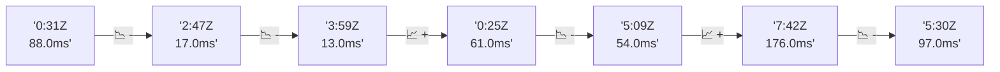

# 📊 Reporte de Performance - PokeAPI

**Fecha de corrida:** 2026-09-11 16:50 UTC

**Enlace:** [34624023333](https://github.com/rba3/Lab_CD_CI_Perfomance/actions/runs/34624023333)

## ✅ Veredicto

```
PASS (fallback por umbrales)

- Error maximo: 0.0%
- p95 maximo: 54.8 ms
```

## 🔮 Predicciones

⚠️ **Tendencia de degradación detectada** (MEDIUM risk)
- Pendiente: +21.0ms/corrida
- P95 actual: 44.0ms
- Días hasta WARN: ~36
- Días hasta FAIL: ~69
- Confianza: 80%

## 📈 Métricas Globales

| Métrica | Valor | SLO | Estado |
|---------|-------|-----|--------|
| Error Rate | 0.0% | < 0.1% | ✅ PASS |
| Latencia p50 | 29.0ms | - | ℹ️ |
| Latencia p95 | 44.0ms | < 800ms | ✅ PASS |
| Latencia p99 | 68.0ms | - | ℹ️ |
| Throughput | 0.00 req/s | - | ℹ️ |
| Muestras | 0 | - | ℹ️ |

## 📉 Tendencia Histórica (Últimas 7 corridas)



## 🔧 Análisis Técnico Detallado (JSON)

```json
{
  "predictions": {
    "prediction": "DEGRADATION_TREND",
    "confidence": 80,
    "slope_ms_per_run": 21.0,
    "current_p95": 44.0,
    "days_to_warn": 36,
    "days_to_fail": 69,
    "risk_level": "MEDIUM"
  },
  "recommendations": [],
  "correlations": {},
  "root_cause": {
    "issue": null,
    "root_cause": null,
    "confidence": 0,
    "evidence": []
  },
  "timestamp": "2026-09-11T16:50:26.503570"
}
```

## 📦 Datos Completos (JSON)

```json
{
  "scenario": "load",
  "overall": {
    "samples": 15883,
    "errors": 0,
    "error_pct": 0.0,
    "avg_ms": 30.9,
    "min_ms": 17,
    "max_ms": 282,
    "p50_ms": 29.0,
    "p90_ms": 40.0,
    "p95_ms": 44.0,
    "p99_ms": 68.0,
    "throughput_rps": 132.73,
    "duration_s": 119.7
  },
  "by_endpoint": {
    "ability-static": {
      "samples": 1588,
      "errors": 0,
      "error_pct": 0.0,
      "avg_ms": 30.2,
      "min_ms": 18,
      "max_ms": 122,
      "p50_ms": 28.0,
      "p90_ms": 39.0,
      "p95_ms": 42.0,
      "p99_ms": 53.6,
      "throughput_rps": 13.43,
      "duration_s": 118.3
    },
    "berry-cheri": {
      "samples": 1588,
      "errors": 0,
      "error_pct": 0.0,
      "avg_ms": 29.8,
      "min_ms": 18,
      "max_ms": 113,
      "p50_ms": 29.0,
      "p90_ms": 38.0,
      "p95_ms": 41.0,
      "p99_ms": 55.0,
      "throughput_rps": 13.43,
      "duration_s": 118.2
    },
    "generation-1": {
      "samples": 1588,
      "errors": 0,
      "error_pct": 0.0,
      "avg_ms": 30.0,
      "min_ms": 18,
      "max_ms": 104,
      "p50_ms": 28.0,
      "p90_ms": 39.0,
      "p95_ms": 42.0,
      "p99_ms": 52.3,
      "throughput_rps": 13.47,
      "duration_s": 117.9
    },
    "move-tackle": {
      "samples": 1588,
      "errors": 0,
      "error_pct": 0.0,
      "avg_ms": 30.7,
      "min_ms": 18,
      "max_ms": 81,
      "p50_ms": 29.0,
      "p90_ms": 40.0,
      "p95_ms": 43.0,
      "p99_ms": 54.1,
      "throughput_rps": 13.45,
      "duration_s": 118.0
    },
    "pokemon-charizard": {
      "samples": 1589,
      "errors": 0,
      "error_pct": 0.0,
      "avg_ms": 37.6,
      "min_ms": 22,
      "max_ms": 168,
      "p50_ms": 34.0,
      "p90_ms": 48.0,
      "p95_ms": 55.0,
      "p99_ms": 108.0,
      "throughput_rps": 13.34,
      "duration_s": 119.1
    },
    "pokemon-ditto": {
      "samples": 1589,
      "errors": 0,
      "error_pct": 0.0,
      "avg_ms": 29.8,
      "min_ms": 18,
      "max_ms": 233,
      "p50_ms": 27.0,
      "p90_ms": 39.0,
      "p95_ms": 41.0,
      "p99_ms": 55.2,
      "throughput_rps": 13.28,
      "duration_s": 119.6
    },
    "pokemon-list": {
      "samples": 1588,
      "errors": 0,
      "error_pct": 0.0,
      "avg_ms": 27.4,
      "min_ms": 18,
      "max_ms": 272,
      "p50_ms": 25.0,
      "p90_ms": 35.0,
      "p95_ms": 37.0,
      "p99_ms": 47.1,
      "throughput_rps": 13.38,
      "duration_s": 118.7
    },
    "pokemon-pikachu": {
      "samples": 1589,
      "errors": 0,
      "error_pct": 0.0,
      "avg_ms": 35.7,
      "min_ms": 21,
      "max_ms": 282,
      "p50_ms": 31.0,
      "p90_ms": 48.0,
      "p95_ms": 56.0,
      "p99_ms": 104.1,
      "throughput_rps": 13.34,
      "duration_s": 119.1
    },
    "type-fire": {
      "samples": 1588,
      "errors": 0,
      "error_pct": 0.0,
      "avg_ms": 29.6,
      "min_ms": 18,
      "max_ms": 130,
      "p50_ms": 27.0,
      "p90_ms": 39.0,
      "p95_ms": 42.0,
      "p99_ms": 62.1,
      "throughput_rps": 13.4,
      "duration_s": 118.5
    },
    "type-water": {
      "samples": 1588,
      "errors": 0,
      "error_pct": 0.0,
      "avg_ms": 28.6,
      "min_ms": 17,
      "max_ms": 111,
      "p50_ms": 27.0,
      "p90_ms": 37.0,
      "p95_ms": 40.0,
      "p99_ms": 47.1,
      "throughput_rps": 13.39,
      "duration_s": 118.6
    }
  },
  "empty": false
}
```

---

*Reporte generado automáticamente por el workflow de performance.*

*Timestamp: 2026-09-11T16:50:26.504545Z*
